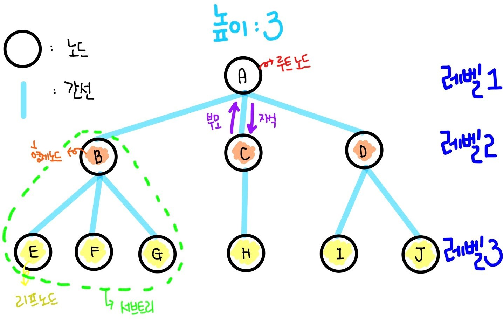
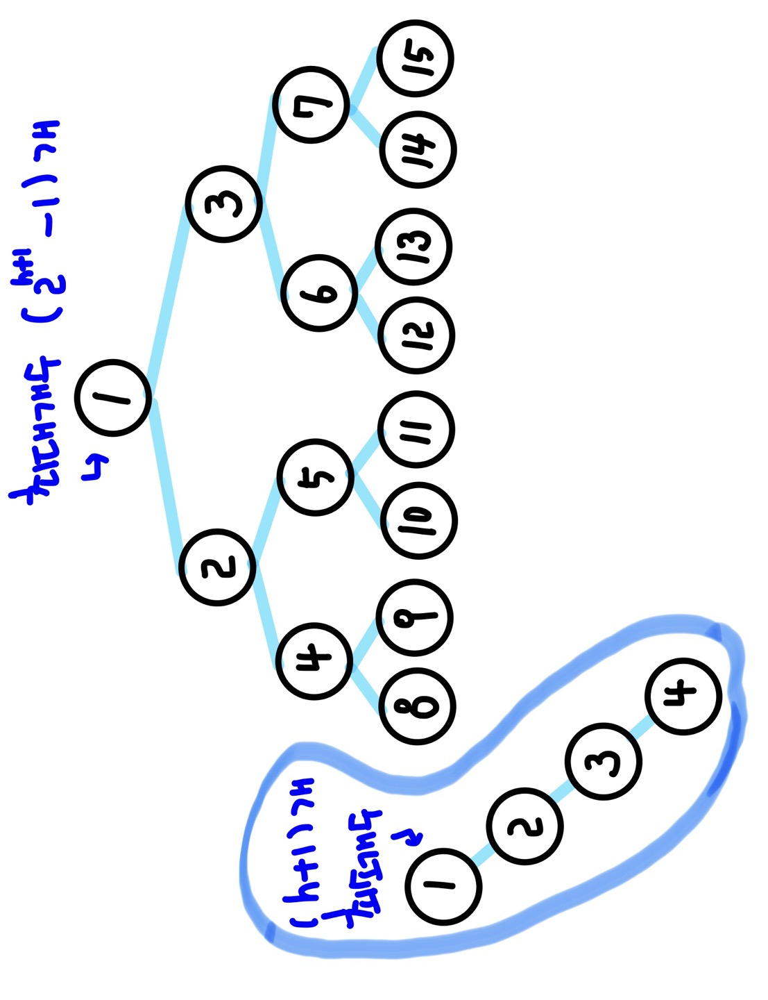
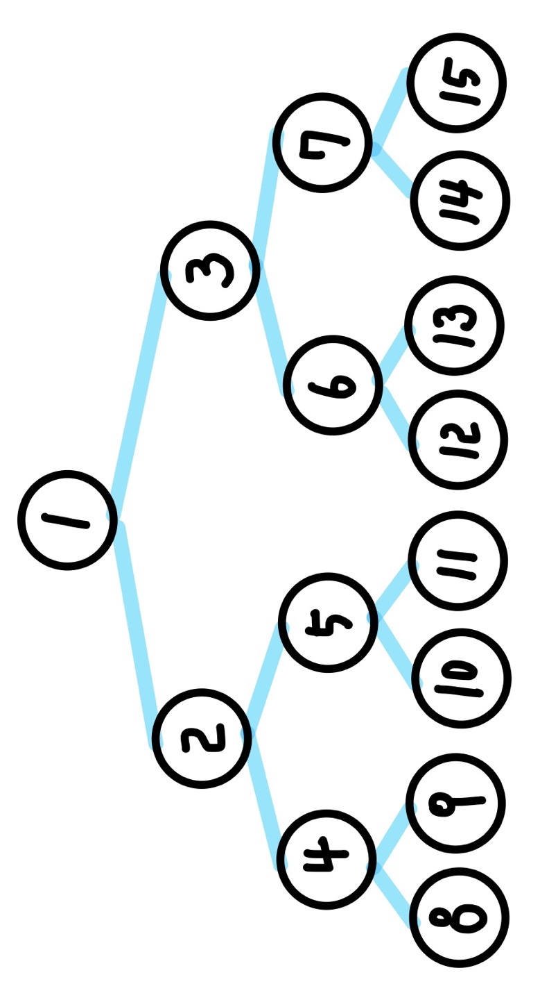
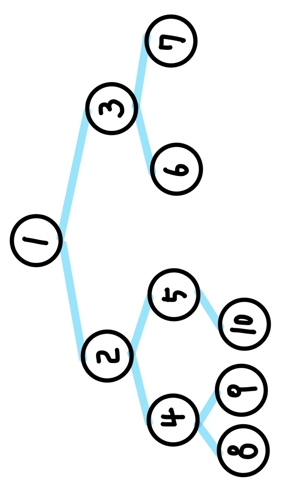
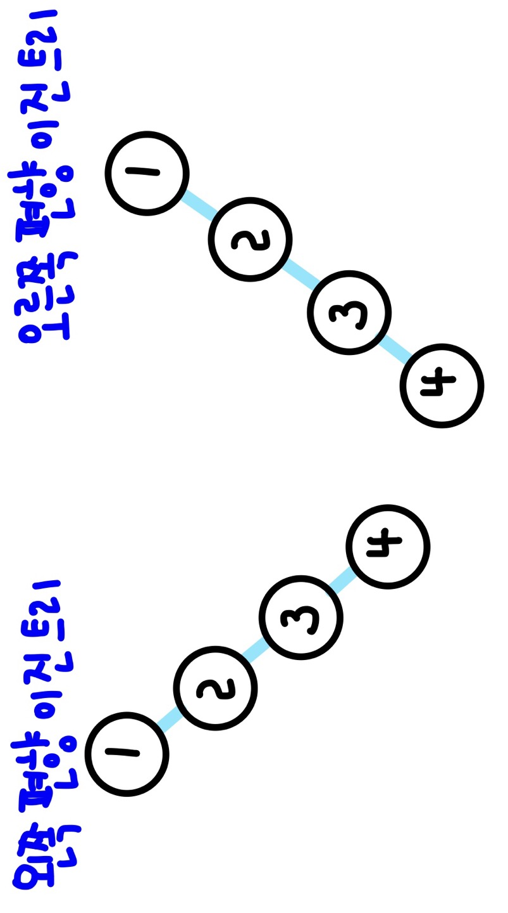

# 📚 <a style="color:#00adb5">트리 ( Tree )</a>

## <a style="color:#00adb5">트리</a>란 무엇인가 ?

트리란 <a style="color:red"><b>계층적인 구조를 표현하기 위해 일상적으로 사용하는 구조</b></a>이다. 
비선형 구조이며 원소들 간에 계층관계를 가지는 계층형 자료구조이다. 
상위 원소에서 하위 원소로 내려가면서 확장되는 트리(나무)모양의 구조이다.

### <a style="color:#00adb5">트리</a>의 용어정리
- 노드 ( node )  
트리의 원소
- 간선 ( edge, branch, link )  
노드와 노드를 연결하는 선으로 부모 노드와 자식 노드를 연결
- 루트 노드 ( root node )  
트리의 시작 노드인 최상위 노드
- 리프 노드 ( leaf node )  
자식이 없는 노드, 맨 밑에 있는 노드
- 형제 노드 ( sibling node )  
같은 부모 노드의 자식 노드들
- 조상 노드   
간선을 따라 루트 노드까지 이르는 경로에 있는 모든 노드들
- 서브 트리 ( subtree ) = 부트리  
부모 노드와 연결된 간선을 끊었을 때 생성되는트리
- 자손 노드  
서브 트리에 있는 하위 레벨의 노드들

- 차수 ( degree ) 
    - 노드의 자수 : 노드에 연결된 자식 노드의 수 (B의 노드 : 3, C의 노드 : 1)
    - 트리의 차수 : 트리에 있는 노드의 차수 중에서 가장 큰 값 (트리 T의 차수 : 3)

- 높이
    - 노드의 높이 : 루트에서 노드에 이르는 간선의 수, 노드의 레벨 (B의 높이 : 1, F의 높이 : 2)
    - 트리의 높이 : 트리에 있는 노드의 높이 중에서 가장 큰 값 (트리 T의 높이 : 3)

## <a style="color:#00adb5">이진트리</a>란 무엇인가 ?
<a style="color:red"><b>차수가 2인 트리</b></a> 
각 노드가 자식 노드를 최대한 2개 까지만 가질 수 있는 트리 
모든 노드들이 최대 2개의 서브트리를 갖는 특별한 형태의 트리 

### <a style="color:#00adb5">이진트리</a>의 특성

높이 i ( 레벨 i )에서의 노드의 최대 개수는 2^i개 
높이가 h인 이진 트리가 가질 수 있는 노드의 최소 개수는 (h+1)개 이며, 최대 개수는 (2^(h+1)-1) 개가 된다.

### <a style="color:#00adb5">이진트리</a>의 종류

#### <a style="color:#00adb5">포화 이진 트리 ( Full Binary Tree )</a>

- 모든 레벨에 노드과 포화 상태로 차 있는 이진 트리
- 높이가 h 일 때, 최대 노드 개수인 (2^(h+1)-1)의 노드를 가진 이진 트리

#### <a style="color:#00adb5">완전 이진 트리 ( Complete Binary Tree )</a>

- 포화 이진 트리의 노드 번호 1번 부터 n번 까지 빈 자리가 없는 이진 트리

#### <a style="color:#00adb5">편향 이진 트리 ( Skewed Binary Tree )</a>

- 높이 h에 대한 최소 개수의 노드를 가지면서 한쪽 방향의 자식 노드만을 가진 이진 트리

### <a style="color:#00adb5">이진트리</a> 순회
트리의 노드들을 체계적으로 방문 

- 전위 순회 ( preorder traversal ) : VLR 
부모 노드 방문 후 자식노드를 좌,우 순서로 방문

- 중위 순회 ( inorder traversal ) : LVR 
왼쪽 자식노드, 부모노드, 오른쪽 자식노드 순으로 방문

- 후위 순회 ( postorder traversal ) : LRV 
자식노드를 좌우 순서로 방문한 후, 부모노드 방문

### <a style="color:#00adb5">이진트리</a>의 표현
배열을 사용해서 이진 트리를 표현할 수 있다. 
루트 번호를 1로 지정하고 나머지 노드를 순서대로 저장한다.<bf>

- 노드 번호의 성질
    - 노드 번호가 i 인 노드의 부모 노드 번호 : i/2
    - 노드 번호가 i 인 노드의 왼쪽 자식 노드 번호 : 2*i
    - 노드 번호가 i 인 노드의 오른쪽 자식 노드 번호 : 2*i + 1
    - 레벨 n의 노드 번호 시작 번호 : 2^n
 
- 높이가 h인 이진 트리 성질
    - 레벨 i의 최대 노드 수 : 2^i
    - 모든 노드의 수 : 2^(h+1) - 1
    - 배열의 크기 : 2^(h+1)
 

배열을 이용한 이진 트리의 표현의 <a style="color:red">단점</a> 
사용하지 않는 배열 원소에 대한 메모리 공간 낭비 발생 
새로운 노드를 삽입하거나 기존 노드를 삭제할 경우 배열의 크기 변경이 어려워 비효율적

    
참조 
<a href="https://ahnyezi.github.io/java/javastudy-5-tree/" target=_blank>https://ahnyezi.github.io/java/javastudy-5-tree/</a> 
