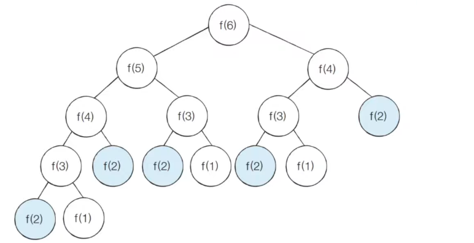
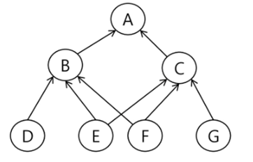
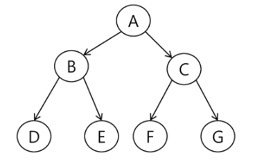

# 📚 <a style="color:#00adb5">ALGORITHM</a>

<center>

</center>
<br>

# 📚 <a style="color:#00adb5">DP ( Dynamic )</a>

## <a style="color:#00adb5">피보나치 수열</a> 이란 무엇인가 ?

- <a style="color:red"><strong>0 ( 0항 ) 과 1 ( 1항 )로 시작하고 이전의 두 수 합을 다음 항으로 하는 수열</strong></a>
- i 번째 피보나치 수열을 계산하는 방법<br>
F(i) = F(i-1) + F(i-2); 

- 재귀로 피보나치 수열 구하는 방법<br>
( 재귀는 함수, 메서드(정의)의 역할을 명확히 !! )<br>
```java
static void fibo(int n){
    if(n < 2) return n;

    else{
        return fibo(n-1)+ fibo(n-2);
    }
}
```

-> 큰 문제점이 있다.<br>
그것은 <a style="color:red"><strong>엄청난 중복 호출이 존재한다는 것이다.</strong></a><br>
피보나치 수열의 Call Tree ( 상태 공간 트리 )
<center>

</center>
<br>
이 사진은 수가 적어서 중복이 적어 보이지만 수가 크다면 중복의 빈도는 더 많아질 것이다.

->> 이 문제를 해결할 방법은 <a style="color:red"><strong>메모이제이션 </strong></a>!!


## <a style="color:#00adb5">메모이제이션 ( memoization )</a> 이란 무엇인가?

- 메모이제이션 ( memoization )은 컴퓨터 프로그램을 실행할 때 <a style="color:red"><strong>이전에 계산한 값을 메모리에 저장해서 매번 다시 계산하지 않도록 하여 전체적인 실행 속도를 빠르게 하는 기술</strong></a>이다. <a style="color:red"><strong>동적 계획법의 핵심이 되는 기술</strong></a>이다.

- 메모리제이션이 아니다 !! 기억하기 암기하기가 아니라 메모리에 넣기라고 생각하면 된다.

- 피보나치 수를 구하는 알고리즘에서 fibo1(n)의 값을 계산하자마자 저장하면 실행시간을 O(n)으로 줄일 수 있다.

- 메모이제이션로 피보나치 수열 구하는 방법<br>
```java
static int fibo1(int n){
    if(n >= 2 && memo[n] == 0){
        memo[n] = fibo[n-1] + fibo[n-2];
    }
    return memo[n];
}
```

- 고려해야할 점
    - 추가적인 메모리 공간이 필요하다
    - 재귀 함수 호출로 인한 시스템 호출 스택을 사용하게 되고 실행 속도 저하 또는 오버플로우가 발생할 수 있다.
    - <a style="color:red"><strong>순수함수 일 때만 메모이제이션을 사용할 수 있다.</strong></a>
        - 순수함수란 같은 값을 넣을 때 같은 값만을 출력하는 것 ( 넣을때마다 값이 변하면 안된다 )
    - 알고리즘 문제풀 때 dp 점화식으로 못풀겠는 경우 메모이제이션해도 풀리는 경우가 많다.
    - 일반 재귀 -> 재귀 ( 메모이제이션, 하향식 ) -> DP ( 메모이제이션, 상향식 ( 점화식, for ) ) -> 수학일반항


## <a style="color:#00adb5">동적 계획법 ( Dynamic Programming )</a> 이란 무엇인가?

- 동적계획법 ( Dynamic Programming ) 은 그리디 알고리즘과 같이 <a style="color:red"><strong>최적화 문제를 해결하는 알고리즘</strong></a>이다.

- 동적 계획법은 먼저 작은 부분 문제들의 해들을 구하고 이들을 이용하여 보다 큰 크기의 부분 문제들을 해결하여 최종적으로 원래 주어진 문제를 해결하는 알고리즘 설계 기법이다.

<br>

### <a style="color:#00adb5">동적 계획법 ( Dynamic Programming )</a> 이 가지고 있어야 하는 2가지 요건


- 중복 부분문제 구조 ( Overlapping subproblems)<br>
    - DP 는 <a style="color:red"><strong>큰 문제를 이루는 작은 문제들을 먼저 해결하고 작은 문제들의 최적 해를 이용하여 순환적으로 큰 문제를 해결</strong></a>한다. ( 순환적인 관계를 명시적으로 표현하기 위해 점화식을 사용한다. )
    - DP 는 문제의 순환적인 성질 때문에 이전에 계산되어졌던 작은 문제의 해가 다른 어딘가에서 필요하게 되는데 이를 위해 DP에서는 이미 해결된 작은 문제들의 해들을 어떤 저장 공간에 저장하게 된다. 그렇게 해서 중복된 계산을 피한다. ( 메모이제이션 )
        

- 최적 부분문제 구조 ( Optimal substructure )
    - DP가 최적화에 대한 모든 문제에 적용되는 것은 아니다. 주어진 문제가 최적화의 원칙을 만족해야만 동적 계획법을 효율적으로 사용할 수 있다.
    - <a style="color:red"><strong>최적화의 원칙이란 어떤 문제에 대한 해가 최적일 때 그 해를 구성하는 작은 문제들도 역시 최적이어야 한다는 것</strong></a>이다.
    - 최적화 원칙이 적용되지 않는 예 : 최장 경로 문제 ( DP 로 해결할 수 없다. )


### <a style="color:#00adb5">동적 계획법 ( Dynamic Programming )</a> 과 분할정복 비교

- DP
    - 부분 문제들이 연관이 없으면 적용 불가.
    - 모든 부분 문제를 한번만 계산하고 결과를 저장하여 사용한다.
    - 상향식 방법

<center>

</center>
<br>

- 분할정복
    - 연관 없는 부분 문제로 분할 한다.
    - 부분문제를 재귀적으로 해결한다.
    - 부분문제의 해를 결합한다.
    - 하향식 방법
    - 예 ) 병합 정렬, 퀵 정렬

<center>

</center>
<br>


### <a style="color:#00adb5">동적 계획법 ( Dynamic Programming )</a> 적용 접근 방법

1. 최적해 구조의 특성을 파악하라
    - 문제를 부분 문제로 나눈다.

2. 최적해의 값을 재귀적으로 정의하라
    - 부분 문제의 최적해 값에 기반하여 문제의 최적해 값을 정의한다.

3. 상향식 방법으로 최적해의 값을 계산하라
    - 가장 작은 부분 문제부터 해를 구한 뒤 테이블에 저장한다. ( 메모이제이션 )
    - 테이블에 저장되어 있는 부분 문제의 해를 이용하여 점차적으로 상위 부분 문제의 최적해를 구한다. ( 상향식 방법 )

<br>
<br>
<strong>피보나치 수 DP 적용</strong><br>

- 피보나치 수는 부분 문제의 답으로부터 본 문제의 답을 얻을 수 있으므로 최적 부분 구조로 이루어져 있다.<br>

1. 문제를 부분 문제로 분할한다.
2. 점화식으로 정의한다.
3. 가장 작은 부분 문제부터 해를 구한다. 결과는 테이블에 저장하고 테이블에 저장된 부분 문제의 해를 이용하여 상위 문제의 해를 구한다.
<br>
피보나치 DP 적용 알고리즘<br>

```java
    static int fibo_dp(int n){
        dp[0] = 0;
        dp[1] = 1;
        for(int i=2; i<N; i++){
            dp[i] = dp[i-1] + dp[i-2];
        }
        return dp[i];
    }
```
<br>
<strong>피보나치 수 구하기 - DP 알고리즘 분석</strong><br>

- DP 알고리즘이 수행속도가 더 빠르다
- 이유
    - 재귀 알고리즘과는 달리 중복 계산이 없다
    - 또한 반복문을 사용하기 때문에 함수 호출이 발생하지 않는다.

- 계산하는 항의 총 개수
    - n+1 개수의 항 계산
    - 즉 fibo[0] ~ fibo[n] 까지 단 한번씩만 계산


- 팁 : dp 0 1 2 3 까지 구해서 점화식 찾아서 구해서 ㄱ