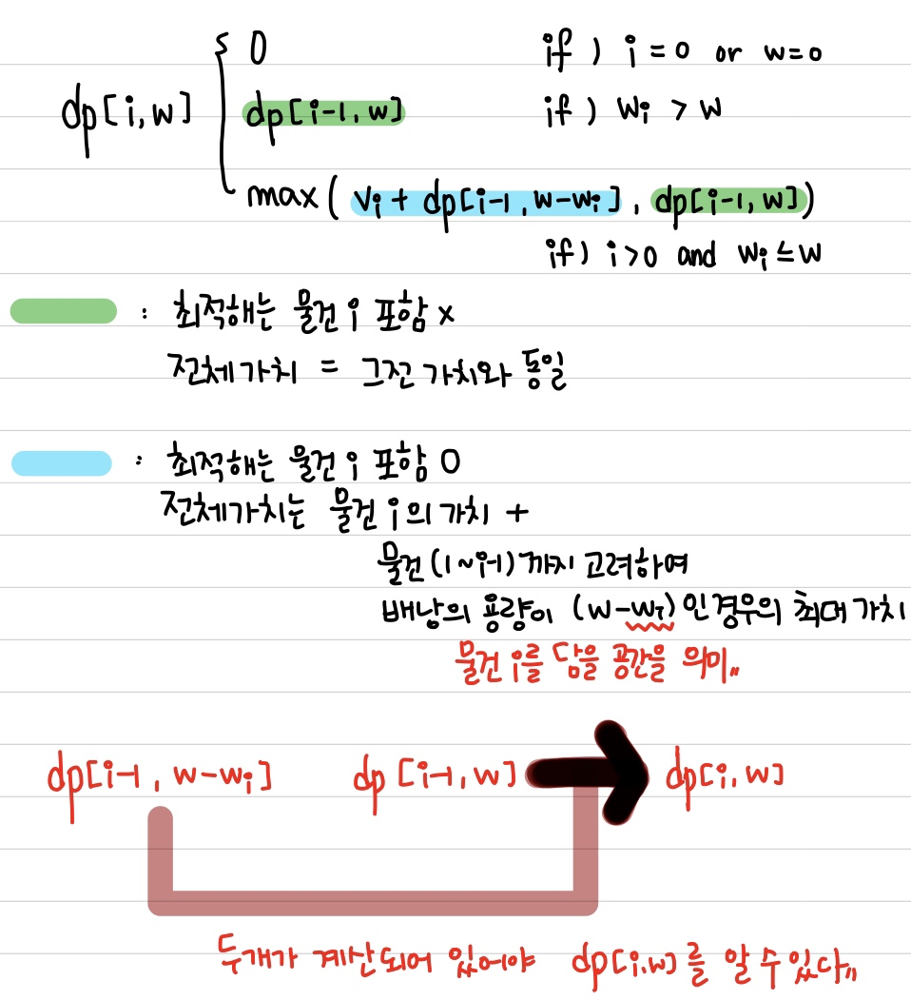
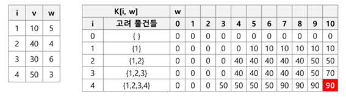
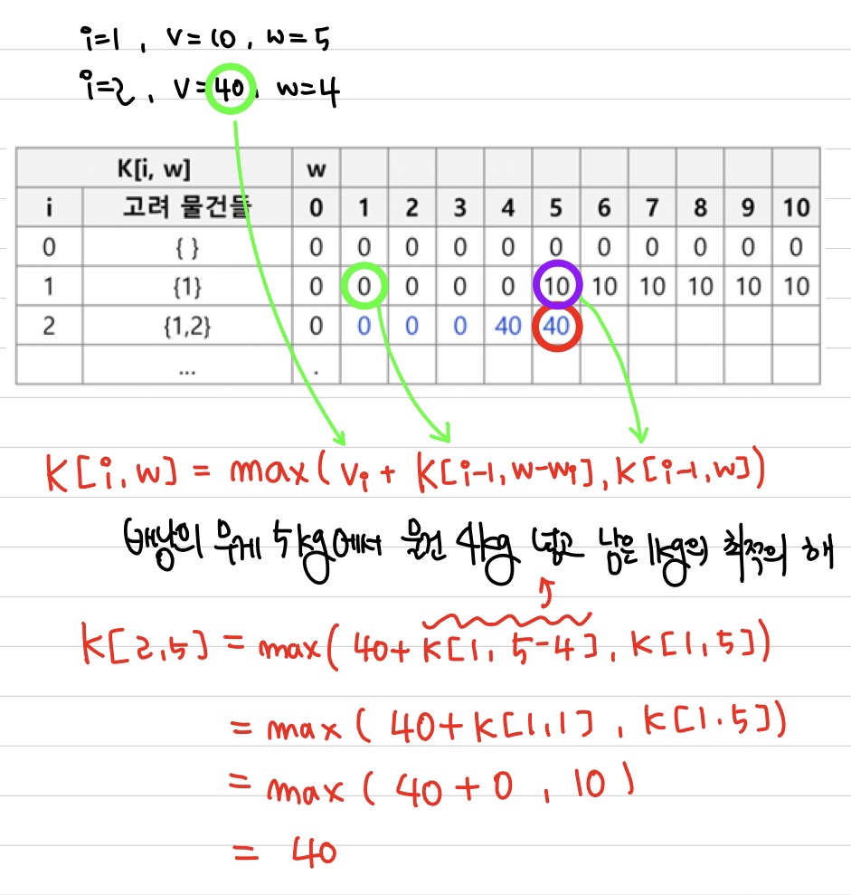
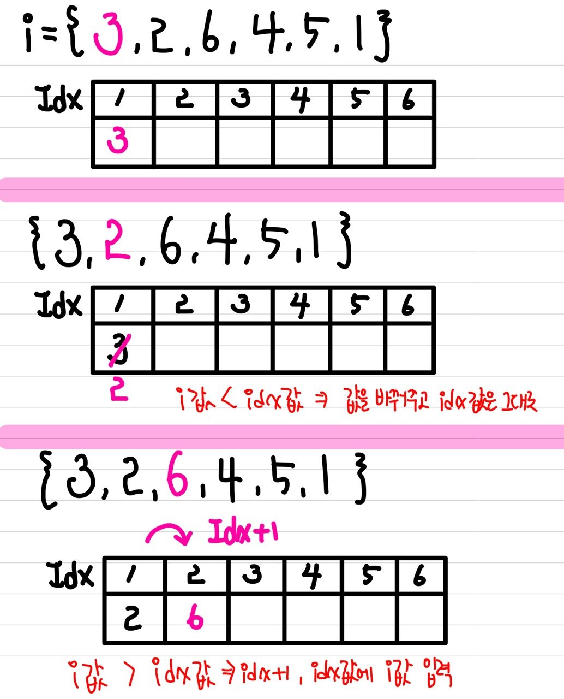
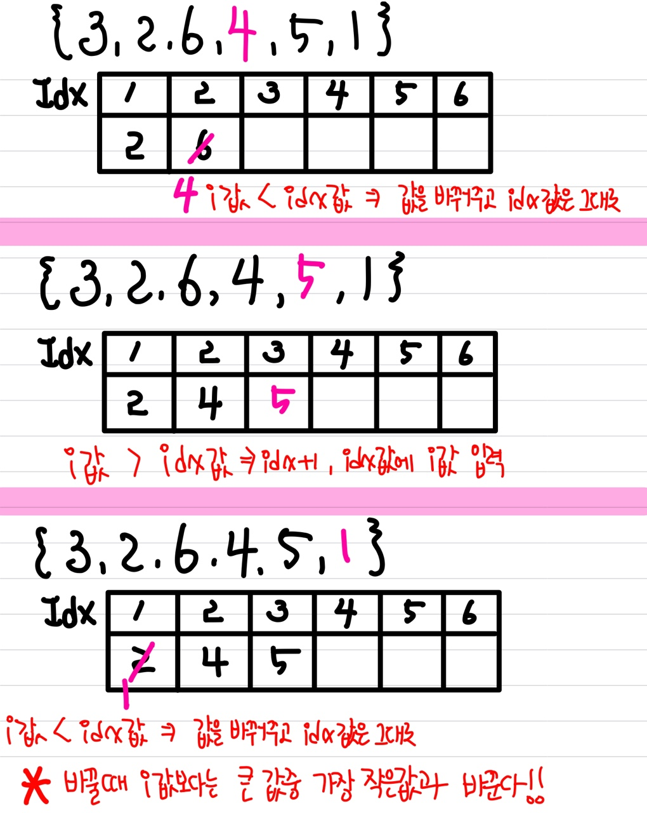

# 📚 <a style="color:#00adb5">ALGORITHM</a>

<center>

</center>
<br>

# 📚 <a style="color:#00adb5">DP ( Dynamic )</a>

## <a style="color:#00adb5">동적 계획법 ( Dynamic Programming )</a> 이란 무엇인가?

- 동적계획법 ( Dynamic Programming ) 은 그리디 알고리즘과 같이 <a style="color:red"><strong>최적화 문제를 해결하는 알고리즘</strong></a>이다.

- 동적 계획법은 먼저 작은 부분 문제들의 해들을 구하고 이들을 이용하여 보다 큰 크기의 부분 문제들을 해결하여 최종적으로 원래 주어진 문제를 해결하는 알고리즘 설계 기법이다.

## <a style="color:#00adb5">DP</a> 기본 - 동전 거스름 돈 구하기
동전의 종류가 1원, 4원, 6원이 있을 때 8원을 거슬려주려고 하면 최소 몇 개의 동전을 거슬려 주면 되나?<br>
라는 문제가 있다.<br>
이 문제를 그리디한 방법으로 푼다면 6원, 1원, 1원이라는 결과가 나올 것이다.<br>
그러나 최적의 방법은 4원, 4원이다.<br>
이 방법으로 풀기 위해서는 DP로 접근해야 한다.<br>
<br>

- <a style="color:red"><strong>상향식 접근으로 최적의 해를 부분적으로 구해가며 메모이제이션을 해 최적의 해를 계산해 나가는 방법</strong></a>이다.
- dp[n] = n원을 거슬러 줄 떄의 최적
- 기존 구해오던 값들이 다 최적의 해이기 때문에 최적의 해에서 + 1 만 해줘도 최적의 해가 나온다.

<br>
 
<center>

</center>
<br>


## <a style="color:#00adb5">DP</a> 기본 - 이항 계수 구하기
다음 수식의 ? 값은 ?<br>
(x + y)⁴ = x⁴ + 4x³y + ?x²y² + 4xy³ + y⁴<br>
(x + y)ⁿ 을 전개했을 때 n이 r 일때 x^r*y^(n-r)의 값은?<br>
<br>
먼저 여기서 알아야 하는 것은 이항 정리이다.<br>
이항 정리는 <a style="color:red"><strong>이항 다항식 x+y의 거듭제곱 (x+y)ⁿ 에 대해서 전개한 각 항의 계수값을 구하는 정리</strong></a>이다.<br>
구체적으로 x³y의 계수는 3개에서 1개를 고르는 조합의 가짓수인 ₃C₁ 이다.<br>
예를 들어 n이 2,3,4 일 때는 다음과 같다.<br>
(x + y)² = x² + 2xy + y²<br>
(x + y)³ = x³ + 3x²y + 3xy² + y³<br>
(x + y)⁴ = x⁴ + 4x³y + ?x²y² + 4xy³ + y⁴<br>
<br>
<br>
기본 이항계수 구하는 공식은 n개 중에 r번째 계수를 구하는 것은<br>
n! / r!(n-r)! 이다.<br>
그러나 팩토리얼 계산은 계산량이 많기 떄문에 조합 ( Combination )의 점화식을 이용한다.<br>
점화식은 <a style="color:red"><strong>nCr  = n-1 C r-1 + n-1 C r </strong></a>이다.<br>
만약 r = 0 이거나 r = n 이면 1을 반환한다.<br>
이 속성들을 가지고 dp로 구현하면 된다 !!<br>

<br>
 
<center>

</center>
<br>

## <a style="color:#00adb5">DP</a> 활용 - 0-1 Knapsack Problem
배낭 ( Knapsack ) 문제는 <a style="color:red"><strong>배낭의 용량이 W일 때 N개의 물건과 각 물건의 무게 W 와 가치 V가 주어지고 배낭에 담을 수 있는 물건의 최대 가치를 찾는 문제</strong></a>이다.<br>
냅색 문제에는 물건을 쪼갤 수 있어 무게나 가치가 소수점으로 나뉘는 문제와 0-1 Knapsack Problem 은 쪼개지지 않고 무게와 가치가 무조건 정수형태를 가지는 두 형태로 나뉜다. <br>
0-1 Knapsack Problem 에 대해 알아보자.<br>
물론 DP로 알아보자. ( Brute force나 다른 방법으로도 알아볼 수 있지만 시간 복잡도가 크기 때문에 DP가 좋은 방법일 것이다. )<br>
<br>

먼저 배낭 문제의 부분 문제를 찾기 위해 문제의 주어진 조건을 살펴보자. <br>
물건, 물건의 무게, 물건의 가치, 배낭의 용량 총 4가지 요소가 있다.<br>
이 중에서 물건과 물건의 무게는 부분 문제를 정의하는데 반드시 필요하다.<br>
왜냐하면 배낭이 비어 있는 상태에서 시작하여 물건을 하나씩 배낭에 담는 것과 안 담는 것을 현재 배낭에 들어있는 물건의 가치의 합에 근거하여 결정해야 하기 때문이다.<br>
또한 물건을 배낭에 담으려고 할 때 배낭 용량의 초과 여부를 검사해야한다.<br>
<br>

배낭 문제의 부분 문제를 정의해보자면<br>
- W = 배낭의 용량
- (v,w) = 가치, 무게
- dp[i, w] = 물건 1~i 까지만 고려하고, 배낭 용량이 w일 때의 최대 가치 (i = 1,2,3,..,n 이고 w = 1,2,3,..,W 이다.)
<br>

dp[i,w] 를 재귀적으로 정리하면<br>
첫 번째는 물건이 없거나 배낭의 무게가 0 인 경우이기 때문에 값이 0이다.<br>
두 번째는 물건을 넣었을 때 물건의 총 무게가 배낭의 무게를 넘어서 이번에 넣는 물건은 넣을 수 없는 경우이다. 그래서 전에 넣은 물건 무게의 최적 해를 넣는다.<br>
세 번째는 넣을 수 있는 경우이다. 그래서 (전에 넣은 물건 무게의 최적해)와 (이번에 물건을 넣고 남은 무게의 최적해의 합)을 비교해서 더 큰 값을 넣어준다.
<center>

</center>
<br>


### <a style="color:#00adb5"> 0-1 Knapsack Problem</a> 수행 과정
<strong>문제</strong><br>
배낭의 용량은 10KG 이고 각 물건의 무게와 가치는 다음과 같다.<br>
5KG / 10만원<br>
4KG / 40만원<br>
6KG / 30만원<br>
3KG / 50만원<br>
<br>
가장 높은 가격을 가질 수 있게 배낭에 물건들을 넣었다. 가장 높은 가격은 ?<br><br>

먼저 전체 과정을 진행하고 나서의 결과 표를 보여주고 설명을 하겠다.
<center>

</center>
<br>
먼저 index 는 i 라고 하고, v 는 물건의 가격, w 는 물건의 무게이다.<br>
배낭의 용량은 10이다.<br>
진행의 순서는 i 값 순서대로 진행을 한다.<br>
i 번째 값들을 순서대로 고려해주면서 총 10kg을 1kg씩 늘려가며 체크한다.<br>
만약 들어갈 수 있으면 그 물건의 가격을 넣어준다.<br>
그렇게 진행하면서 만약 여러 경우가 나올 시 더 큰 값을 넣어주면 된다.<br><br>

처음엔 아무것도 고려하지 않으면 다 0 이 된다.<br><br>

다음에 첫번째 물건 ( 5KG, 10만원 ) 을 각 무게에 넣어본다.<br>
5KG 이기 때문에 배낭의 무게가 5KG 전까지는 0 이고 그 후는 들어갈 수 있기 때문에 10만원이 표에 입력된다.<br>
그리고 배낭의 무게가 10kg일 때 가격이 10만원인 이유는 이 문제는 0-1 냅색 문제이기 때문이다. ( 1번 밖에 못들어감 )<br><br>

다음에는 두 번째 물건 ( 4KG, 40만원 ) 까지 같이 고려하여 각 무게에 넣어본다.<br>
이 때 배낭의 무게가 4KG가 되면 40만원이 들어가진다.<br>
그리고 !! 5KG일 때 이제 2가지 경우가 나오게 된다. 5KG 하나 넣는 것 ( 10만원 )과 4KG 하나 넣고 1KG는 빈 자리( 40만원 ) 인 경우가 나온다.<br>
이 때 가격은 40만원이 더 크기 때문에 4KG 하나 넣고 1KG이 빈자리인 40만원이 들어가게 된다.<br>
이 과정이 위에 있는 계산식이다.<br>
<center>

</center>
<br>
이 과정을 다 i = 4 인 값까지 다 반복하면 마지막에 있는 값이 가장 큰 가격을 가지는 배냥일 것이다.<br>
<br>
결국 부분 문제들의 최적의 값을 구해 그 값들을 메모이제이션하며 최종 값 까지 구해주는 것이다.<br>


## <a style="color:#00adb5">DP</a> 활용 - 최장 증가 수열
최장 증가 수열 ( Longest Increasing Subsequence ) 이란 <a style="color:red"><strong>어떤 수열이 왼쪽에서 오른쪽으로 나열돼 있으면, 그 배열 순서를 유지하면서 크기가 점진적으로 커지는 가장 긴 부분수열을 추출하는 문제</strong></a>이다.<br><br>
문제를 풀어보면서 알아가보자.<br>
<strong>문제</strong><br>
3, 2, 6, 4, 5, 1 이라는 수열이 있다. 이 배열의 순서를 유지하면서 크기가 점진적으로 커지는 가장 긴 부분수열의 길이는 ?<br>
<br>
먼저 완전 탐색 ( Brute-force ) 로도 풀 수는 있다. <br>
수열의 모든 부분 집합을 구해서 그 부분 집합이 증가 수열인지 판단하여 그 중 길이가 가장 긴 것을 구하면 된다.<br>
그러나 !! 시간 복잡도가 O(2ⁿ) 이다. <br>
수가 크면 기본적으로 문제에서 요구하는 시간 내에서는 못할 것이다. <br>
그래서 이 방법을 대신해 DP를 사용한다 !


### <a style="color:#00adb5"> 최장 증가 수열 ( LIS )</a> 수행 과정 - DP1
먼저 구조를 파악해보자.<br>

생각해야할 것은 <a style="color:red"><strong>i 원소를 끝으로 하는 최장증가수열 길이를 구하는 것이다.</strong></a><br><br>

입력은 숫자열이 들어온다. LIS[i]= 3, 2, 6, 4, 5, 1<br>

만약 <a style="color:red"><strong>LIS[i] 가 i번째 값을 포함한다면 i 보다 작은 j 값을 찾아야한다.</strong></a><br>
j 값을 알 수 없으므로 모두 검색해야한다. 그 중에서 최대값을 찾아 1을 증가시켜 LIS[i]에 저장한다.<br>
그리고 다 돌고나서 LIS[] 중에 최대값을 구한다.<br>
예를 들면 ) LIS[5] 는 2, 4, 5로 5를 포함한다. 그러면 5보다 작은 값 들 중에 최대값을 찾는다. 그 값은 4고 LIS[5] = LIS[4] + 1 가 된다.<br>
LIS[4] 는 2 이므로 LIS[5] 는 3이 된다.<br><br>

DP를 이용한 LIS 는 일차원 배열을 가지고 계산한다.<br>
그리고 중요한 것은 맨 뒤에 값이 최대값이 아니다.<br>
 <a style="color:red"><strong>LIS[]를 구한 것들 중에 최대값을 구해야한다.</strong></a><br>
예를 들면 ) 11 12 15 16 9 10 인 경우 LIS[5]에는 4가 들어가 있을 것이다. 그리고 10을 지나면 10이 9보다 크기 때문에 LIS[6] 은 5가 된다. 이 것은 잘못된 방식이다. LIS[5] 에는 1이 들어가고 LIS[6] 에는 2가 들어가는 게 맞다. <br>
그래서 맨 뒤에 LIS[] 값이 최대값이 아니고 LIS[] 값 들 중에서 최대값을 구해야한다.<br>


### <a style="color:#00adb5">실습해보즈아</a>
DP 로 구현한 것은 시간복잡도가 <a style="color:red"><strong>O(N²)</strong></a> 이다.


```java
public class ListDp {
	// input 배열
	static int[] arr = { 3, 2, 6, 4, 5, 1 };
	static int[] dp;
	static int res = 0;

	public static void main(String[] args) {
		// LIS() 값 저장 배열
		dp = new int[arr.length];

		LIS();
		System.out.println(res);

	}

	static void LIS() {
		for (int i = 0; i < dp.length; i++) {
			// 현재의 수만 수열에 넣었을 때 길이로 초기화 ( 자기자신 하나 )
			dp[i] = 1;
			// 자신의 앞쪽 값들 중 가장 긴 최장길이에 자신을 붙인다 ( +1 )
			for (int j = 0; j < i; j++) {
				if (arr[i] > arr[j] && dp[i] < dp[j] + 1) {
					// 최댓값 갱신
					dp[i] = dp[j] + 1;
				}
			}
		}
		// dp[] 중 최대값 구해서 res에 저장
		for (int i = 0; i < dp.length; i++) {
			res = Math.max(res, dp[i]);
		}
	}
}
```
<hr>
<strong>결과값</strong><br>
3


### <a style="color:#00adb5"> 최장 증가 수열 ( LIS )</a> 수행 과정 - 이진 검색 활용

입력은 숫자열이 들어온다. LIS[i]= 3, 2, 6, 4, 5, 1<br>
<br>
이진 검색을 활용한 LIS 길이 탐색도 일차원 배열( dp[N] )을 활용한다.<br>
그리고  <a style="color:red"><strong>저장할 위치 ( 변수 ) idx 와 수열을 순서대로 가져오는 i가 존재</strong></a>한다.<br>
2가지의 부분 경우들이 생긴다.<br>
하나는 idx 값 < i 값 인 것이고 하나는 idx 값 > i 값 인 것이다. 같다라는 경우는 무시한다.<br>
먼저 idx 값 > i 값인 경우는 idx 값에 i 값을 넣고 idx를 +1 해준다.<br>
다음 idx 값 < i 값인 경우는 idx 값을 i 값으로 바꾸고 idx는 그대로 유지한다. 여기서 i 값을 idx 값으로 바꿀 때 i 값은 idx 값 중에서 본인보다 큰 것중 가장 작은 값을 바꾼다. 예를 들면 i가 7일 때 idx에 6,8 이 존재하면 8을 7로 바꾼다.<br>
여기서 이진 검색이 활용된다. 만약 i 가 본인보다 큰 것중 가장 작은 값을 바꿀 때 완전 탐색을 이용한다면 시간 복잡도는 기존 DP1과 비슷할 것이다. 그러나 여기서 이진 검색을 활용하며 시간복잡도를 O(NlogN) 으로 해준다. 이 둘의 차이는 N의 수가 커지면 커질 수록 어마어마 하다.<br>
다음은 문제를 진행한 과정이다.<br>

<center>

</center>
<center>

</center>
<br>


### <a style="color:#00adb5">실습해보즈아</a>
이진 검색을 활용한 DP 로 구현한 것은 <a style="color:red"><strong>O(NlogN)</strong></a> 이다.
<br>

```java 
public class ListDp2 {
	// input 배열
	static int[] arr = { 3, 2, 6, 4, 5, 1 };
	static int[] dp;
	static int idx = 0;

	public static void main(String[] args) {
		// LIS() 값 저장 배열
		dp = new int[arr.length];

		LIS();
		
		// idx 가 0으로 시작해서 +1 해준다.
		System.out.println(idx+1);

	}

    // 최장 증가 수열
	static void LIS() {
		dp[0] = arr[0];
		for(int i=1; i<dp.length; i++) {
			// i 값이 idx 값보다 클 경우 -> 
			// idx + 1 하고 idx 값에 i 값 넣는다
			if(arr[i] > dp[idx]) {
				idx++;
				dp[idx] = arr[i];
			}
			// idx 값이 i 값보다 클 경우 -> 
			// idx 값은 그대로, i 값은 이진 검색을 통해 i 값보다 큰 값 중 가장 작은 값 자리에 넣는다.
			else {
				int lower = lower_bound(idx, arr[i]);
				dp[lower] = arr[i];
			}
		}
	}
	
	// 이진 검색
	static int lower_bound(int end, int n) {
		int start = 0;
		
		while(start < end) {
			int mid = (start + end) / 2;
			if(dp[mid] >= n) {
				end = mid;
			}else {
				start = mid + 1;
			}
		}
		
		return end;
	}
}
```
<hr>
<strong>결과값</strong><br>
3