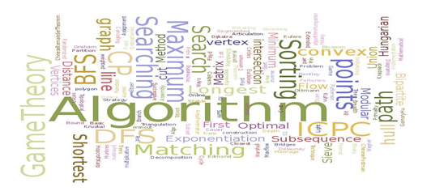

# 📚 <a style="color:#00adb5">ALGORITHM</a>

 

# 📚 <a style="color:#00adb5">DP ( Dynamic )</a>

## <a style="color:#00adb5">동적 계획법 ( Dynamic Programming )</a> 이란 무엇인가?

- 동적계획법 ( Dynamic Programming ) 은 그리디 알고리즘과 같이 <a style="color:red"><strong>최적화 문제를 해결하는 알고리즘</strong></a>이다.

- 동적 계획법은 먼저 작은 부분 문제들의 해들을 구하고 이들을 이용하여 보다 큰 크기의 부분 문제들을 해결하여 최종적으로 원래 주어진 문제를 해결하는 알고리즘 설계 기법이다.

## <a style="color:#00adb5">DP</a> 기본 - 동전 거스름 돈 구하기
동전의 종류가 1원, 4원, 6원이 있을 때 8원을 거슬려주려고 하면 최소 몇 개의 동전을 거슬려 주면 되나? 
라는 문제가 있다. 
이 문제를 그리디한 방법으로 푼다면 6원, 1원, 1원이라는 결과가 나올 것이다. 
그러나 최적의 방법은 4원, 4원이다. 
이 방법으로 풀기 위해서는 DP로 접근해야 한다. 
 

- 상향식 접근으로 최적의 해를 부분적으로 구해가며 메모이제이션을 해 최적의 해를 계산해 나가는 방법이다.
- dp[n] = n원을 거슬러 줄 떄의 최적

