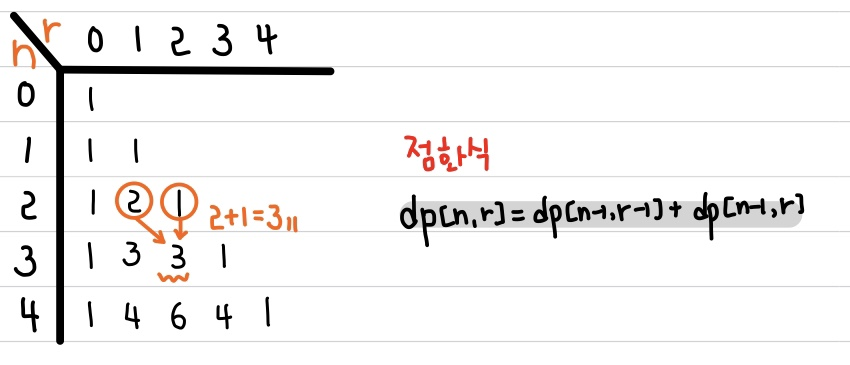

# 📚 <a style="color:#00adb5">ALGORITHM</a>

 

# 📚 <a style="color:#00adb5">DP ( Dynamic )</a>

## <a style="color:#00adb5">동적 계획법 ( Dynamic Programming )</a> 이란 무엇인가?

- 동적계획법 ( Dynamic Programming ) 은 그리디 알고리즘과 같이 <a style="color:red"><strong>최적화 문제를 해결하는 알고리즘</strong></a>이다.

- 동적 계획법은 먼저 작은 부분 문제들의 해들을 구하고 이들을 이용하여 보다 큰 크기의 부분 문제들을 해결하여 최종적으로 원래 주어진 문제를 해결하는 알고리즘 설계 기법이다.

## <a style="color:#00adb5">DP</a> 기본 - 동전 거스름 돈 구하기
동전의 종류가 1원, 4원, 6원이 있을 때 8원을 거슬려주려고 하면 최소 몇 개의 동전을 거슬려 주면 되나? 
라는 문제가 있다. 
이 문제를 그리디한 방법으로 푼다면 6원, 1원, 1원이라는 결과가 나올 것이다. 
그러나 최적의 방법은 4원, 4원이다. 
이 방법으로 풀기 위해서는 DP로 접근해야 한다. 
 

- <a style="color:red"><strong>상향식 접근으로 최적의 해를 부분적으로 구해가며 메모이제이션을 해 최적의 해를 계산해 나가는 방법</strong></a>이다.
- dp[n] = n원을 거슬러 줄 떄의 최적
- 기존 구해오던 값들이 다 최적의 해이기 때문에 최적의 해에서 + 1 만 해줘도 최적의 해가 나온다.

 
 

 

## <a style="color:#00adb5">DP</a> 기본 - 이항 계수 구하기
다음 수식의 ? 값은 ? 
(x + y)⁴ = x⁴ + 4x³y + ?x²y² + 4xy³ + y⁴ 
(x + y)ⁿ 을 전개했을 때 n이 r 일때 x^r*y^(n-r)의 값은? 
 
먼저 여기서 알아야 하는 것은 이항 정리이다. 
이항 정리는 <a style="color:red"><strong>이항 다항식 x+y의 거듭제곱 (x+y)ⁿ 에 대해서 전개한 각 항의 계수값을 구하는 정리</strong></a>이다. 
구체적으로 x³y의 계수는 3개에서 1개를 고르는 조합의 가짓수인 ₃C₁ 이다. 
예를 들어 n이 2,3,4 일 때는 다음과 같다. 
(x + y)² = x² + 2xy + y² 
(x + y)³ = x³ + 3x²y + 3xy² + y³ 
(x + y)⁴ = x⁴ + 4x³y + ?x²y² + 4xy³ + y⁴ 
 
 
기본 이항계수 구하는 공식은 n개 중에 r번째 계수를 구하는 것은 
n! / r!(n-r)! 이다. 
그러나 팩토리얼 계산은 계산량이 많기 떄문에 조합 ( Combination )의 점화식을 이용한다. 
점화식은 <a style="color:red"><strong>nCr  = n-1 C r-1 + n-1 C r </strong></a>이다. 
만약 r = 0 이거나 r = n 이면 1을 반환한다. 
이 속성들을 가지고 dp로 구현하면 된다 !! 

 
 

 

