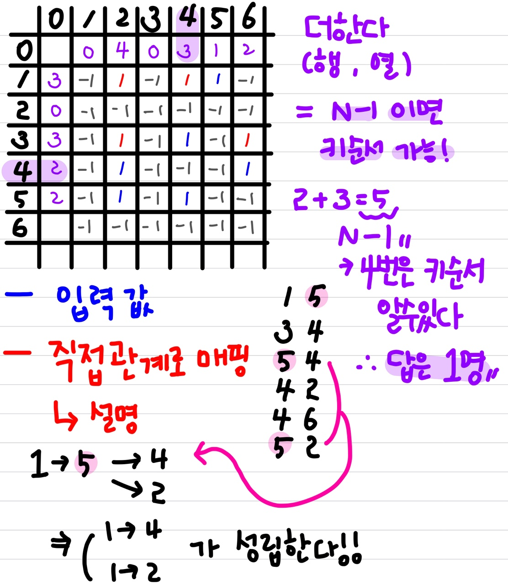

# 📚 <a style="color:#00adb5">ALGORITHM</a>

<center>

</center>
<br>

# 📁 <b><a style="color:#00adb5" href="https://swexpertacademy.com/main/code/problem/problemDetail.do?contestProbId=AWXQsLWKd5cDFAUo" target=_blank>[D4_5643] 키 순서</a></b>


## <a style="color:#00adb5">설명</a>
그래프 유형 문제의 여러 풀이법을 SWEA_D4_5643 키 순서 문제를 가지고 정리해 보았다.<br>
<br>
먼저 문제를 분석해보면 그림을 통해 그래프 유형 문제인 것을 알 수 있다.<br>
정점은 학생이고 간선은 키 관계이다. ( 가중치가 없고 방향성이 있다. 1->5와 5->1이 다른 의미이기 때문에 방향성이 있다. )
그래프 유형 문제는 표현을 정점 중심과 간선 중심으로 나눌 수 있는데 정점 중심은 인접행렬이나 인접리스트로 나타낼 수 있고 간선 중심은 간선리스트로 나타낼 수 있다.<br>
이 문제는 정점 중심, 인접행렬로 나타내 보겠다.
<br>
이 문제의 가장 주된 질문은 자신의 키 순서를 알 수 있는 학생은 몇명인가? 이다.<br>
이 것은 본인보다 키가 큰 친구수 + 본인보다 키가 작은 친구수 = N-1 이면 알 수있다.<br>
정점을 간선 따라 확인해가며 키가 큰 친구수 , 키가 작은 친구수를 여러가지 방법을 사용해 (bfs or dfs or 플로이드 워샬 .. )알아낸다.<br>
정점 중심의 시간 복잡도는 N * N * 4(int) = 약 1.000.000으로 해결된다.<br>
그리고 행렬을 입력 받을 때 자신보다 큰 아이들은 행으로 보고 자신보다 작은 아이들은 열로 본다.<br>
이렇게 지정하는 이유는 문제에서 1(a) 5(b) 가 입력되면 a학생이 b학생보다 키가 작은 것을 의미하기 때문이다.
 
## <a style="color:#00adb5">BFS 활용</a>
```java
package SWEA;

import java.io.BufferedReader;
import java.io.IOException;
import java.io.InputStreamReader;
import java.util.LinkedList;
import java.util.Queue;
import java.util.StringTokenizer;

public class SWEA_D4_5643_BFS {
	static int N;
	static int[][] adjMatrix;

	public static void main(String[] args) throws IOException {
		StringTokenizer st;
		BufferedReader br = new BufferedReader(new InputStreamReader(System.in));
		StringBuilder sb = new StringBuilder();

		int T = Integer.parseInt(br.readLine());

		for (int tc = 1; tc <= T; tc++) {
			sb.append("#").append(tc).append(" ");

			// 학생수
			N = Integer.parseInt(br.readLine());

			// 비교 횟수
			int M = Integer.parseInt(br.readLine());

			// 학생번호 1부터 시작하도록..
			// 인접행렬 : 0이면 키관계 모름 1이면 자신보다 키가 큰 학생과의 관계를 표현
			adjMatrix = new int[N + 1][N + 1];

			// 다 돌고나면 배열이 완성
			for (int i = 0; i < M; i++) {
				st = new StringTokenizer(br.readLine(), " ");
				int a = Integer.parseInt(st.nextToken());
				int b = Integer.parseInt(st.nextToken());
				// a보다 b가 크다
				adjMatrix[a][b] = 1;
			}

			// 자신의 키를 알 수 있는 학생 수
			int answer = 0;
			
			for(int i=1; i<=N; i++) {
				// 만약 N-1 학생들의 키를 알 수 있으면 자신의 키를 알 수 있는 학생이다. 그래서 ++
                // 본인보다 큰 친구들 + 본인보다 작은 친구들
				if(gtBfs(i, new boolean[N+1]) + ltBfs(i, new boolean[N+1]) == N-1) {
					answer++;
				}
			}
			
			
            // 출력
			sb.append(answer).append("\n");
		}
		System.out.println(sb);
	}

	// 자신보다 큰 학생 탐색
	static int gtBfs(int start, boolean[] visited) {
		// 카운트 ( 자신보다 큰 애가 몇명 있나 )
		int cnt = 0;
        // bfs Queue
		Queue<Integer> queue = new LinkedList<Integer>();
        // 방문 처리
		visited[start] = true;
        // 제일 처음 값을 넣어준다
		queue.offer(start);

        // 큐가 빌때까지 실행
		while (!queue.isEmpty()) {
            // 큐에서 하나를 빼서 현재 값으로 저장
			int cur = queue.poll();

			// 모든학생 들여다 보며 자신보다 키가 큰 학생 따라 탐색
			for (int i = 1; i <= N; i++) {
                // 자신보다 큰 학생은 행을 탐색 && 방문하지 않은 곳
				if (adjMatrix[cur][i] != 0 && !visited[i]) {
					cnt++;
					// 방문처리
					visited[i] = true;
					// 다시 넣어준다
					queue.offer(i);
				}
			}
        }
		return cnt;
	}

	// 자신보다 작은 학생 탐색
	static int ltBfs(int start, boolean[] visited) {
		// 카운트 ( 자신보다 작은 애가 몇명 있나 )
		int cnt = 0;
        // bfs Queue
		Queue<Integer> queue = new LinkedList<Integer>();
        // 방문 처리
		visited[start] = true;
        // 제일 처음 값을 넣어준다
		queue.offer(start);

        // 큐가 빌때까지 실행
		while (!queue.isEmpty()) {
            // 큐에서 하나를 빼서 현재 값으로 저장
			int cur = queue.poll();

			// 모든학생 들여다 보며 자신보다 키가 작은 학생 따라 탐색
			for (int i = 1; i <= N; i++) {
                // 자신보다 작은 학생은 열을 탐색 && 방문하지 않은 곳
				if (adjMatrix[i][cur] != 0 && !visited[i]) {
					cnt++;
					// 방문처리
					visited[i] = true;
					// 다시 넣어준다
					queue.offer(i);
				}
			}
		}
		return cnt;
	}
}
```

bfs를 이용하여 자신보다 큰 학생들 탐색하는 것 하나와 자신보다 작은 학생들 탐색하는 것 하나에서 카운팅을 한 뒤 <br>
마지막에 합쳐준 값이 N-1 이면 그 학생은 본인 키가 몇번째인지 아는 학생이다.
<br><br><br>

## <a style="color:#00adb5">DFS 활용 - 1 ( 가장 기본 )</a>
```java
package SWEA;

import java.io.BufferedReader;
import java.io.IOException;
import java.io.InputStreamReader;
import java.util.StringTokenizer;

public class SWEA_D4_5643_DFS {
	static int N;
	static int[][] adjMatrix;

	public static void main(String[] args) throws IOException {
		StringTokenizer st;
		BufferedReader br = new BufferedReader(new InputStreamReader(System.in));
		StringBuilder sb = new StringBuilder();

		int T = Integer.parseInt(br.readLine());

		for (int tc = 1; tc <= T; tc++) {
			sb.append("#").append(tc).append(" ");

			// 학생수
			N = Integer.parseInt(br.readLine());

			// 비교 횟수
			int M = Integer.parseInt(br.readLine());

			// 학생번호 1부터 시작하도록..
			// 인접행렬 : 0이면 키관계 모름 1이면 자신보다 키가 큰 학생과의 관계를 표현
			adjMatrix = new int[N + 1][N + 1];

			// 다돌고나면 배열이 완성
			for (int i = 0; i < M; i++) {
				st = new StringTokenizer(br.readLine(), " ");
				int a = Integer.parseInt(st.nextToken());
				int b = Integer.parseInt(st.nextToken());
				// a보다 b가 크다
				adjMatrix[a][b] = 1;
			}

			// 자신의 키를 알 수 있는 학생 수
			int answer = 0;
			
            // 모든 학생을 체크
			for(int i=1; i<=N; i++) {
				// 돌때마다 초기화
				gtCnt = 0;
				ltCnt = 0;
                // 자신보다 큰 학생
				gtDfs(i, new boolean[N+1]);
                // 자신보다 작은 학생
				ltDfs(i, new boolean[N+1]);
				
				// 만약 N-1 학생들의 키를 알 수 있으면 자신의 키를 알 수 있는 학생이다. 그래서 ++
				if(gtCnt + ltCnt == N-1) {
					answer++;
				}
			}
			
			sb.append(answer).append("\n");
		}
		System.out.println(sb);
	}
	
	static int gtCnt = 0, ltCnt = 0;

	// 자신보다 큰 학생 탐색
	static void gtDfs(int cur, boolean[] visited) {
		// 방문처리
		visited[cur] = true;

			// 모든학생 들여다 보며 자신보다 키가 큰 학생 따라 탐색
			for (int i = 1; i <= N; i++) {
				// 이게 기저조건 역할도 한다
				if (adjMatrix[cur][i] != 0 && !visited[i]) {
					gtCnt++;
					// 다시 넣어준다
					gtDfs(i, visited);
				}
			}
	}

	// 자신보다 작은 학생 탐색
	static void ltDfs(int cur, boolean[] visited) {
		// 방문처리
		visited[cur] = true;

			// 모든학생 들여다 보며 자신보다 키가 작은 학생 따라 탐색
			for (int i = 1; i <= N; i++) {
				// 이게 기저조건 역할도 한다
				if (adjMatrix[i][cur] != 0 && !visited[i]) {
					ltCnt++;
					// 다시 넣어준다
					ltDfs(i, visited);
				}
			}
	}
}
```
dfs을 이용하여 자신보다 큰 학생들 탐색하는 것 하나와 자신보다 작은 학생들 탐색하는 것 하나에서 카운팅을 한 뒤 <br>
마지막에 합쳐준 값이 N-1 이면 그 학생은 본인 키가 몇번째인지 아는 학생이다.
<br><br><br>


## <a style="color:#00adb5">DFS 활용 - 2 ( 하나의 dfs로 )</a>
```java
package SWEA;

import java.io.BufferedReader;
import java.io.IOException;
import java.io.InputStreamReader;
import java.util.StringTokenizer;

public class SWEA_D4_5643_DFS2 {
	static int N;
	static int[][] adjMatrix, radjMatrix;

	public static void main(String[] args) throws IOException {
		StringTokenizer st;
		BufferedReader br = new BufferedReader(new InputStreamReader(System.in));
		StringBuilder sb = new StringBuilder();

		int T = Integer.parseInt(br.readLine());

		for (int tc = 1; tc <= T; tc++) {
			sb.append("#").append(tc).append(" ");

			// 학생수
			N = Integer.parseInt(br.readLine());

			// 비교 횟수
			int M = Integer.parseInt(br.readLine());

			// 학생번호 1부터 시작하도록..
			// 인접행렬 : 0이면 키관계 모름 1이면 자신보다 키가 큰 학생과의 관계를 표현
            // 이것은 본인보다 큰 키를 관리하는 배열
			adjMatrix = new int[N + 1][N + 1];
            //  이것은 본인보다 작은 키를 관리하는 배열
			radjMatrix = new int[N + 1][N + 1];

			// 다돌고나면 배열이 완성
			for (int i = 0; i < M; i++) {
				st = new StringTokenizer(br.readLine(), " ");
				int a = Integer.parseInt(st.nextToken());
				int b = Integer.parseInt(st.nextToken());
				// a보다 b가 크다
				radjMatrix[b][a] = adjMatrix[a][b] = 1;
			}

			// 자신의 키를 알 수 있는 학생 수
			int answer = 0;
			
			for(int i=1; i<=N; i++) {
				cnt = 0;
				DFS(i, new boolean[N+1], adjMatrix);	// 나보다 큰애 탐색
				DFS(i, new boolean[N+1], radjMatrix);	// 나보다 작은애 탐색
				// 만약 N-1 학생들의 키를 알 수 있으면 자신의 키를 알 수 있는 학생이다. 그래서 ++
				if(cnt == N-1) {
					answer++;
				}
			}

			sb.append(answer).append("\n");
		}
		System.out.println(sb);
	}

	static int cnt = 0;

	// 하나의 dfs 문을 이용해서 배열 2개를 처리 ( 하나는 큰 애들, 하나는 작은 애들 )
	static void DFS(int cur, boolean[] visited, int[][] adjM) {
        // 방문처리
		visited[cur] = true;

		// 모든학생 들여다 보며 자신보다 키가 큰 학생 따라 탐색
		for (int i = 1; i <= N; i++) {
			if (adjMatrix[cur][i] != 0 && !visited[i]) {
				cnt++;
				DFS(i, visited, adjM);
			}
		}
	}
}
```

dfs을 이용하여 자신보다 큰 학생들 탐색하는 것 하나와 자신보다 작은 학생들 탐색하는 것 하나에서 카운팅을 한 뒤 <br>
마지막에 합쳐준 값이 N-1 이면 그 학생은 본인 키가 몇번째인지 아는 학생이다.<br>
이 풀이 과정은 기존에 dfs에서 큰 키를 가진 학생과 작은 키를 가진 학생을 다른 dfs메서드에서 처리해줬다면<br>
이번에는 같은 dfs에서 처리하고 배열을 하나 새로 만들어서 따로 관리해주었다.<br>
큰 키를 담당하는 배열이 adj[a][b] 라면 작은 키를 담당하는 배열은 adj[b][a] 이다.<br>
기존 풀이보다 한결 더 코드가 간단하다.
<br><br><br>


## <a style="color:#00adb5">DFS 활용 - 3 ( dfs + 메모이제이션 )</a>
```java
package SWEA;

import java.io.BufferedReader;
import java.io.IOException;
import java.io.InputStreamReader;
import java.util.StringTokenizer;

public class SWEA_D4_5643_DFS_Memo {
	static int N;
	static int[][] adjMatrix;

	public static void main(String[] args) throws IOException {
		StringTokenizer st;
		BufferedReader br = new BufferedReader(new InputStreamReader(System.in));
		StringBuilder sb = new StringBuilder();

		int T = Integer.parseInt(br.readLine());

		for (int tc = 1; tc <= T; tc++) {
			sb.append("#").append(tc).append(" ");

			// 학생수
			N = Integer.parseInt(br.readLine());

			// 비교 횟수
			int M = Integer.parseInt(br.readLine());

			// 학생번호 1부터 시작하도록..
			// 인접행렬 : 0이면 키관계 모름 1이면 자신보다 키가 큰 학생과의 관계를 표현
			adjMatrix = new int[N + 1][N + 1];

			// 탐색전인 것으로 초기화 ( 나보다 크거나 작은애들이 없는 경우 0이 나올 수 있기 때문에 구분하기 위해 -1로 초기화 해준다.)
			for (int i = 1; i <= N; i++) {
				adjMatrix[i][0] = -1;
			}

			// 다돌고나면 배열이 완성
			for (int i = 0; i < M; i++) {
				st = new StringTokenizer(br.readLine(), " ");
				int a = Integer.parseInt(st.nextToken());
				int b = Integer.parseInt(st.nextToken());
				// a보다 b가 크다
				adjMatrix[a][b] = 1;
			}

			
			for (int i = 1; i <= N; i++) {
				// 탐색전인 학생들만 탐색
				if (adjMatrix[i][0] == -1) {
					gtDfs(i);
				}
			}
			
			// 나보다 작은 학생수 카운팅
			for (int i = 1; i <= N; i++) {
				for (int j = 1; j <= N; j++) {
					adjMatrix[0][j] += adjMatrix[i][j];
				}
			}
			
			// 자신의 키를 알 수 있는 학생 수
			int answer = 0;
			
			// 총 합 구하기
			for (int i = 1; i <= N; i++) {
				if(adjMatrix[i][0] + adjMatrix[0][i] == N-1) {
					answer++;
				}
			}

			sb.append(answer).append("\n");
		}
		System.out.println(sb);
	}

	// 자신보다 큰 학생 탐색
	static void gtDfs(int cur) {
		
		for (int i = 1; i <= N; i++) {
            // 원리
            // i > j && j > z -> i > z

			// 나보다 큰 학생이면
			if (adjMatrix[cur][i] != 0) {

				// 탐색한 적 없다
				if (adjMatrix[i][0] == -1) {
					gtDfs(i);
				}

				// 나보다 큰 학생이 알고있는 다른 학생과의 키 관계를 나와의 직접 관계로 매핑
				// i 보다 큰 학생이 있다면 ( 0 인경우는 큰학생이 없는 경우다 )
				if (adjMatrix[i][0] > 0) {
					for (int j = 1; j <= N; j++) {
						// cur < i < j==> cur < j
						if(adjMatrix[i][j] == 1) {
							adjMatrix[cur][j] = 1;
						}
					}
				}

			}
		}
		
		// 기록 - 다 배열의 첫번째 ( 0 )에 더해둔다
		
		int cnt = 0;
		for (int i = 1; i <= N; i++) {
			cnt += adjMatrix[cur][i];
		}
		adjMatrix[cur][0] = cnt;
	}
}
```
<strong>첫번째 테스트케이스를 그림으로 설명</strong><br>
이 풀이는 좌표를 잘 봐야한다. 헷갈릴 수 있음
<center>

</center>
<br><br><br>

## <a style="color:#00adb5">DFS 활용 - 4 ( 플로이드 와샬 )</a>
```java
package SWEA;

import java.io.BufferedReader;
import java.io.IOException;
import java.io.InputStreamReader;
import java.util.StringTokenizer;

public class SWEA_D4_5643_DFS_Floyd {
	static int N;
	static int[][] adjMatrix;

	public static void main(String[] args) throws IOException {
		StringTokenizer st;
		BufferedReader br = new BufferedReader(new InputStreamReader(System.in));
		StringBuilder sb = new StringBuilder();

		int T = Integer.parseInt(br.readLine());

		for (int tc = 1; tc <= T; tc++) {
			sb.append("#").append(tc).append(" ");

			// 학생수
			N = Integer.parseInt(br.readLine());

			// 비교 횟수
			int M = Integer.parseInt(br.readLine());

			// 학생번호 1부터 시작하도록..
			// 인접행렬 : 0이면 키관계 모름 1이면 자신보다 키가 큰 학생과의 관계를 표현
			adjMatrix = new int[N + 1][N + 1];

			// 다돌고나면 배열이 완성
			for (int i = 0; i < M; i++) {
				st = new StringTokenizer(br.readLine(), " ");
				int a = Integer.parseInt(st.nextToken());
				int b = Integer.parseInt(st.nextToken());
				// a보다 b가 크다
				adjMatrix[a][b] = 1;
			} // 입력처리
			
			// 모든 쌍의 관계를 파악
			// 경출도
			for (int i = 1; i <= N; i++) {	// 경유 학생 : 고정
				for (int j = 1; j <= N; j++) {	// 출발 학생 ( 자신과 다른 학생과의 관계를 알고 싶은 학생 )
					// 나 자신으로 도는 것은 의미가 없다
					if( i == j ) continue;
					
					for (int z = 1; z <= N; z++) {	// 도착 학생 ( 다른 학생 )
                        // i -> j && j -> z => i -> z 이용
						if(adjMatrix[i][j] == 1 && adjMatrix[i][z]==1 ) {
							adjMatrix[j][z] = 1;
						}
					}
					
				}
			}
			
			// 알 수 있는 모든 쌍의 관계가 반영되어 있다.
			
			// 자신보다 작은 학생수 카운트
			for(int i=1; i<=N; i++) {
				for(int j=1; j<=N;j++) {
					adjMatrix[i][0] += adjMatrix[i][j];
					adjMatrix[0][j] += adjMatrix[i][j];
				}
			}
			
			// 자신의 키를 알 수 있는 학생 수
			int answer = 0;
			
			// 총 합 구하기
			for (int i = 1; i <= N; i++) {
				if(adjMatrix[i][0] + adjMatrix[0][i] == N-1) {
					answer++;
				}
			}

			sb.append(answer).append("\n");
		}
		System.out.println(sb);
	}
}
```
이 해결법은 플로이드 와샬 알고리즘을 사용하였다.<br>
출발지, 경유지, 도착지을 이용해서 경유지는 고정시켜두고 출발지와 도착지를 for문을 통해 확인했다.<br>
그리고 메모이제이션에서 썻던 방법과 같은 방법으로 i -> j && j -> z => i -> z  직접 관계로 매핑하였다.<br>
중요한 것은 출발지와 경유지가 같거나 경유지와 도착지가 같으면 경유를 하지 않는 것으으로 출발지 도착지 의미가 사라진다.<br>
플로이드 와샬 알고리즘을 이용하면 가장 코드가 심플해진다.