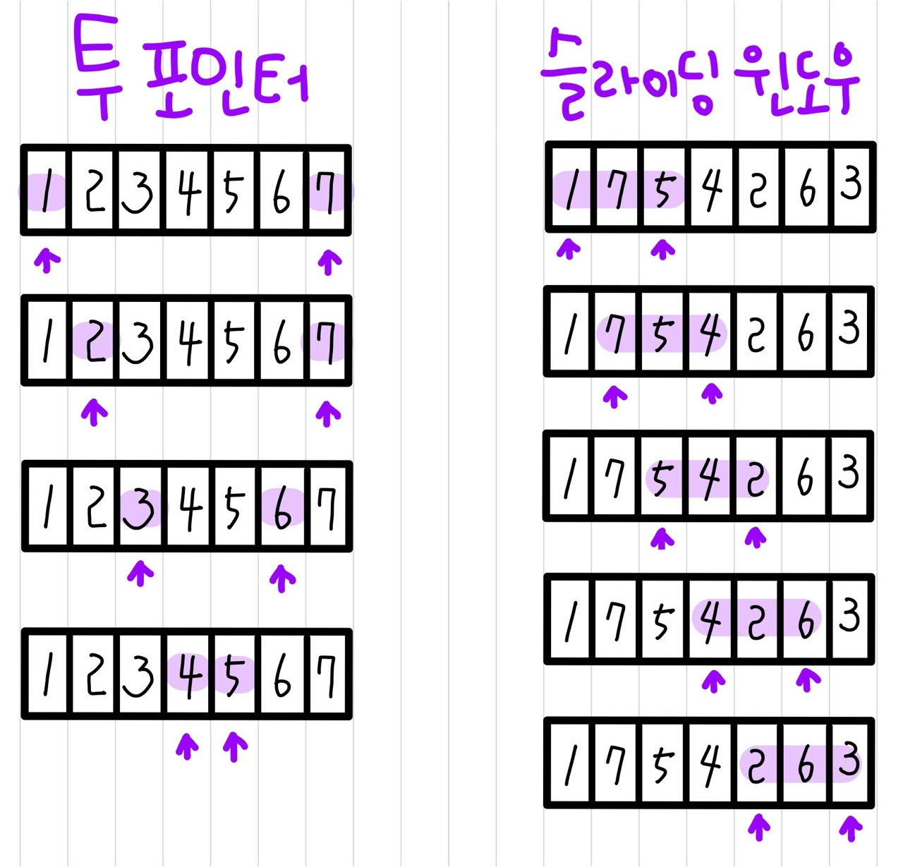

# 📚 <a style="color:#00adb5">ALGORITHM</a>

<center>

</center>
<br>

# 📚 <a style="color:#00adb5">슬라이딩 윈도우 ( Sliding Window )</a>

## <a style="color:#00adb5">슬라이딩 윈도우</a> 란?
슬라이딩 윈도우란 <a style="color:red"><strong>고정 사이즈의 윈도우가 이동하면서 윈도우 내에 있는 데이터를 이용해 문제를 풀이하는 알고리즘</strong></a>을 말한다.<br>
배열이나 리스트 요소의 일정 범위 값을 비교할 때 사용하면 매우 유용하다.<br>
원래 네트워크에서 사용되던 알고리즘을 문제풀이에 응용한 경우이다.<br>
<br>
<a style="color:red"><strong>투 포인터</strong></a>와 비슷한데, 일반적으로 고정 사이즈 윈도우를 사용하는 경우를 슬라이딩 윈도우라 구분하기도 한다. 그리고 투 포인터는 정렬된 배열을 대상으로 하는데 슬라이딩 윈도우는 관계없이 활용된다.

<center>

</center>
<br>
<br>

## <a style="color:#00adb5">슬라이딩 윈도우</a> 예시 문제

📁 <b><a style="color:#00adb5" href="http://jungol.co.kr/bbs/board.php?bo_table=pbank&code=2577&sca=99" target=_blank>[JUNGOL_2577] 회전 초밥</a></b><br>
이 문제의 풀이를 통해 예시를 보여주겠다.<br>

```java
import java.io.BufferedReader;
import java.io.IOException;
import java.io.InputStreamReader;
import java.util.Arrays;
import java.util.LinkedList;
import java.util.Queue;
import java.util.StringTokenizer;

public class main{
	static StringTokenizer st;
	static int N, d, k, c;
	static int answer = Integer.MIN_VALUE;

	public static void main(String[] args) throws IOException {
		BufferedReader br = new BufferedReader(new InputStreamReader(System.in));

		st = new StringTokenizer(br.readLine(), " ");
		// 접시 수
		N = Integer.parseInt(st.nextToken());
		// 초밥의 가짓수
		d = Integer.parseInt(st.nextToken());
		// 연속해서 먹는 접시의 수
		k = Integer.parseInt(st.nextToken());
		// 쿠폰 번호
		c = Integer.parseInt(st.nextToken());

		// N+k 인 이유는 원형이기 때문
		int[] arr = new int[N+k];
		// 먹은 초밥 배열
		int[] check = new int[d+1];

		// 초밥 입력받기
		for (int i = 0; i < N; i++) {
			arr[i] = Integer.parseInt(br.readLine());
		}
		
		// 뒤에 더 추가 ( 원형이기 때문에 )
		for(int i=N; i<N+k; i++) {
			arr[i] = arr[i-N];
		}
		
		int ans = -1;
		// 쿠폰에 해당되는 초밥 접시의 개수
		int cnt = 0;
		int coupon = 0;	
				
		// 슬라이딩 윈도우 사용
		for(int i=0; i<N+k; i++) {
			// 접시 k개를 선택한 상태에서 다음 선택으로 넘어갔을때
			if(i>=k) {
				// 맨 뒤 접시빼기
				if(--check[arr[i-k]] == 0) cnt--;
				if(arr[i-k] == c) coupon--;
			}
			
			// 현재 접시 추가
			if(++check[arr[i]] == 1) cnt++;
			if(arr[i] == c) coupon++;
			if(i>=k)
				ans = Math.max(ans, coupon == 0 ? cnt+1 : cnt);
		}
		System.out.println(ans);
	}
}
```
<br>
문제는 크게 어렵지 않다.<br>
쿠폰이 있는데 만약 쿠폰번호가 적힌 초밥을 포함해서 연속으로 k 개 먹으면 총 k개 초밥을 먹을 수 있는 것이고<br>
쿠폰번호가 적힌 초밥을 제외하고 연속으로 k개 먹으면 총 k+1개 초밥을 먹을 수 있는 것이다.<br>
물론 연속으로 안먹는 경우도 있다. 그러나 그런 경우에는 쿠폰에 있는 초밥을 못먹기 때문에 최대값을 구해야하는 입장으로서 고려하지 않아도 될 사항이다.<br>
여기서 중요한 것은 만약 같은 번호의 초밥이 2개이상 한 그룹에 있는 것이다.<br>
그 때 초밥 개수 카운팅을 어떻게 해줘야하지 고민하다가 아예 포함하지 않았다. 넣어주지도 않았고 카운팅해주지도 않았다.<br>
약간 빈자리 같은 느낌으로 ? 사실 연산에는 다 포함 되어 있지만 겉으로보면 포함되어 있지 않은 느낌이다.<br>
기존 초밥 배열과 먹은 초밥 배열을 나누고 전위연산자를 사용하여 좀 더 코드를 간단히 하였다.<br>
이 풀이에서 슬라이딩 윈도우를 사용하였는데 주석에 달린 것 처럼 선택하는 index가 k개 이상이 되었을 때 맨 뒤 접시 하나를 빼주고 현재 접시를 더해주었다. <br>
굳이 int 배열이 아니더라도 queue 나 다른 방법으로 해도 상관이 없을 것 같다.<br>
오히려 가독성이 더 좋을 수도.. 전위 연산자, 후위 연산자를 사용하여 가독성이 좋지 않지만 시간은 확실히 빠른 것 같다.
