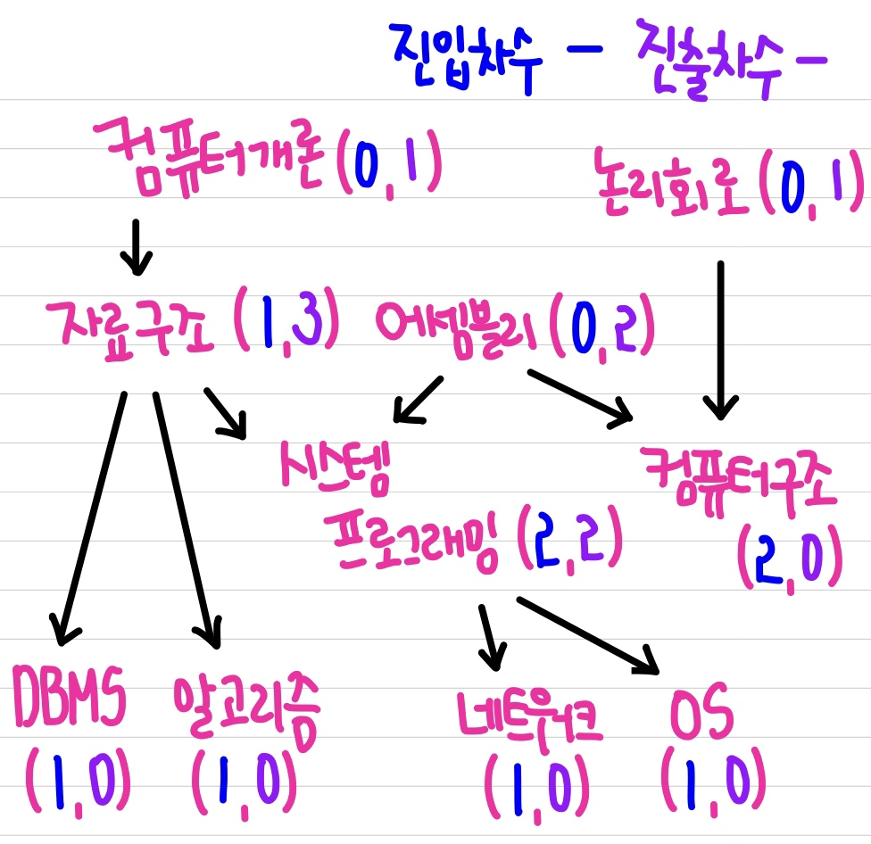

# 📚 <a style="color:#00adb5">ALGORITHM</a>

<center>

</center>
<br>

# 📚 <a style="color:#00adb5">위상 정렬 ( Topological sort )</a>

## <a style="color:#00adb5">위상 정렬</a> 이란?
<a style="color:red"><strong>어떤 일들에 순서가 정해져 있을 때 순서에 맞게 나열하는 행위</strong></a>이다.<br>
즉, 방향 그래프에 존재하는 각 정점들의 선행 순서를 위배하지 않으면서 모든 정점을 나열하는 것이다.<br><br>

예시를 통해 이해를 도와보겠다.<br>
<center>

</center>
<br>
다음은 10 과목이 있다.<br>
여기서 DBMS 를 들으려면 <strong>컴퓨터개론 -> 자료구조 -> DBMS</strong> 순으로 과목을 들어야한다.<br>
다른 순서로는 학습을 할 수 없다.<br>
<br>
이런 경우가 순서가 정해져있는 경우이며 순서들을 지키고 모든 정점을 나열하는 것이 위상 정렬이다.<br>
그리고 진입차수와 진출차수의 개념을 알아야한다.
- 진입 차수 (Indegree) : 특정한 노드로 들어오는 간선의 개수
- 진출 차수 (Outdegree) : 특정한 노드로 나가는 간선의 개수
예시에 진입차수는 파란색, 진출차수는 보라색으로 각 정점마다 표현해두었다.

## <a style="color:#00adb5">위상 정렬</a> 특징
- 방향 그래프, 진입 차수, 진출 차수가 있다. ( 진입 차수가 중요하다. )
- 하나의 방향 그래프에는 여러 위상 정렬이 가능하다.
- 위상 정렬에서 가장 먼저 들어와야 하는 놈은 진입 차수가 0 인 정점이다.
- 위상 정렬 과정에서 그래프에 남아 있는 정점 중에 진입 차수가 0 인 정점이 없다면 위상 정렬 알고리즘은 중단 된다.
- <a style="color:red"><strong>사이클이 있을 때는 위상 정렬을 할 수 없다 !</strong></a>


## <a style="color:#00adb5">위상 정렬</a> 과정
처음에 큐에 진입차수가 0 인 것을 다 삽입한다.
1. 진입사수가 0인 정점과 이와 연결된 모든 간선을 지운다. ( 선행 처리 )
2. 남아있는 정점의 진입차수를 갱신한다. ( 1씩 감소 )
3. 그래프에 모든 정점이 없어질 때 까지 반복한다.

## <a style="color:#00adb5">위상 정렬</a> 예시
여러 문제들이 있다.<br>
BOJ 2252 줄세우기<br>
BOJ 2623 음악프로그램<br>
BOJ 1948 임계경로<br>
<br>
이 중에 <a href="https://www.acmicpc.net/problem/2252">줄 세우기</a> 풀이를 적어보겠다.<br>

```java
import java.util.ArrayList;
import java.util.LinkedList;
import java.util.Queue;
import java.util.Scanner;

public class main {
	static int N; // 정점의 갯수
	static int M; // 간선의 갯수
	static ArrayList<Integer>[] list;

	public static void main(String[] args) {
		Scanner sc = new Scanner(System.in);
		N = sc.nextInt();
		M = sc.nextInt();

		// 인접리스트
		list = new ArrayList[N + 1];
		for (int i = 0; i <= N; i++) {
			list[i] = new ArrayList<Integer>();
		}

		// 위상정렬
		// 1. 진입차수를 관리할 1차원 배열이 필요하다(정점의 개수만큼)
		int[] inD = new int[N + 1]; // 초기값 0
		// 입력
		int x, y;
		for (int i = 0; i < M; i++) {
			x = sc.nextInt();
			y = sc.nextInt();
			list[x].add(y);
		// 2. 입력받은면수 진입차수 배열에 진입차수를 누적한다.    
			inD[y]++;
		}

		// 3. 큐에 진입차수가 0인 것을 모두 삽입한다.
		Queue<Integer> q = new LinkedList<Integer>();
		for (int i = 1; i <= N; i++) {
			if (inD[i] == 0) {
				q.offer(i);
			}
		}
		// 큐 사이즈가 0이면 위상정렬불가
		if (q.size() == 0) {
			return;
		}

		// 4. 큐사이즈가 빌때까지 자신과 연결된 정점의 진입차수를 1씩 감소한다.
		// 감소된 진입차수가 0인 정점은 큐에 삽입한다.

		ArrayList<Integer> res = new ArrayList<Integer>();
		Integer cur = -1;
		while (!q.isEmpty()) {
			cur = q.poll();
			// 자신의 할 일 구현
			res.add(cur);
			//자신과 연결된 정점의 진입차수를 1씩 감소한다.
			for (int i = 0; i < list[cur].size(); i++) {
				int idx = list[cur].get(i);
				inD[idx]--;
				//감소된 진입차수가 0인 정점은 큐에 삽입한다.
				if (inD[idx] == 0) {
					q.offer(idx);
				}
			}
		}

		//사이클 존재여부판단
		if (res.size() != N) {
			return;
		}

		for (int idx : res) {
			System.out.print(idx + " ");
		}
		System.out.println();
	}
}
```


<br><br><br><br>
👏 참조<br>
<a href="https://velog.io/@kimdukbae/%EC%9C%84%EC%83%81-%EC%A0%95%EB%A0%AC-Topological-Sorting" target=_blank>https://velog.io/@kimdukbae/%EC%9C%84%EC%83%81-%EC%A0%95%EB%A0%AC-Topological-Sorting</a><br>