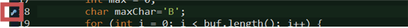
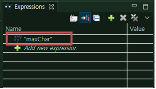
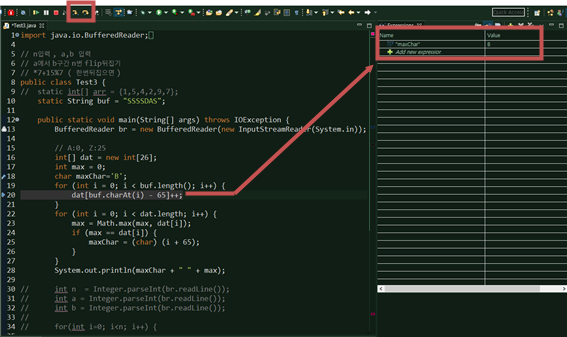

# 📚 <a style="color:#00adb5">ALGORITHM</a>

 

# 📚 <a style="color:#00adb5">ALGORITHM STUDY</a>

이번에 JOB FAIR 기간에 <big>최인호</big> 강사님 께서 강의 해주신 <big>코딩 테스트를 위한 설계와 디버깅 방법</big>을 정리해보고자 한다. 
방향을 확실히 잡지 못하던 나에게는 큰 도움이 되었던 강의였다.

## <a style="color:#00adb5">코테 대비 중요한 알고리즘</a>

1. 재귀 호출 기본 ( 백트래킹 )
2. DFS, BFS ( 그래프 탐색 )
3. Binary Search ( Parametric 포함 -> 주어진 범위 )
4. Heap ( P.Q )
5. Dijkstra ( P.Q )
6. 플로이드 와샬
7. 그리디
8. UNION-Find + MST
9. Sliding Window
10. Hash
11. 플러드 필

- 부분합 , Trie, DP, Segment Tree

## <a style="color:#00adb5">알고리즘을 잘하기 위한 준비</a>

### <a style="color:#00adb5">능숙함을 목표로</a>

같은 문제를 풀었다고 하더라도 개인별로 들인 노력은 다르다. 
쉬운 문제들은 다 풀지 몰라도 문제가 어려워지면 어려워질수록 차이가 나기 마련이다. 
<a style="color:red"><strong>기초적인 문제들을 능숙하게 푸는 것을 목표로 기초를 다져가야 한다 !!</strong></a>  

<big>추천</big> 
아직 삼성 코테 A형 문제를 시간내에 풀지 못한다면

- 정보올림피아드 알고리즘 문제에 Language_Coder부터 쉽더라도 빠르게 푸는 연습을 해라 !!
  - 기간을 잡고 다 풀기 ( 3일안에 이 문제들을 다 푼다 ! ) , 점점 Beginner_Coder 등 더 풀기
- 매일 쉬운 문제 두 문제씩
  - 난이도가 쉽던 어렵던 매일 두 문제씩 풀자 !
  - 컨디션이 좋으면 더 풀기 !!

### <a style="color:#00adb5">마인드 컨트롤</a>

무엇이든 <a style="color:red"><strong>마인드 컨트롤</strong></a>이 중요하다 ! 
어디에나 시험이 끝나고 커뮤니티나 오카방에 '너무 쉬웠다.' , '이거 변별력이 없겠는데요?' 등 이런 <big>헛!소리</big>들을 많이한다. 
물론 헛소리가 아닐 수도 있다. 그러나 나에게 도움되는 말은 <big>하나도</big> 없다 ! 
그 말을 듣고 내 시험 성적이 달라지는 것도 아니고 스트레스만 더 받을 뿐이다. 
그런 말에 휘둘리지말고 전체적인 시험 동향만 파악하고 <a style="color:red"><strong>본인의 공부를 계속적</strong></a>으로 하면 된다. 
진정한 고수는 티내지 않는 법이다..   

그리고 <big>시험치러 갔을 때</big>도 마인드 컨트롤이 중요하다. 
이제 슬슬 비대면이 되어서 코테를 보러가는 경우도 많을 것이다. 
그럴 때마다 주변의 타자소리에 본인의 마음이 급해지는 경우가 아주 많다고 한다. 
그러면 자동으로 준비가 덜 된상태에서 코딩을 하게되고 자연스레 말리게 된다.. 
이런 부분을 방지하기 위해 이제 말해줄 <a style="color:red"><strong>문제풀기 전 항상 설계 !</strong></a> 를 많이 연습해서 몸에 익히고 가야한다 !! 

### <a style="color:#00adb5">문제풀기 전 항상 설계</a>

설계 ! 계획 ! 
문제 풀기 전 <a style="color:red"><strong>계획은 습관이 되어있어야 한다.</strong></a> 
여기서 계획이란 무엇인가 .. 말 그대로 문제를 풀기 위해 내가 어떻게 풀 것인지, 어떤 것이 필요한지, 주의사항 등 여러가지를 고려해서 전체적인 문제 풀이 흐름을 계획하는 것이다. 
이것은 오류 발생률도 굉장히 줄여주고 풀면서 헷갈리는 경우도 잘 잡아준다고 한다.  

먼저 <a style="color:red"><strong>A4와 펜</strong></a>을 준비한다. 글로만 하는 것이 아니라 그림으로도 그려봐야 한다.  

그리고 <a style="color:red"><strong>계획 재료를 나열</strong></a>한다.  
배열은 어떤 것 쓸 것이며, 크기는 , 변수는 어떤 것을 쓰고 for문은 몇중for문 등등 을 순서대로 적는다.  

그리고 <a style="color:red"><strong>계N 값을 확인</strong></a>한다 ! 
N값은 보통 문제에서 강한 힌트 역할을 한다. 
예를 들면 'N의 범위는 2 부터 100000까지 이다.' 라고 한다면 여기서 알 수 있는 것은 100000² 은 10000000000 이므로 이중for문을 사용하지 못한다. 이것이 강한 힌트이다. 
이렇게 된다면 만약 위에 계획했던 것에서 이중for문을 사용할 일이 있었다면 고치면 된다. 
그러나 이렇게 확인을 안하고 구현을 다했을 경우 시간낭비를 할 수 있다. 
참고로 계산방법은 <a style="color:red"><strong>1초가 1억번 반복횟수</strong></a>를 뜻한다.  

그리고 또 N값을 확인할 때 팁은 <big>N이 유독 작거나 깔끔하게 떨어지는 단위 ( 50, 100, 1000 .. ) 가 아니고 수상한 단위 ( 7, 13 .. )</big> 이면 <a style="color:red"><strong>완전탐색</strong></a>일 가능성이 아주 높다! 이럴 경우 가지치기를 많이 해야 한다.  

그리고 <a style="color:red"><strong>최소비용</strong></a>을 구할 때 가중치가 동일하면 BFS, 가중치가 다르면 다익스트라이다.. 이것은 그냥.. 한 번더 정리해봤다 ㅎㅎ

### <a style="color:#00adb5">디버깅은 Trace</a>

<a style="color:red"><strong>디버깅</strong></a>은 부분부분Test 하는 것이 베스트이다. 
어느부분 짜고 Test, 어느부분 짜고 Test, .. 그래야 나중에 오류가 떴을 때 빠르게 디버깅 할 수 있다.  

디버깅에는 크게 3가지 방법이 있다.

- 호크아이

  - 말 그대로 유심히 잘 쳐다보기..ㅋ

- <a style="color:red"><strong>Trace ( BreakPoint )</strong></a>

  - IDE 에 있는 BreakPoint를 활용해서 디버깅 ( 슬로우 비디오로 확인 )
  - 가장 추천 !!! 못한다면 연습해라 ( 주력으로 해라 )
  - 실무에서 디버깅할 때 많은 도움이 된다. ( 방법이 )

- Log ( 출력 print )
  - 확인하고 싶은 부분에 print를 찍어 확인해 보는 것이다.
  - 일반적으로 이것을 많이 사용하는데 중간중간에 코드가 들어가기 때문에 나중에 실수할 가능성이 높다.

### <a style="color:#00adb5">Eclipse에서 Trace 사용</a>

- 'Ctrl + Shift + B' 로 BreakPoint 설정
  - 단축키를 누르면 옆에 표시가 뜸

 

- Expression 에서 확인하고 싶은 변수명 작성
  - 여기선 'maxChar' 확인

 

- 곤충 모양 Debug 눌러주면 실행

 

- 위에 화살표 버튼을 통해 한 줄씩 실행
- 배경이 칠해진 부분에서의 원하는 변수값이 Expression에 출력된다.
- 확인하면서 디버깅하면 끝 !

 

## <a style="color:#00adb5">마무리</a>

결국 최종목표는 취준이기 때문에 취준하는 과정에서 알고리즘이 굉장히 중요하다고 볼 수 있다. 
기본 실력을 판단할 수 있는 척도가 되고 어느정도 단계인지 파악할 수 있기 때문이다. 
그리고 언어를 무엇을 써야하나.. 이런 고민들이 많은데 파이썬, C++, JAVA 중 한개만 선택해서 본인이 가장 잘 다룰 수 있는 것을 선택하면 상관이 없다. 
대부분의 기업들이 코테에서 다루는 언어를 위주로 해야한다. 
실력차이는 개개인의 능력 차이지 언어 차이가 아니다. 
그리고 무작정 어려운 것을 풀기 보단 기초부터 탄탄하게 다져가며 기출은 시험치기 전에 풀어도 괜찮다고 한다. 
또 혹시 모르니 평소에 자동완성은 지양하도록 하는 것도 좋다. 왜냐면 자동완성을 지원하지 않는 코테 시험도 있기 때문에.. 
그리고 대회만큼 준비할 필요가 전혀 없다. 유형도 다를 뿐 더러 시간활용이 효율적이지 않다고 한다. 
결론은 꾸준히 기초부터 탄탄하게 알고리즘 공부를 할 수 있도록 하자 !!
