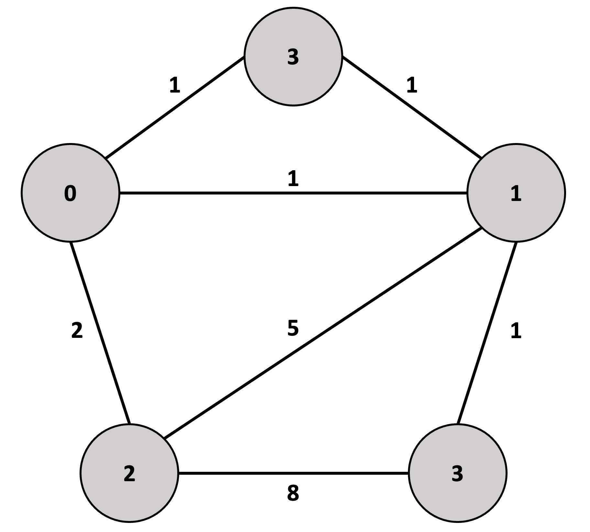
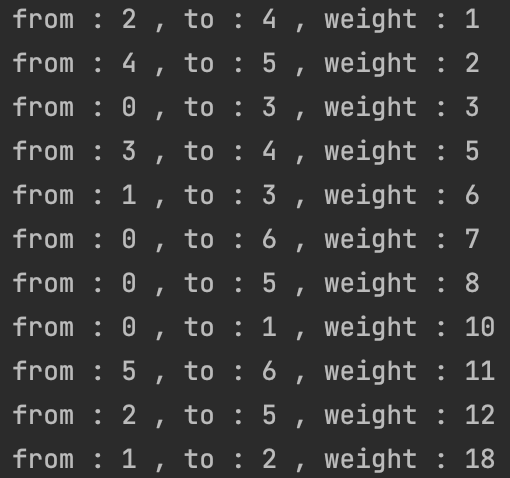
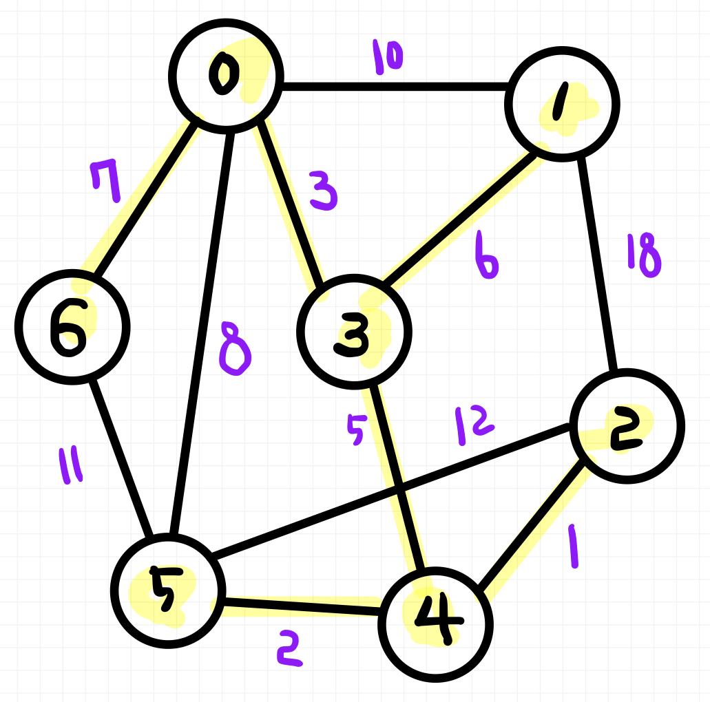

# 📚 <a style="color:#00adb5">ALGORITHM</a>

<center>

</center>
<br>

# 📚 <a style="color:#00adb5">최소 신장 트리 ( MST )</a>

## <a style="color:#00adb5">최소 신장 트리 ( MST ) 란?</a>

<big>최소 신장 트리 ( Minimum Spanning Tree )</big> 란 <br>
<a style="color:red"><strong>무향 가중치 그래프에서 신장 트리를 구성하는 간선들의 가중치의 합이 최소인 신장 트리</strong></a> 이다.<br><br>
여기서 <big>신장 트리</big>는 <br>
n개의 정점으로 이루어진 <a style="color:red"><strong>무향 그래프</strong></a>에서 <a style="color:red"><strong>n개의 정점</strong></a>과 <a style="color:red"><strong>n-1개의 간선</strong></a>으로 이루어진 트리이다.<br><br>
MST는 정점과 간선의 개수가 많아지면 구하기 힘들다. 그래서 완탐으로 구하기보단 Greedy 알고리즘을 이용해서 구한다.<br>
Greedy 알고리즘은 간단히 말해서 미래를 생각하지 않고 각 단계에서 가장 최선의 선택을 하는 기법이다.<br>


<center>

</center>
<br>
<br>

MST를 풀이하는 알고리즘은 대표적으로 2가지가 있다.<br>

- <a style="color:red"><strong>크루스칼 알고리즘 ( KRUSKAL )</strong></a><br>
- <a style="color:red"><strong>프림 알고리즘 ( PRIM )</strong></a>
<br>


## <a style="color:#00adb5">크루스칼 알고리즘 ( KRUSKAL )</a>
<big>크루스칼 알고리즘</big>은 <br>
<a style="color:red"><strong>간선을 하나씩 선택해서 MST 를 찾는 알고리즘</strong></a>이다.<br>

1. 최초, 모든 간선을 가중치에 따라 <a style="color:red"><strong>오름차순</strong></a>으로 정렬
2. 가중치가 가장 낮은 간선부터 선택하면서 트리를 증가시킴
  - 사이클이 존재하면 다음으로 가중치가 낮은 간선 선택
3. n-1 간선이 선택될 때 까지 2를 반복

<br>
크루스칼 알고리즘은 <a style="color:red"><strong>간선 중심 그래프</strong></a>로 <a style="color:red"><strong>간선리스트</strong></a>를 만들어야 한다.<br>
그래서 <a style="color:red"><strong>UNION-FIND 알고리즘</strong></a>을 이용해서 트리를 합치고, 부모 정점을 파악하고 사이클 여부를 파악해서 MST를 찾는다.<br><br>
가장 중요한 것은 <a style="color:red"><strong>사이클을 파악</strong></a>하는 것이다. 사이클이 있으면 MST가 될 수 없다.<br>
위의 모든 과정을 n-1 간선이 선택될 때까지 진행해서 MST를 찾아주면 된다.

## <a style="color:#00adb5">크루스칼 알고리즘 ( KRUSKAL ) 실습</a>

- 문제

첫 번째 줄에 정점의 개수는 N개 간선의 개수는 V개로 입력을 받는다.<br>
그 다음엔 V줄 만큼 from ( 출발 정점 ), to ( 도착 정점 ), weight ( 가중치 )가 순서대로 주어진다.<br>
이 때 MST를 구하여라
<br>

- input

```
7 11
0 1 10
0 3 3
0 5 8
0 6 7
1 3 6
1 2 18
2 4 1
2 5 12
3 4 5
4 5 2
5 6 11
```

<br>

- output

24
<br>

- 풀이

```java
import java.io.BufferedReader;
import java.io.IOException;
import java.io.InputStreamReader;
import java.util.Arrays;
import java.util.StringTokenizer;

public class MST {

    public static class Edge implements Comparable<Edge>{
        int from;
        int to;
        int weight;

        public Edge(int from, int to, int weight){
            this.from = from;
            this.to = to;
            this.weight = weight;
        }

        // 오름차순 정렬 ( 음의 가중치 포함 )
        @Override
        public int compareTo(Edge o) {
            return o.weight >= this.weight ? -1:1;
        }
    }

    // 정점의 개수
    static int N;
    // UNION-FIND Parents
    static int[] parents;
    // Edge List
    static Edge[] edgeList;

    // UNION-FIND START-----------------

    // makeSet
    // 새로운 집합 생성 - 초기 부모값을 다 본인을 가르키게 하기
    static void makeSet(){
        parents = new int[N];
        for(int i=0; i<N; i++){
            parents[i] = i;
        }
    }

    // findSet
    // a를 포함한 부모값 찾기
    static int findSet(int a){
        if(parents[a] == a) return a;
        // Path Compression
        // 노드의 부모 정보를 갱신 ( 쓸데없는 경로를 줄여줌 )
        return parents[a] = findSet(parents[a]);
    }

    // union
    // 트리 ( 집합 ) 를 합치기
    static boolean union(int a, int b){
        // a와 b의 부모값 찾기
        int aRoot = findSet(a);
        int bRoot = findSet(b);

        // 만약 같으면 사이클이 생성되므로 실패
        if(aRoot == bRoot) return false;

        // 같지 않다면 같게 만들어 준다
        // 부모값끼리 합쳐야한다.
        parents[bRoot] = aRoot;
        return true;
    }

    // UNION-FIND END-----------------

    public static void main(String[] args) throws IOException {
        BufferedReader br = new BufferedReader(new InputStreamReader(System.in));
        StringTokenizer st= new StringTokenizer(br.readLine()," ");

        // 정점 개수 입력
        N = Integer.parseInt(st.nextToken());
        // 간선 개수 입력
        int V = Integer.parseInt(st.nextToken());

        // Edge 저장할 리스트 생성
        edgeList = new Edge[V];

        // 간선 개수 만큼 Edge 추가
        for(int i=0; i<V; i++){
            st = new StringTokenizer(br.readLine()," ");
            int from = Integer.parseInt(st.nextToken());
            int to = Integer.parseInt(st.nextToken());
            int weight = Integer.parseInt(st.nextToken());

            // 리스크에 추가
            edgeList[i] = new Edge(from,to,weight);
        }

        // 1. weight 로 오름차순 정렬해주기
        Arrays.sort(edgeList);

        // 새로운 집합 생성
        makeSet();

        // 결과 비용
        int result = 0;

        // 횟수 카운팅
        int cnt = 0;

        // 2. 가중치가 가장 낮은 간선부터 선택하면서 트리를 증가
        for(Edge edge : edgeList){
            // edge.from 과 edge.to 를 같은 트리로 묶기
            if(union(edge.from, edge.to)){
                result += edge.weight;
                // 3. N-1 간선이 선택되면 끝
                if(++cnt == N-1){
                    break;
                }
            }
        }
        System.out.println(result);
    }
}
```

- 가중치 오름차순 한 것

<center>

</center>
<br>

- MST Graph

위에 오름차순 순서대로 그래프에서 정점을 연결시켜주면 된다.<br>
사이클이 생겼을 때는 연결해주지 않는 것이 중요하다 !!

<center>

</center>
<br>

## <a style="color:#00adb5">프림 알고리즘 ( PRIM )</a>