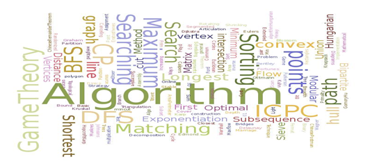

# 📚 <a style="color:#00adb5">ALGORITHM</a>

 

# 📚 <a style="color:#00adb5">ArrayList & HashMap</a>

## <a style="color:#00adb5">Collection</a>

- List 계열
    - AbstractList, ArrayList, LinkedList, Vector
- Map 계열
    - AbstractMap, Attributes, HashMap, Hashtable, identityHashMap, RenderingHints, TreeMap, WeakHashMap
- Set 계열
    - AbstractSet, HashSet, LinkenHashSet, TreeSet

- Collection, List, Map, Set은 모두 구현되지 않은 Interface이다.
- 그래서 구현된 class를 사용해서 정의해주어야 한다.
- List a = new List(); -> X
- List a = new ArrayList(); -> O ( 다형성 -> 부모는 여러가지 자식의 형태로 나타낼 수 있다.)

## <a style="color:#00adb5">계열들 특징</a>

- Collection의 자식들은 자신들만의 고유한 특징을 명확히 가진다.

- <big>List</big>
    - 수집의 순서가 있다.
    - 동일한 데이터의 중복 입력 가능
    - <a style="color:red"><strong>순차적으로 대량의 데이터를 접근하거나 입력할 때 유리함</strong></a>

- <big>Map</big>
    - Key & value의 형태로 입력
    - 키값을 입력하면 해당하는 value 값을 획득
    - 수집의 순서를 기억하지 않는다.
    - 동일한 데이터를 key 값으로 사용할 수 없다.
    - <a style="color:red"><strong>대량의 데이터에서 원하는 특정 데이터를 검색할 때 유리함</strong></a>

- <big>Set</big>
    - 중복되는 데이터를 불허하는 것을 제외하고는 큰 특징이 없음
    - 입력되는 당시는 순서에는 따르지 않으나 순차적인 접근을 위해서는 Iterator로 접근하게 된다.

## <a style="color:#00adb5">ArrayList와 HashMap의 차이</a>

- <big>입력 방식 차이점</big>
    - <big>ArrayList</big>
        - add(Object o), add(int index, Object o), set(int index, Object o) ..
        - 데이터를 검색하기 위해서는 처음부터 끝가지 돌거나 사용자가 index를 알아야함
        - <a style="color:red"><strong>index 정보를 알고 있다면 ArrayList가 HashMap보다 빠름</strong></a>

    - <big>HashMap</big>
        - put(Object key, Object value)
        - Key값을 Object로 갖고 있기에 자바에서 사용가능한 모든 class 가능
        - <a style="color:red"><strong>Key 값을 활용해 바로 원하는 정보를 얻어낼 수 있기에 검색 능력이 탁월하다.</strong></a>

- <big>용도의 차이점</big>
    - ArrayList의 경우 <a style="color:red"><strong>단순히 데이터를 입력하고 그 데이터를 출력하는 용도</strong></a>
    - HashMapa의 경우 <a style="color:red"><strong>데이터를 캐쉬해서 특정 Key값으로 HashMap에 있는 데이터를 검색해서 사용하는 용도</strong></a>