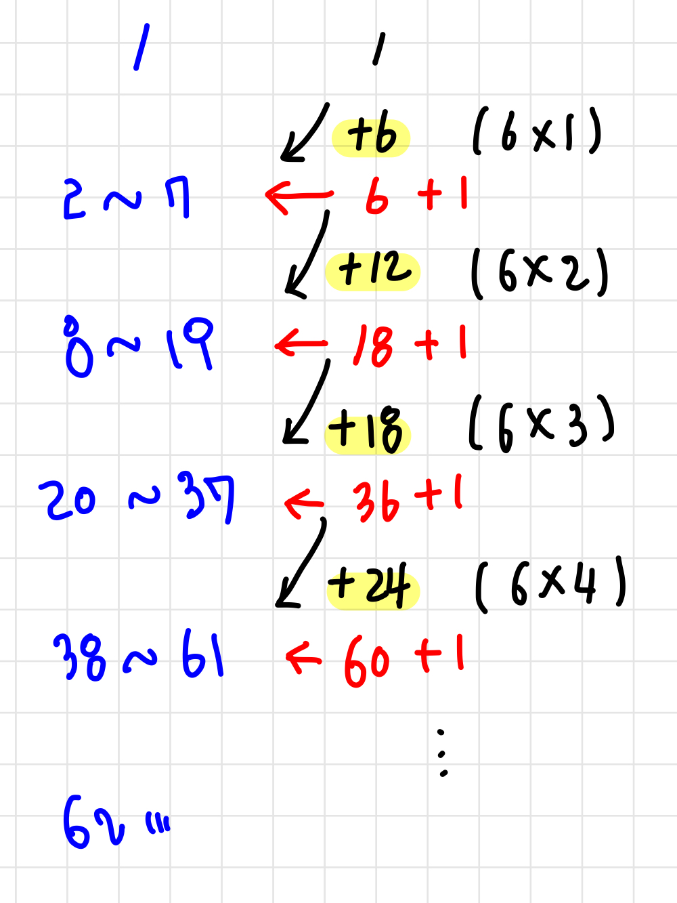

# 📁 <b><a style="color:#00adb5" href="https://www.acmicpc.net/problem/2292" target=_blank>[B2_2292] 벌집</a></b>

```java
import java.io.BufferedReader;
import java.io.IOException;
import java.io.InputStreamReader;

public class Main {
    public static void main(String[] args) throws IOException {
        BufferedReader br = new BufferedReader(new InputStreamReader(System.in));

        // N번 방
        int N = Integer.parseInt(br.readLine());

        // 1번 방 들리고 시작
        int cnt = 1;


        int j = 1;

        if( N==1 ){
            cnt = 1;
        }

        while(N>1){
            N -= (6*j);
            cnt++;
            j++;
        }


        System.out.println(cnt);

    }
}
```


## 🤔 <b><a style="color:#00adb5">나의 생각</a></b>
<p align="center"></p><br>
6의 배수를 계속 중첩해 더해가는 규칙을 찾았다.<br>
6, 12, 18, 24 ... 이렇게 더 해질때 마다 한 번씩 카운팅 해주었다.<br>
또 다른 포인트는 N이 1일 때 1을 반환하도록 해야한다. 이걸로 잠시 헤맸다 ㅎㅎ