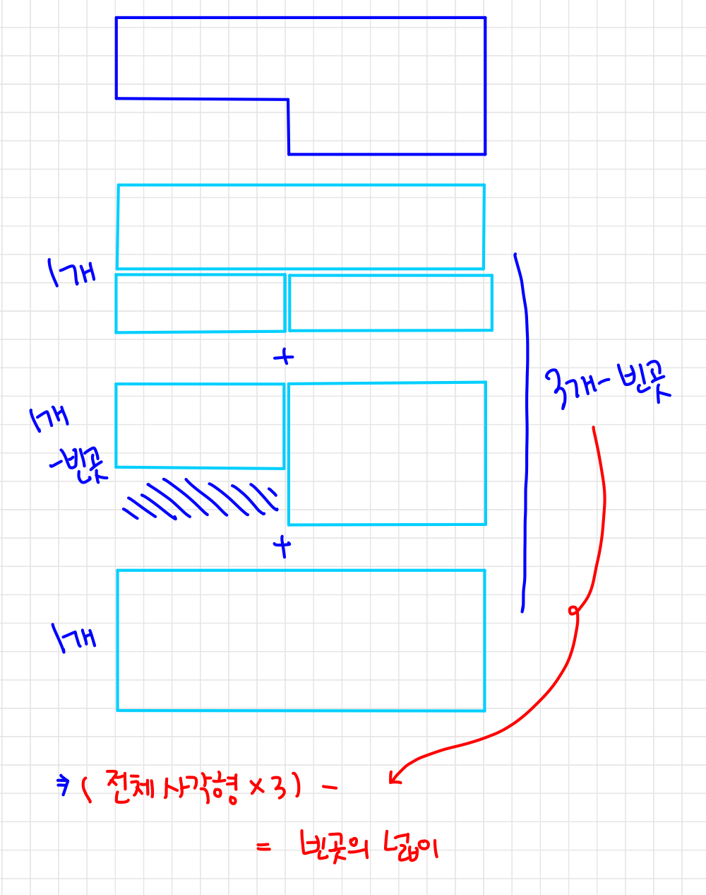

# 📁 <b><a style="color:#00adb5" href="https://www.acmicpc.net/problem/2477" target=_blank>[S4_2477] 참외밭</a></b>

```java
import java.io.BufferedReader;
import java.io.IOException;
import java.io.InputStreamReader;
import java.util.StringTokenizer;

public class Main {
    static StringTokenizer st;
    public static void main(String[] args) throws IOException {
        BufferedReader br = new BufferedReader(new InputStreamReader(System.in));

        // 참외의 개수
        int K = Integer.parseInt(br.readLine());

        // 방향과 길이 배열 저장
        int[][] arr = new int[6][2];

        // 입력
        for(int i =0; i<6; i++){
            st = new StringTokenizer(br.readLine(), " ");

            int input = Integer.parseInt(st.nextToken());
            int input_l = Integer.parseInt(st.nextToken());

            arr[i][0] = input;
            arr[i][1] = input_l;
        }

        // 총 합
        int sum = 0;

        // 제일 큰 넓이
        int max = Integer.MIN_VALUE;

        for(int i=1; i<7; i++){
            int area = 0;
            if(i == 6){
                area = arr[0][1] * arr[i-1][1];
            }
            else {
                // 사각형 넓이
                area = arr[i][1] * arr[i - 1][1];
            }
            // 제일 큰 넓이 구하기 = 기준이 되는 사각형
            max = Math.max(max, area);

            // 사각형의 모든 넓이 다 더하기
            sum += area;
        }

        // 결과
        int res = (max-((max*3)-sum));

        res *= K;

        System.out.println(res);
    }
}

```


## 🤔 <b><a style="color:#00adb5">나의 생각</a></b>
<p align="center"></p><br>
처음에 넓이를 구해야 하기 때문에 전체 공간에서 빈 공간을 빼는 방법을 선택했다.<br>
그래서 조건을 달며 접근했는데 조건이 너무 많이 달려서 수학적인 방법을 찾아나섰다.<br>
그렇게 찾아낸 결과 전체 넓이에서 3을 곱한 값을 모든 변 마다의 직사각형을 구한 뒤 빼주었다.<br>
그리고 그 값을 전체 넓이에서 빼주면 빈 공간을 제외한 넓이가 된다. 거기에서 N을 곱하여 전체 참외 개수를 구해주었다.<br>
약간 이런 문제들은 수학적으로 접근하는 것이 코드도 더 깔끔해지고 간단해 지는 것 같다.<br>
앞으로 이런 문제들은 막 시작하기 보단 생각하고 수학적으로 접근해보자 !!