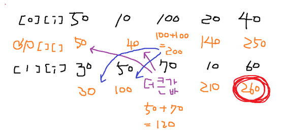

# 📁 <b><a style="color:#00adb5" href="https://www.acmicpc.net/problem/9465" target=_blank>[S1_9465] 곱셈</a></b>

```java
import java.io.BufferedReader;
import java.io.IOException;
import java.io.InputStreamReader;
import java.util.StringTokenizer;

public class Main {
	static StringTokenizer st;

	public static void main(String[] args) throws IOException {
		BufferedReader br = new BufferedReader(new InputStreamReader(System.in));
		StringBuilder sb = new StringBuilder();

		// testcase
		int T = Integer.parseInt(br.readLine());

		for (int tc = 0; tc < T; tc++) {
			int n = Integer.parseInt(br.readLine());

			int[][] arr = new int[2][n+1];

			// 배열 입력
			for (int i = 0; i < 2; i++) {
				st = new StringTokenizer(br.readLine(), " ");
				for (int j = 1; j < n + 1; j++) {
					arr[i][j] = Integer.parseInt(st.nextToken());
				}
			}

			// dp 배열 초기화
			int[][] dp = new int[2][n + 1];

			// 제일 처음에 있는 값 설정
			dp[0][1] = arr[0][1];
			dp[1][1] = arr[1][1];

				// 본인보다 더 작은 2값이랑 비교하기 때문에 2부터 시작
				for (int j = 2; j < n + 1; j++) {
					// 위에 줄
					dp[0][j] = Math.max(dp[1][j-1], dp[1][j-2]) + arr[0][j];
					
					// 아래줄
					dp[1][j] = Math.max(dp[0][j-1], dp[0][j-2]) + arr[1][j];
				}
				sb.append(Math.max(dp[0][n],dp[1][n])).append("\n");
		}
		System.out.println(sb);
	}
}
```

## 🤔 <b><a style="color:#00adb5">나의 생각</a></b>
dp 문제이다.<br>
본인 값의 다른 행에 존재하는 전값과 전에전값을 비교하여 더 큰 값(dp 배열)과 자기 값(arr 배열)을 더해서 dp 배열에 넣어준다.<br>
그래서 마지막에 제일 큰 값을 출력한다.<br>
그리고 본인보다 2개 더 적은 값부터 비교하기 때문에 열 값을 0부터 시작이 아닌 1부터 시작을 해주었다.
이것은 그림으로 보여주는게 더 이해가 빠를 것 같아 그림을 준비했다.<br>

<center>

</center>
<br>

처음 [0][1] 과 [1][1] 은 본래 배열 값이 들어가고 다음부터는 본인 전의 2개의 값을 비교하여 더 큰 값 ( dp 배열 값 )과 본인 값 ( arr 배열 값 )을 더해서 dp 배열에 저장한다.
