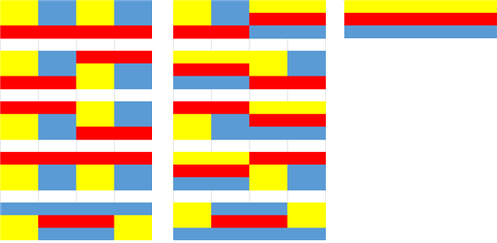

# 📁 <b><a style="color:#00adb5" href="https://www.acmicpc.net/problem/2133" target=_blank>[G5_2133] 타일 채우기</a></b>

```java
import java.io.BufferedReader;
import java.io.IOException;
import java.io.InputStreamReader;

public class Main {
	static int[] dp;
	static int N;
	static int res;
	public static void main(String[] args) throws IOException{
		BufferedReader br = new BufferedReader(new InputStreamReader(System.in));
		
		N = Integer.parseInt(br.readLine());
		
		dp = new int[N+2];
		dp[0] = 1;
		dp[2] = 3;

		if(N>=4) {
			for(int i=4; i<=N; i++) {
				dp[i] += dp[i-2]*dp[2];
				for(int j = 4; j <= i; j += 2) {
					dp[i] += dp[i-j]*2;
				}
			}
		}
		System.out.println(dp[N]);
	}
}
```

## 🤔 <b><a style="color:#00adb5">나의 생각</a></b>
dp 문제이다. <br>
타일의 모든 칸을 채우는 경우의 수를 구하는데 홀수 인 경우는 제외한다. 가득차지 않기 때문이다.<br>
그래서 구조를 살펴보면 먼저 3*2일 때 가장 기본적인 구조가 나타난다.
<center>

</center>
<br>

이 구조 3개가 반복된다고 생각하면 된다.<br>
그리고 3*4 일 때 구조이다.
 
<center>

</center>
<br>

이 것을 보면 위의 3가지 구조가 반복되어 나오는거에 새로운 모양 2개가 추가 된다.<br>

3*6 까지 보았을 때 구조를 파악해보면<br>
dp[n-2] * 3 + dp[n-4] * 2 + dp[n-6] 경우의수 * 2 + ... + dp[0] * 2 이라는 식이 나온다.<br>
이것을 식으로 표현하면 위에 포문이 된다.<br>

<br><br><br><br>
잘 이해가 안된다면 참고하도록...<br>
<a href="https://kosaf04pyh.tistory.com/236">https://kosaf04pyh.tistory.com/236</a>