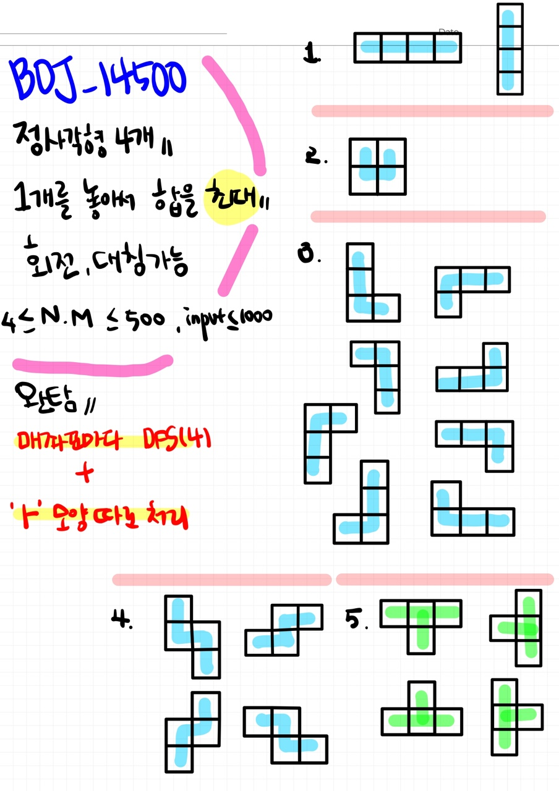

# 📁 <b><a style="color:#00adb5" href="https://www.acmicpc.net/problem/14500" target=_blank>[G5_14500] 테트로미노</a></b>

```java
import java.io.*;
import java.util.*;

public class Main {
	static int N, M;
	static int[][] map;
	static boolean[][] v;
	static int max = Integer.MIN_VALUE;
	static int sum;
	static int[] dx = { 1, -1, 0, 0 };
	static int[] dy = { 0, 0, 1, -1 };

	public static void main(String[] args) throws IOException {
		BufferedReader br = new BufferedReader(new InputStreamReader(System.in));
		StringTokenizer st = new StringTokenizer(br.readLine(), " ");

		// 세로 크기
		N = Integer.parseInt(st.nextToken());

		// 가로 크기
		M = Integer.parseInt(st.nextToken());

		// 배열
		map = new int[N][M];

		// 방문 체크
		v = new boolean[N][M];

		// 배열 입력
		for (int i = 0; i < N; i++) {
			st = new StringTokenizer(br.readLine(), " ");
			for (int j = 0; j < M; j++) {
				map[i][j] = Integer.parseInt(st.nextToken());
			}
		}

		for (int i = 0; i < N; i++) {
			for (int j = 0; j < M; j++) {
				v[i][j] = true;
                // 값을 더해주고 들어가기
                // 첫 좌표는 고정
				sum = map[i][j];
				dfs(0, j, i);
                // 백트래킹
				v[i][j] = false;
                // 'ㅗ' 모양 4가지 확인
				check(j,i);
			}
		}

		// 최댓값 출력
		System.out.println(max);
	}

	static void dfs(int idx, int x, int y) {
		// 기저조건 4칸 이동 ( 처음 값은 넣어주고 넘어 온다 )
		if (idx == 3) {
			max = Math.max(max, sum);
			return;
		}

		// 4방향 탐색
		int nx, ny;
		for (int i = 0; i < 4; i++) {
			nx = x + dx[i];
			ny = y + dy[i];

			// 범위 넘어가는 경우 , 이미 갔던 경우
			if (nx < 0 || ny < 0 || nx > M - 1 || ny > N - 1 || v[ny][nx])
				continue;

			// 방문 체크
			v[ny][nx] = true;
			sum += map[ny][nx];
			dfs(idx + 1, nx, ny);

			// 백트래킹
			v[ny][nx] = false;
			sum -= map[ny][nx];
		}
	}

	// ㅗ 모양 따로 검사
	static void check(int x, int y) {
		// ㅏ
		if (x >= 0 && y >= 0 && x + 1 < M && y + 2 < N) {
			max = Math.max(max, map[y][x] + map[y + 1][x] + map[y + 2][x] + map[y + 1][x + 1]);
		}

		// ㅓ
		if (x < M && y >= 0 && x - 1 >= 0 && y + 2 < N) {
			max = Math.max(max, map[y][x] + map[y + 1][x - 1] + map[y + 1][x] + map[y + 2][x]);
		}

		// ㅜ
		if (x >= 0 && y >= 0 && x + 2 < M && y + 1 < N) {
			max = Math.max(max, map[y][x] + map[y][x + 1] + map[y][x + 2] + map[y + 1][x + 1]);
		}

		// ㅗ
		if (x + 1 < M && y >= 0 && x - 1 >= 0 && y + 1 < N) {
			max = Math.max(max, map[y][x] + map[y + 1][x - 1] + map[y + 1][x] + map[y + 1][x + 1]);
		}
	}
}
```

## 🤔 <b><a style="color:#00adb5">나의 생각</a></b>
처음에 문제를 보고 일단 대칭, 회전되어서 그려지는 그림을 다 그려보았다.<br>
그리고 완탐인 것은 느꼈지만 어떻게 해결할지 바로 감이 잡히지 않다가<br>
6조각을 바탕으로 거의 모든 경우를 다 거치는 것이였다.<br>
그래서 for문으로 다 돌면서 한 점 마다 dfs를 통해 확인해 주었다.<br>
그러나 한가지 놓친게 있었다.<br>
바로 !! 'ㅗ'  이 것이다.<br>
이 모양은 깊이 우선 탐색으로 찾아지지 않는다. 그래서 따로 빼서 처리를 해주었다.<br>
어떻게 보면 이 문제의 속임수? 인 것 같다.<br>
결국 완탐에서 dfs를 활용하고 'ㅏ' 모양 4가지를 따로 처리해주면 된다 !!

<br>
<center>
    
</center>