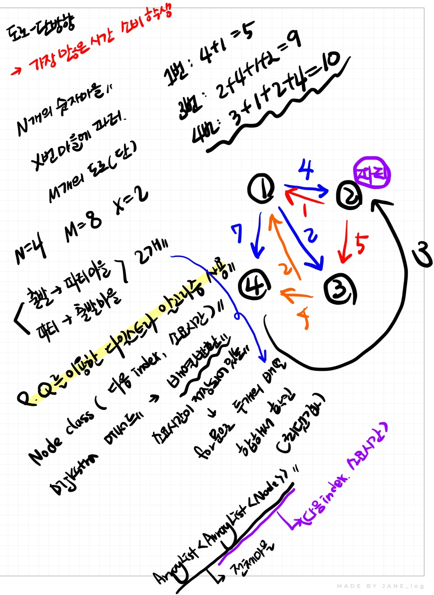

# 📁 <b><a style="color:#00adb5" href="https://www.acmicpc.net/problem/1238" target=_blank>[G3_1238] 파티</a></b>

```java
import java.util.*;
import java.io.*;

public class Main {
	static int N,M,X;
	static int INF = 999999999;
	static ArrayList<ArrayList<Node>> nList, xList;

	// 다음 노드 인덱스와 소요시간을 저장
	static class Node implements Comparable<Node>{
		int idx,time;

		Node(int idx, int time){
			this.idx = idx;
			this.time = time;
		}

		@Override
		public int compareTo(Node o) {
			return this.time - o.time;
		}
	}

	public static void main(String[] args) throws IOException{
		BufferedReader br = new BufferedReader(new InputStreamReader(System.in));
		StringTokenizer st = new StringTokenizer(br.readLine(), " ");

		// 학생 수 & 마을 수
		N = Integer.parseInt(st.nextToken());

		// 도로 수
		M = Integer.parseInt(st.nextToken());

		// 파티 장소
		X = Integer.parseInt(st.nextToken());

		// 문제 그대로
		nList = new ArrayList<>();
		// 문제 반대
		xList = new ArrayList<>();

		for(int i=0; i<=N; i++) {
			nList.add(new ArrayList<>());
			xList.add(new ArrayList<>());
		}

		// 도로 정보 입력
		for(int i=0; i<M; i++) {
			st = new StringTokenizer(br.readLine()," ");
			int start = Integer.parseInt(st.nextToken());
			int end = Integer.parseInt(st.nextToken());
			int time = Integer.parseInt(st.nextToken());

			// 정보 저장
			// 부모 ArrayList에는 출발번호가 자식 ArrayList에는 도착번호와 소요시간이 저장
			nList.get(start).add(new Node(end,time));
			// 부모 ArrayList에는 도착번호가 자식 ArrayList에는 출발번호와 소요시간이 저장
			xList.get(end).add(new Node(start,time));
		}

		// 다익스트라 알고리즘
		int[] dist1 = dijkstra(nList);
		int[] dist2 = dijkstra(xList);

		// 최댓값 찾기
		int res = 0;
		for(int i=1; i<=N; i++) {
			res = Math.max(res, dist1[i] + dist2[i]);
		}
		System.out.println(res);
	}

	// 다익스트라 알고리즘 - P.Q 사용
	static int[] dijkstra(ArrayList<ArrayList<Node>> list) {
		// 우선순위 큐
		PriorityQueue<Node> pq = new PriorityQueue<>();
		pq.offer(new Node(X,0));

		// 방문체크
		boolean[] v = new boolean[N+1];
		// 최소 시간 저장 배열
		int[] dist = new int[N+1];
		// 최대로 값 저장
		Arrays.fill(dist, INF);
		dist[X] = 0;

		while(!pq.isEmpty()) {
			// 다음 갈 곳
			Node curNode = pq.poll();
			int cur = curNode.idx;

			// 아직 방문하지 않았다면
			if(!v[cur]) {
				// 방문처리
				v[cur] = true;

				// dist 값 갱신
				for(Node node : list.get(cur)) {
					if(!v[node.idx] && dist[node.idx] > dist[cur] + node.time) {
						dist[node.idx] = dist[cur] + node.time;
						pq.add(new Node(node.idx, dist[node.idx]));
					}
				}
			}
		}
		return dist;
	}
}
```

## 🤔 <b><a style="color:#00adb5">나의 생각</a></b>

가중치가 있는 그래프에서 최단거리를 구하는 문제이기 때문에 P.Q를 이용해 다익스트라 알고리즘을 생각했다.<br>
갔다 오는 것 까지 생각해야하기 때문에 파티열리는 곳을 경유지로 생각하고 플로이드 와샬 알고리즘도 사용할 수 있겠다 생각 했지만 플로이드 와샬 알고리즘의 시간 복잡도는 O³이기 때문에 1000000000은 1초를 넘기 때문에 불가능한 것을 알 수 있다.<br>
그래서 출발 마을에서 파티 마을까지 하나의 다익스트라 리스트를 만들고 파티 마을에서 다시 출발 마을로 돌아오는 하나의 다익스트라를 만들어 합한 뒤 가장 많은 시간을 소비하는 학생을 구해주면 된다.<br>

<br>
<center>
    
</center>
