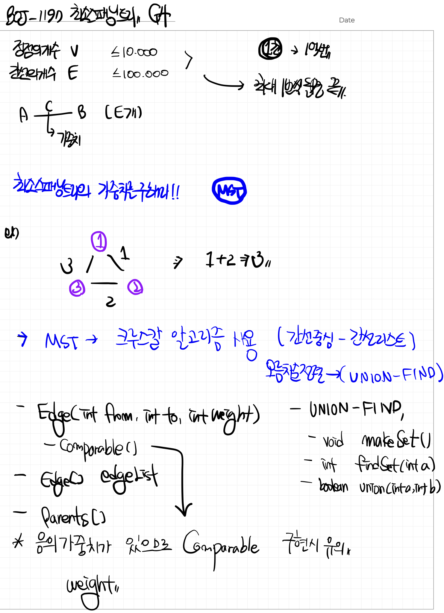

# 📁 <b><a style="color:#00adb5" href="https://www.acmicpc.net/problem/1197" target=_blank>[G4_1197] 최소 스패닝 트리</a></b>

```java
import java.io.BufferedReader;
import java.io.IOException;
import java.io.InputStreamReader;
import java.util.Arrays;
import java.util.StringTokenizer;

public class Main {

    static class Edge implements Comparable<Edge>{
        int from;
        int to;
        int weight;

        public Edge(int from, int to, int weight) {
            super();
            this.from = from;
            this.to = to;
            this.weight = weight;
        }

		// 오름차순 정렬
        @Override
        public int compareTo(Edge o) {
            return o.weight >= this.weight ? -1:1;
        }
    }

    static int N;
    static int[] parents;
    static Edge[] edgeList;

    // 단위 집합 생성
    public static void makeSet(){
        parents = new int[N];
        // 자신의 부모노드를 자신의 값으로 세팅
        for(int i=0; i<N; i++){
            parents[i]= i;
        }
    }

    // a의 집합 찾기 : a의 대표자 찾기
    public static int findSet(int a){
        if(a == parents[a]) return a;
        // 나의 부모의 부모의 부모의 .. 를 찾으러 간다
        // path compression
        return parents[a] = findSet(parents[a]);
    }

    // a,b 두 집합 합치기
    public static boolean union(int a, int b){
        int aRoot = findSet(a);
        int bRoot = findSet(b);
        // 만약 같으면 합칠 필요가 없다
        if(aRoot == bRoot) return false;

        // 짱끼리 합쳐야 한다
      parents[bRoot] = aRoot;
        return true;
    }

    public static void main(String[] args) throws IOException {
        BufferedReader br = new BufferedReader(new InputStreamReader(System.in));
        StringTokenizer st= new StringTokenizer(br.readLine()," ");

        N = Integer.parseInt(st.nextToken());
        int E = Integer.parseInt(st.nextToken());
        edgeList = new Edge[E];

        for(int i=0; i<E; i++){
            st = new StringTokenizer(br.readLine()," ");
            int from = Integer.parseInt(st.nextToken());
            int to = Integer.parseInt(st.nextToken());
            int weight = Integer.parseInt(st.nextToken());
            edgeList[i] = new Edge(from-1, to-1, weight);
        }

        // 간선비용의 오름차순 정렬
        Arrays.sort(edgeList);
        makeSet();

        // 결과 비용
        int result = 0;

        // 카운팅
        int cnt = 0;

        for(Edge edge : edgeList){
            if(union(edge.from, edge.to)){
                result += edge.weight;
                if(++cnt == N-1) break;
            }
        }
        System.out.println(result);
    }
}
```

## 🤔 <b><a style="color:#00adb5">나의 생각</a></b>
MST의 기본 문제이다.<br>
나는 MST의 크루스칼 알고리즘을 사용해서 해결했다.<br>
여기서 음의 가중치까지 있기 때문에 comparable 부분을 음수까지 고려해서 처리해주었다.

<br>
<center>
    
</center>
