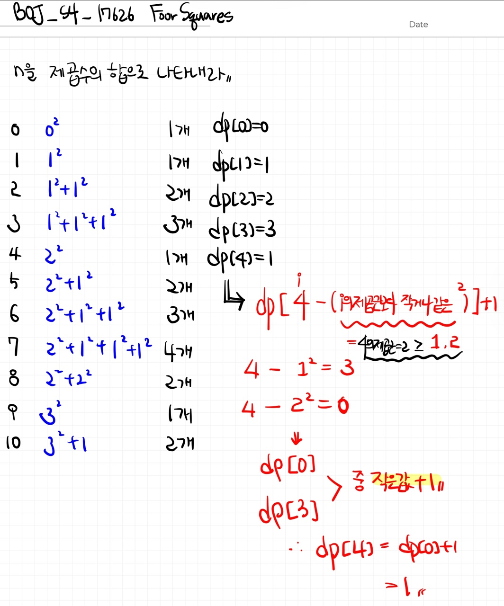

# 📁 <b><a style="color:#00adb5" href="https://www.acmicpc.net/problem/17626" target=_blank>[S4_17626] Four Squares</a></b>

```java
import java.io.BufferedReader;
import java.io.IOException;
import java.io.InputStreamReader;

public class Main {
	public static void main(String[] args) throws IOException{
		BufferedReader br = new BufferedReader(new InputStreamReader(System.in));
		int n = Integer.parseInt(br.readLine());

		int[] dp = new int[n+1];

		// 0을 제곱의 합으로 나타낸 개수 ( 0 )
		dp[0] = 0;
		// 1을 제곱의 합으로 나타낸 개수 ( 1 * 1 )
		dp[1] = 1;

		for(int i=2; i<=n; i++) {
			int min = Integer.MAX_VALUE;
			for(int j=1; j*j<=i; j++) {
				// 최소값을 구한다
				min = Math.min(min, dp[i-(j*j)]);
			}
			// 최소값에 1을 더해준다
			dp[i] = min+1;
		}
		// 출력
		System.out.println(dp[n]);
	}
}

```

## 🤔 <b><a style="color:#00adb5">나의 생각</a></b>

처음에 그리디하게 전체를 다 돌면서 가장 큰 수부터 빼주면서 구하려고 했다.<br>
근데 구하다 보니 모든 수가 큰 수부터 뺀다고 최소의 개수가 되는 게 아니라는 것을 알고 방향을 바꿨다.<br>
dp로 풀었는데 처음부터 나열해보니 규칙을 찾을 수 있었다.<br>

<br>
<center>
    
</center>
<br>

이 과정을 통해 값을 구해나가면 된다 !!<br>
`dp[i] = dp[ i - ( i 제곱근 보다 작거나 같은 값 의 제곱 ) ] 값들 중 최소값에 +1` 을 해주면 된다<br>
