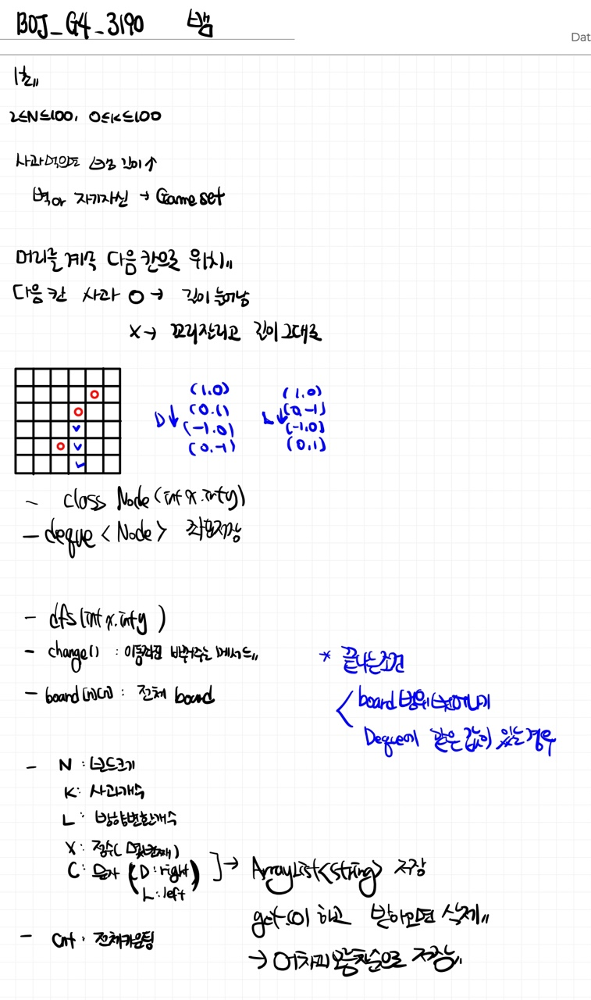

# 📁 <b><a style="color:#00adb5" href="https://www.acmicpc.net/problem/3190" target=_blank>[G4_3190] 뱀</a></b>

```java
import java.io.BufferedReader;
import java.io.IOException;
import java.io.InputStreamReader;
import java.util.ArrayList;
import java.util.Deque;
import java.util.LinkedList;
import java.util.StringTokenizer;


public class Main{
	static int[][] board;
	static ArrayList<Integer> list_num;
	static ArrayList<String> list_str;
	static Deque<Node> node;
	static int dx, dy;
	static int N, K, L;
	static int res, cnt;

	public static class Node {
		int x;
		int y;

		public Node(int x, int y) {
			this.x = x;
			this.y = y;
		}
	}

	public static void main(String[] args) throws IOException {
		BufferedReader br = new BufferedReader(new InputStreamReader(System.in));
		StringTokenizer st;

		// **** input start ****
		N = Integer.parseInt(br.readLine());
		K = Integer.parseInt(br.readLine());

		// 전체 보드
		board = new int[N][N];

		// 사과 위치 저장
		for (int i = 0; i < K; i++) {
			st = new StringTokenizer(br.readLine(), " ");
			int y = Integer.parseInt(st.nextToken());
			int x = Integer.parseInt(st.nextToken());

			// 사과위치 1로 저장
			board[y - 1][x - 1] = 1;
		}

		// 방향변환 리스트
		L = Integer.parseInt(br.readLine());
		// 수 저장
		list_num = new ArrayList<>();
		// 문자저장
		list_str = new ArrayList<>();
		for (int i = 0; i < L; i++) {
			st = new StringTokenizer(br.readLine(), " ");
			int num = Integer.parseInt(st.nextToken());
			String str = st.nextToken();

			list_num.add(num);
			list_str.add(str);
		}

		// 처음 오른쪽으로 이동
		dx = 1;
		dy = 0;

		cnt = 0;
		res = 0;

		// deque 생성
		node = new LinkedList<>();
		// 첫 좌표 삽입
		node.add(new Node(0, 0));
		// 재귀 시작
		recursive(0, 0);

		System.out.println(res);
	}

	static void recursive(int x, int y) {
		// 카운팅 + 1
		cnt++;


		// 좌표 이동을 하고 마지막에 방향을 바꾼다
		// 다음 좌표
		int nx = x + dx;
		int ny = y + dy;

		// 만약 범위를 벗어나거나 자기 몸에 닿일 경우 끝
		if (nx < 0 || ny < 0 || nx > N - 1 || ny > N - 1) {
			// 값 저장
			res = cnt;
			return;
		}

		for(Node list : node) {
			if(list.x == nx && list.y == ny) {
				// 값 저장
				res = cnt;
				return;
			}
		}

		// 사과 없는지 체크 -> 없으면 꼬리 삭제
		if (board[ny][nx] == 0) {
			node.removeLast();
		}

		// 사과 먹고 삭제
		if(board[ny][nx] == 1) {
			board[ny][nx] = 0;
		}

		// 머리 다음칸 이동 ( 맨 앞에 삽입 )
		node.addFirst(new Node(nx, ny));

		if (list_num.size() > 0) {
			if (cnt == list_num.get(0)) {
				change(list_str.get(0).charAt(0));
				// 사용한 것 삭제해주기
				list_num.remove(0);
				list_str.remove(0);
			}
		}

		// 반복
		recursive(nx, ny);
	}

	// 방향 전환
	static void change(char c) {
		// 오른쪽으로 바꾸기
		if (c == 'D') {
			// 오른쪽으로 가고 있으면 아래쪽으로
			if (dx == 1 && dy == 0) {
				dx = 0;
				dy = 1;
			}
			// 밑으로 가고 있으면 왼쪽으로
			else if (dx == 0 && dy == 1) {
				dx = -1;
				dy = 0;
			}
			// 왼쪽으로 가고 있으면 위쪽으로
			else if (dx == -1 && dy == 0) {
				dx = 0;
				dy = -1;
			}
			// 위쪽으로 가고 있으면 오른쪽으로
			else if (dx == 0 && dy == -1) {
				dx = 1;
				dy = 0;
			}
		}
		// 왼쪽으로 바꾸기
		else if (c == 'L') {
			// 오른쪽으로 가고 있으면 위쪽으로
			if (dx == 1 && dy == 0) {
				dx = 0;
				dy = -1;
			}
			// 아래쪽으로 가고 있으면 오른쪽으로
			else if (dx == 0 && dy == 1) {
				dx = 1;
				dy = 0;
			}
			// 왼쪽으로 가고 있으면 아래쪽으로
			else if (dx == -1 && dy == 0) {
				dx = 0;
				dy = 1;
			}
			// 위쪽으로 가고 있으면 왼쪽으로
			else if (dx == 0 && dy == -1) {
				dx = -1;
				dy = 0;
			}
		}
	}
}
```

## 🤔 <b><a style="color:#00adb5">나의 생각</a></b>

여기서 deque를 활용한 이유는 사과가 있으면 하나의 node만 추가하면 되지만 사과가 없는 경우는 마지막 node를 삭제해야 하기 때문에 앞 뒤로 간단하게 삽입, 삭제 할 수 있는 deque를 활용했다.<br>
그리고 Node 클래스를 통해서 좌표를 받아온다.<br>

- 방향을 정하고 한 칸씩 이동하면 deque의 구조를 변경한다.
- 사과가 있으면 그대로 하나의 node를 추가한다.
- 사과가 없으면 하나의 node는 추가하지만 deque에 저장되어있는 마지막 node는 삭제한다.
- 이 과정들을 반복하며 기존 deque에 있는 node값에 도달하거나 범위를 벗어나면 끝 !
- 총 횟수를 카운팅해준다.

<br>
<center>
    
</center>
