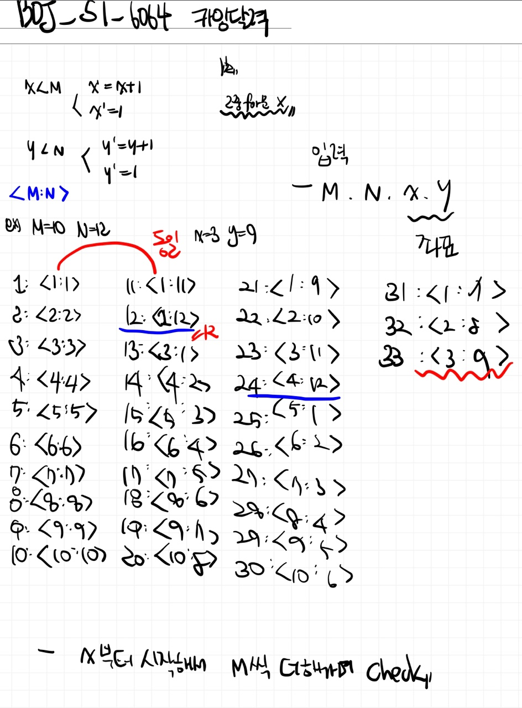

# 📁 <b><a style="color:#00adb5" href="https://www.acmicpc.net/problem/6064" target=_blank>[S1_6064] 카잉 달력</a></b>

```java
import java.io.BufferedReader;
import java.io.IOException;
import java.io.InputStreamReader;
import java.util.StringTokenizer;

public class Main {
	public static void main(String[] args) throws IOException {
		BufferedReader br = new BufferedReader(new InputStreamReader(System.in));
		StringTokenizer st;
		StringBuilder sb = new StringBuilder();

		// **** input start ****

		int tc = Integer.parseInt(br.readLine());

		for (int TC = 0; TC < tc; TC++) {
			st = new StringTokenizer(br.readLine(), " ");

			int M = Integer.parseInt(st.nextToken());
			int N = Integer.parseInt(st.nextToken());
			int x = Integer.parseInt(st.nextToken());
			int y = Integer.parseInt(st.nextToken());

			// 결과값
			int res = -1;

			// 최소 공배수를 구해준다
			int num_lcm = 0;
			// 크기에 따라
			if (M >= N) {
				num_lcm = lcm(M, N);
			} else {
				num_lcm = lcm(N, M);
			}
			// 나머지가 0이 되는 경우 때문에 1을 빼준다. 나중에 결과에서 1을 더해준다.
			x--;
			y--;

			// x부터 시작해서 M을 더해가며 check
			for(int i=x; i<num_lcm; i += M) {
				// 값을 찾으면
				if(i%N==y) {
					// 값 넣기
					res = i+1;
					// 중지
					break;
				}
			}

			sb.append(res).append("\n");
		}
		System.out.println(sb);
	}

	// 최대공약수 구하기
	static int gcd(int a, int b) {
		if (b == 0)
			return a;

		return gcd(b, a % b);
	}

	// 최소공배수 구하기
	static int lcm(int a, int b) {
		return a * b / gcd(a, b);
	}
}

```

## 🤔 <b><a style="color:#00adb5">나의 생각</a></b>

먼저 제시된 TC를 통해 문제를 나열해보았다.<br>
나열해보니 규칙을 찾을 수 있었다.<br>
기준을 x로 잡고 M만큼 늘리면서 체크해준다. 거기서 n으로 나눠서 y 값이 나오면 그 값이 찾는 값이다.

<br>
<center>
    
</center>
