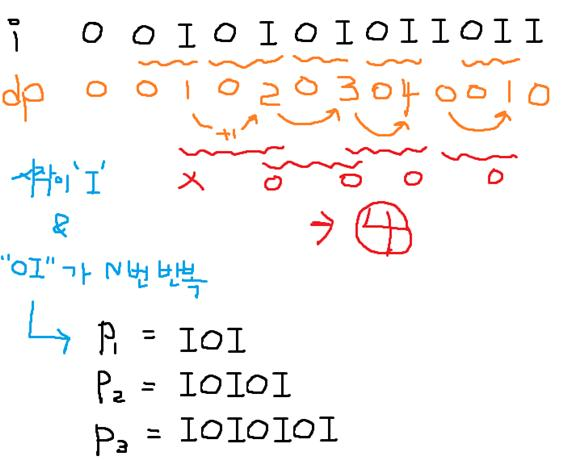

# 📁 <b><a style="color:#00adb5" href="https://www.acmicpc.net/problem/5525" target=_blank>[S1_5525] IOIOI</a></b>

- <big>첫 구현 - 시간초과 50점 </big>

```java
import java.io.BufferedReader;
import java.io.IOException;
import java.io.InputStreamReader;

public class Main {
	public static void main(String[] args) throws IOException {
		BufferedReader br = new BufferedReader(new InputStreamReader(System.in));

		// **** input start ****
		int N = Integer.parseInt(br.readLine());

		int S = Integer.parseInt(br.readLine());

		String str = br.readLine();

		// **** input end ****

		String P = "";

		// Pn 구하기
		for (int i = 0; i < (N * 2 + 1); i++) {
			if (i % 2 == 0) {
				P += "I";
			} else {
				P += "O";
			}
		}

		// 총 횟수
		int cnt = 0;

		for (int i = 0; i < S - (N * 2); i++) {
			if (str.charAt(i) == 'I') {
				if(str.substring(i, i+N*2+1).equals(P)) {
					cnt++;
					};
				}
			}
		System.out.println(cnt);
	}
}
```

- <big>dp로 구현 - 100점 </big>

```java
import java.io.BufferedReader;
import java.io.IOException;
import java.io.InputStreamReader;

public class Main {
	public static void main(String[] args) throws IOException {
		BufferedReader br = new BufferedReader(new InputStreamReader(System.in));

		// **** input start ****
		int N = Integer.parseInt(br.readLine());

		int S = Integer.parseInt(br.readLine());

		String str = br.readLine();

		// **** input end ****
		char[] ch = str.toCharArray();
		int[] dp = new int[S];

		// 총 횟수
		int cnt = 0;

		// dp 배열 구하기
		for(int i=1; i<S-1; i++) {
			// "OI"값이 있으면 전 dp 값에서 +1
			if(ch[i] == 'O' && ch[i+1] == 'I') {
				// "OI" 가 세트이기 때문에 i-1번째 값에서 더한다
				dp[i+1] = dp[i-1] + 1;
			}
			// "OI"가 N번 이상 반복 하고 처음 시작하는 값이 "I"면 카운팅
			if(dp[i+1] >= N && ch[i-(N*2)+1] == 'I') {
				cnt++;
			}
		}

		System.out.println(cnt);
	}
}
```

## 🤔 <b><a style="color:#00adb5">나의 생각</a></b>

String 값에서 Pn을 구해 몇 번 나오는지 구하는 문제를 이해한 뒤 String.substring으로 길이만큼 잘라 확인해 주는 방식으로 구현을 했는데 시간초과가 떴다..<br>
이중 for문을 돌리면 시간초과가 뜰거라고 예상은 했지만 가지치기를 해서 괜찮을 줄 알았는데 ... ㅜ<br>
그래서 다른 블로그를 참고하니 dp형식으로 푸는 것이였다..<br>
위에 처음은 내가 구현한 string메서드를 활용했고 밑에는 dp로 풀어준 것이다.<br>
dp는 어려워 ㅠ <br>
첫 번째 테케를 이용해서 설명을 해보겠다.<br>

<br>
<center>
    
</center>

- 입력받은 string 값을 ch[] 배열로 생성
- 먼저 dp[] 배열을 완성해준다
  - i 번째 "O", i+1 번째 "I"
  - "OI"세트가 2칸을 차지하기 때문에 `dp[i+1] = dp[i-1]+1`
- dp[] 배열을 완성해준다음 조건에 따라 카운팅을 해준다
  - 카운팅을 해주기 위해선 "IOI"가 완성되어야 하므로 처음 값이 "I"인지 확인 `ch[i-(N*2)+1] == "I"`
  - 그리고 "OI"가 N번 반복되는지 체크 ( Pn이 되어야 하므로 )
