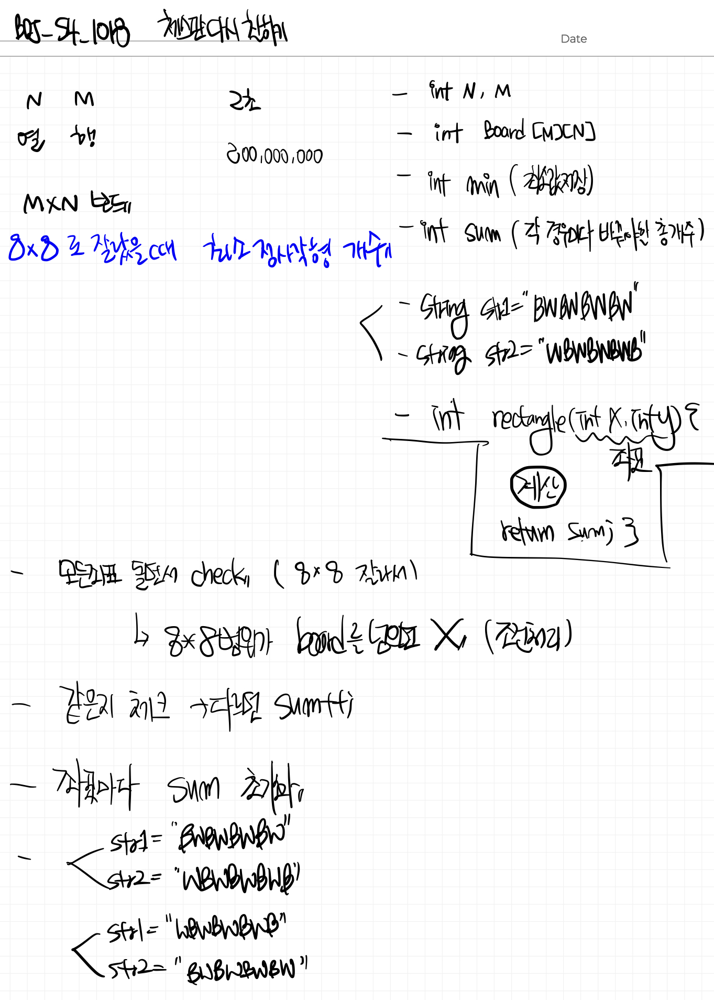

# 📁 <b><a style="color:#00adb5" href="https://www.acmicpc.net/problem/1018" target=_blank>[S4_1018] 체스판 다시 칠하기</a></b>

```java
import java.io.BufferedReader;
import java.io.IOException;
import java.io.InputStreamReader;
import java.util.StringTokenizer;

public class Main {
    static char[][] board;
    static int N,M;
    public static void main(String[] args) throws IOException {
        BufferedReader br = new BufferedReader(new InputStreamReader(System.in));
        StringTokenizer st = new StringTokenizer(br.readLine()," ");

        // **** input start ****
        // 행
        N = Integer.parseInt(st.nextToken());
        // 열
        M = Integer.parseInt(st.nextToken());

        board = new char[N][M];

        // 좌표입력
        for(int i=0; i<N; i++){
            String str = br.readLine();
            for(int j=0; j<M; j++){
                board[i][j] = str.charAt(j);
            }
        }

        // **** input end ****

        // 체크할 string
        String str1 = "BWBWBWBW";
        String str2 = "WBWBWBWB";
        int sum = 0;
        int min = Integer.MAX_VALUE;

        // 모든 좌표 탐색
        for(int i=0; i<N; i++){
            for(int j=0; j<M; j++){
                // 가지치기 만약 8*8 배열을 만들지 못한다면 ( 범위 초과 ) 통과
                if(i+8>N || j+8>M){
                    continue;
                }

                sum = rectangle(j,i,str1,str2);
                // 최솟값 구하기
                min = Math.min(min, sum);

                sum = rectangle(j,i,str2,str1);
                // 최솟값 구하기
                min = Math.min(min, sum);
            }
        }

        System.out.println(min);

    } // main end

    // sum 계산
    static int rectangle(int x, int y, String first, String second){
        int sum = 0;
        // 행 번호
        int temp = 0;

        for(int i=y; i<y+8; i++){
            // string 열 번호
            int temp2 = 0;
            for(int j=x; j<x+8; j++){
                // first check
                if(temp % 2 == 0){
                    // 만약 값이 다르다면 카운팅
                    if(board[i][j] != first.charAt(temp2)) sum++;
                }
                // second check
                else{
                    // 만약 값이 다르다면 카운팅
                    if(board[i][j] != second.charAt(temp2)) sum++;
                }
                // string 열 플러스
                temp2++;
            }
            // 행 플러스
            temp++;
        }
        return sum;
    }
} // class end
```

## 🤔 <b><a style="color:#00adb5">나의 생각</a></b>

문제를 이해하는데 시간이 은근히 걸렸다 ㅋㅋ 쉽게 이해할 수 없었어 ㅠ <br>
그래도 문제를 이해하고 생각한 방법은 모든 좌표를 돌면서 좌표값을 'BWBWBWBW', 'WBWBWBWB' 를 번갈아 확인해준다. 그리고 다른 문자 개수를 체크해 그 수가 최소인 수를 구하는 방법이다.<br>
<br>
과정은 다음과 같다.

- 모든 좌표 돌면서 check ( 8 * 8  잘라서 )
	- 8 * 8 범위가 board 범위를 넘으면 continue;
- 같은지 체크 , 다르면 sum++;
- 좌표마다 sum 초기화
- 'BWBWBWBW', 'WBWBWBWB' 순서 바꿔서 총 2번 진행

<br>
<center>
    
</center>
<br>

처음에 구상은 원래 좌표값이 'W'인지 'B'인지 따라 다르게 해줬었는데 풀어보니 시작좌표와는 관계가 없는 경우가 있어 그냥 두번의 경우 다 구해주고 최솟값을 구해주었다.<br>
시간초과가 나지 않는 범위라 다행이였다.