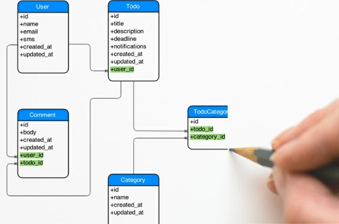

# 📚 <a style="color:#00adb5">DB ( DataBase )</a>


## <a style="color:#00adb5">DB ( DataBase )</a> 란 무엇인가 ?
<strong>데이터베이스 ( DB : database )</strong> 는 <a style="color:red"><strong>통합하여 관리되는 데이터의 집합체를 의미</strong></a>한다.<br>
중복된 데이터를 없애고, 자료를 구조화하여 효율적인 처리를 할 수 있도록 관리된다.<br>
그래서 여러 업무에 여러 사용자가 데이터베이스를 사용할 수 있다.

## <a style="color:#00adb5">DB ( DataBase )</a> 의 특징
- 사용자 질의에 대하여 <strong>즉각적인 처리와 응답</strong>이 이루어진다.
- 생성, 수정, 삭제를 통하여 <strong>항상 최신의 데이터를 유지</strong>한다.
- 사용자들이 원하는 <strong>데이터를 동시에 공유</strong>할 수 있다.
- 사용자가 원하는 데이터를 주소가 아닌<strong>내용에 따라 참조</strong>할 수 있다.
- 응용프로그램과 데이터베이스는 독립되어 있으므로, 데이터의 논리적 구조와 응용프로그램은 별도로 동작된다.

## <a style="color:#00adb5">SQL ( Structured Query Language ) </a>
<strong>SQL ( Structured Query Language )</strong> 은 데이터베이스에서 <a style="color:red"><strong>데이터를 정의, 조작, 제어하기 위해 사용하는 언어</strong></a>이다.<br>
모든 DBMS에서 사용 가능하고 대소문자는 구별하지 않지만 데이터의 대소문자는 구분한다.<br>
<br>
목적에 따라 구분할 수 있다. ( DDL, DML, DCL ) + TCL

### <a style="color:#00adb5">DDL ( Data Definition Language ) </a>
<a style="color:red"><strong>데이터 정의어</strong></a><br>
데이터베이스나 테이블 등을 생성, 삭제하거나 데이터베이스 객체의 구조 ( table, view, index, .. )를 정의한다.<br>
테이블 생성, 컬럼 추가, 타입변경, 제약조건 지정 등등

- <strong>CREATE</strong><br>
데이터베이스 객체를 <a style="color:red"><strong>생성</strong></a>

```sql
dbtest 데이터베이스 생성

create database dbtest
default character set utf8mb3 collate utf8mb3_general_ci;
( utf8mb3 는 다국어 처리, utf8mb4 는 다국어 처리 + 이모지 사용 가능 )
( character set은 각 문자가 컴퓨터에 저장될 때 어떠한 코드로 저장 될지에 대한 규칙의 집합을 의미한다 )
( Collation은 특정 문자 셋에 의해 데이터베이스에 저장된 값들을 비교 검색하거나 정렬 등의 작업을 위해 문자들을 서로 " 비교 " 할 때 사용하는 규칙들의 집합을 의미한다. )

-------------------------------------------------------------------------------------------------------

dbtest 데이터베이스 사용

use dbtest;

```


- <strong>ALTER</strong><br>
기존에 존재하는 데이터베이스 객체를 <a style="color:red"><strong>수정</strong></a>

```sql
dbtest 데이터베이스 수정 ( 이모지 사용 가능한 것으로 )

alter database dbtest
default character set utf8mb4 collate utf8mb4_general_ci;
```

- <strong>DROP</strong><br>
데이터베이스 객체를 <a style="color:red"><strong>삭제</strong></a>

```sql
dbtest 데이터베이스 삭제

drop database dbtest;
```


### <a style="color:#00adb5">DML ( Data Manipulation Language ) </a>
<a style="color:red"><strong>데이터 조작어</strong></a><br>
데이터베이스에 저장된 데이터를 처리하거나 조회, 검색하기 위한 명령어이다.<br>
테이블의 레코드를 CRUD ( Create, Read, Update, Delete )

- <strong>insert ( C ) </strong><br>
데이터베이스 객체에 데이터를 <a style="color:red"><strong>입력</strong></a>

```sql
insert into table_name( col_name1, col_name2 .. )
value ( col_val1, col_val2 .. );


-> col_name 을 안 적으면 전체 속성을 의미
-> col_value 세트를 여러개 적어도 된다.
```

- <strong>select ( R ) </strong><br>
데이터베이스 객체에서 데이터를 <a style="color:red"><strong>조회</strong></a>

```sql
select * | { [] ALL | DISTINCT ] col_name1 | expression [ alias ] .. }
from table_name
where conditions;
order by col_name1 [ ASC | DESC ] ..

-> * : 테이블의 모든 열을 선택
-> ALL : 선택된 모든 행을 반환 ( default ) 생략 가능
-> DISTINCT : 선택된 모든 행 중에서 중복 행 제거
-> col_name1 : 지정된 열
-> expression : 연산자 및 SQL 함수의 조합
-> alias : 별칭, 화면에 나오는 이름을 정할 수 있다.
-> where : 조건을 만족하는 행 검색
-> order by : col_name1 기준으로 정렬 ( ASC : 오름차순 (default 생략가능), DESC : 내림차순 )
-> order by col_name1 col_name2 desc;  => col_name1로 오름차순 정렬 후 col_name2로 내림차순 정렬한다.

🔒 alias, 사칙연산, NULL Value
select employee_id as 사번, first_name as "이 름"
        salary * 12 "연 봉", (salary + salary * IFNULL(commission_pct, 0)) * 12 "커미션 포함 연봉"
from employee;

-> IFNULL ( commission_pct, 0 ) : expr1이 null이면 expr2가 return => 커미션이 null이면 0을 반환한다.


🔒 CASE exp1 WHEN exp2 THEN exp3
             WHEN exp4 THEN exp5
             ..
             ELSE exp6
    END

select employee_id, first_name, salary,
        case when salary > 15000 then '고액 연봉'
             when salary > 8000 then '평균 연봉'
             else '저액 연봉'
        end "연봉 등급"
from employees;

-> 봉급이 15000 이상이면 '고액 연봉' 8000 이상 '평균 연봉' 나머지는 '저액 연봉'

    
🔒 and, or, not

🔒 in , not in
포함하냐 안포함하냐 

- 부서 번호가 50, 60, 70 에 근무하는 사원의 사번, 이름, 부서번호 검색

select employee_id, first_name, department_id
from employees
where department_id in (50,60,70);

- 부서 번호가 50, 60, 70 가 아닌 근무하는 사원의 사번, 이름, 부서번호 검색

select employee_id, first_name, department_id
from employees
where department_id not in (50,60,70);

🔒 between A and B
A 와 B 사이 값

- 급여가 6000 이상 10000 이하인 사원의 사번, 이름, 급여 검색

select employee_id, first_name, department_id
from employees
where salary between 6000 and 10000;

🔒 NULL 비교 : IS NULL, IS NOT NULL
 = NULL 로 검색이 안된다 !!
 
- 커미션을 받는 사원의 사번, 이름, 급여, 커미션 검색

select employee_id, first_name, salary, commission_pct
from employees
where commission_pct is not null;

🔒 LIKE( % , _ )

% : 개수 상관하지 않고 몇 번째 상관 X
_ : 개수, 몇 번째 다 맞아야한다 

- 이름에 'x'가 들어간 사원의 사번, 이름 검색

select employee_id, first_name
from employees
where first_name like '%x%';

- 이름의 끝에서 3번째 자리에 'x'가 들어간 사원의 사번, 이름 검색

select employee_id, first_name
from employees
where first_name like '%x__';


```

- <strong>update ( U ) </strong><br>
데이터베이스 객체에 데이터를 <a style="color:red"><strong>수정</strong></a>

```sql
update table_name
set col_name1 = col_val1 ..
where conditions;

-> where 절의 conditions( 조건 )에 만족하는 레코드의 값을 변경한다.
-> where 절을 생략하면 모든 데이터가 바뀐다.
```

- <strong>delete ( D )</strong><br>
데이터베이스 객체에 데이터를 <a style="color:red"><strong>삭제</strong></a>

```sql
delete from table_name
where conditions;

-> where 절의 conditions( 조건 )에 만족하는 레코드의 값을 삭제한다.
-> where 절을 생략하면 모든 데이터가 삭제된다.
```


### <a style="color:#00adb5">DCL ( Data Control Language ) </a>
<a style="color:red"><strong>데이터 제어어</strong></a><br>
데이터베이스에 저장된 데이터를 관리하기 위하여 데이터의 보안성 및 무결성 등을 제어하기 위한 명령어이다.<br>
DB, Table의 접근 권한 이나 CRUD 권한을 정의한다.<br>
특정 사용자에게 테이블의 검색권한을 부여/금지 등을 한다.

- <strong>grant</strong><br>
데이터베이스 객체에 <a style="color:red"><strong>권한을 부여</strong></a>

```sql
grant create user, alter user, drop user
to js with admin option;

-> js에게 create, alter, drop 권한을 준다. ( 객체는 select, insert .. 도 가능 )
-> with admin option 은 권한 받은 사용자가 다른 사용자에게도 권한을 부여할 수 있는 것
```

- <strong>revoke</strong><br>
데이터베이스 객체 <a style="color:red"><strong>권한을 취소</strong></a>

```sql
revoke create user, alter user, drop user
from js;

-> js에게서 create, alter, drop 권한을 회수한다.
```


### <a style="color:#00adb5">TCL ( Transaction Control Language ) </a>
<a style="color:red"><strong>트랜잭션 제어어</strong></a><br>
transaction 이란 데이터베이스의 논리적 연산 단위

```sql
use jsdb;

create table test(
    var varchar(10)
);

start transaction;

insert into test
values('a');

insert into test
values('b');

commit;
-- 여기까지 a,b 저장

insert into test
values('c');

rollback;
-- commit한 상태로 돌아감 -> c는 저장 안됨


-> savepoint f1으로 저장하고 rollback to f1으로 돌아갈 수도 있다.
```

- <strong>commit</strong><br>
실행한 Query를 <a style="color:red"><strong>최종적으로 적용</strong></a>

- <strong>rollback</strong><br>
실행한 Query를 마지막 commit 전으로 취소시켜 <a style="color:red"><strong>데이터를 복구</strong></a>


### <a style="color:#00adb5">테이블 생성 </a>

- 스키마<br>
스키마란 데이터베이스의 테이블에 저장될 데이터의 구조와 형식을 정의

- ER Diagram ( ERD )<br>
개체 타입과 관계타입을 기본 개념으로 현실 세계를 개념적으로 표현하는 방법<br>




- 스키마를 참조하여 테이블 생성 SQL 작성<br>

```sql

member 테이블 생성

create table member{
    idx         int     auto_increment,
    userid      varchar(16) not null,
    username    varchar(20),
    userpwd     varchar(16),
    primary key (idx)
};

```

- 제약 조건<br>
    - 컬럼에 저장될 데이터의 조건을 설정
    - 제약조건을 설정하면 조건에 위배되는 데이터는 저장 불가
    - 테이블 생성 시 컬럼에 직접 지정하거나 constraint로 지정, 또는 ALTER를 이용하여 설정가능

- NOT NULL<br>
컬럼에 NULL 값을 저장할 수 없다.

- UNIQUE<br>
컬럼에 중복된 값을 저장할 수 없다. NULL 값은 허용

- PRIMARY KEY<br>
컬럼에 중복된 값을 저장할 수 없고 NULL 값도 허용하지 않는다.<br>
유일한 값을 지정할 때 사용 , <a style="color:red"><strong>기본키</strong></a>라고 부른다.

- FOREIGN KEY<br>
특정 테이블의 PK 컬럼에 저장되어 있는 값만 저장<br>
참조키, 외래키라 불리며 NULL 값을 허용한다.<br>
reference를 이용하여 어떤 컬럼에 어떤 데이터를 참조하는지 반드시 지정

- DEFAULT<br>
NULL 값이 들어올 경우 기본 설정되는 값을 지정

- CHECK<br>
값의 범위나 종류를 지정

## <a style="color:#00adb5">RDB ( Relational DataBase )</a> 란 무엇인가 ?
<a style="color:red"><strong>데이터의 종속성을 관계로 표현하는 것이 관계형 데이터베이스</strong></a>의 특징 이다.<br>
현재 가장 많이 쓰이고 있는 데이터베이스의 한 종류이다.<br>
테이블로 이루어져 있으며 이 테이블은 키와 값의 관계를 나타낸다.<br>


## <a style="color:#00adb5">RDB ( Relational DataBase )</a> 의 특징
- 데이터의 분류, 정렬, 탐색 속도가 빠르다.
- 오랫동안 사용된 만큼 신뢰성이 높고, 어떤 상황에서도 데이터의 무결성을 보장해 준다.
- 기존에 작성된 스키마를 수정하기가 어렵다.
- 데이터베이스의 부하를 분석하는 것이 어렵다.
<br>
<br>

# 📚 <a style="color:#00adb5">DBMS ( DataBase Management System )</a>

## <a style="color:#00adb5">DBMS ( DataBase Management System )</a> 란 무엇인가 ?
DBMS는 <a style="color:red"><strong>데이터베이스를 관리하는 시스템</strong></a>이다.<br>
사용자와 DB사이에서 사용자의 요구에 따라 데이터를 생성해주고 DB를 관리해주는 SW이다.<br>
DBMS는 데이터를 계층 또는 탐색 형식으로 저장한다. 파일 시스템을 사용해 저장하며 따라서 테이블 간에는 아무런 관계가 없다.<br>
<a style="color:red"><strong>데이터에 많은 보안을 제공하지 않으며 정규화를 수행할 수 없어 데이터는 높은 중복성을 가질 수도 있다.</strong></a><br>
Sybase, dbase 및 Microsort Access는 DBMS의 몇가지 예이다.

## <a style="color:#00adb5">RDBMS ( Relational DataBase Management System )</a> 란 무엇인가 ?
RDBMS는 DBMS의 한가지 유형으로 <a style="color:red"><strong>관계형 모델을 기반으로 하는 DBMS의 유형</strong></a>이다.<br>
RDBMS는 테이블이 서로 연관되어 있어 일반 DBMS 보다 효율적으로 데이터를 저장 , 구성 및 관리할 수 있다.<br>
그리고 테이블 간의 관계 ( join )를 이용하여 필요한 데이터를 검색할 수 있다.<br>
<a style="color:red"><strong>정규화를 통해 데이터의 중복성을 최소화하여 트랜잭션을 수행하는 것이 더 쉽다.</strong></a><br>
<a style="color:red"><strong>데이터의 원사성, 일관성, 격리 및 내구성을 유지하며 데이터 무결성을 높인다.</strong></a><br>
MSSQL, MySQL, Oracle이 RDBMS의 몇가지 예이다.


## <a style="color:#00adb5">DATABASE</a> 기본 마무리
그래도 비교적 DataBase에 대한 지식이 남아 있어서 쉬웠다.<br>
그러나 원래 DB가 초반에는 쉽고 뒤로 갈 수록 (join) 복잡해 지기 때문에 이제 시작이다.<br>
sqld 자격증도 보유하고 있지만 아직 많이 DB를 실제로 다뤄보지 못했기 때문에 열심히 공부해야한다.<br>
어느 곳에서나 사용하는 DB를 잘 알고 있어야 한다. 그리고 한 번의 잘못된 실행으로 나락으로 갈 수 있기 때문에 신중하게 사용하여야 한다.( 그런 사례가 많다더라 ㅋㅋ)<br>
이제 기본적인 DB와 DBMS 그리고 현재 많이 사용하고 있는 RDB, RDBNS, SQL 에 대해 알아 보았는데 기초를 탄탄히 해놔야 뒤에 여러 테이블들을 이용해 검색하는 것을 이해할 수 있다.<br>
그리고 정규화 과정도 복잡하기 때문에 기초를 탄탄히 하자 !!


<br><br><br><br>
👏 참조<br>
<a href="http://www.tcpschool.com/mysql/DB" target=_blank>http://www.tcpschool.com/mysql/DB</a><br>
<a href="https://m.blog.naver.com/cjhol2107/221758915414" target=_blank>https://m.blog.naver.com/cjhol2107/221758915414</a><br>