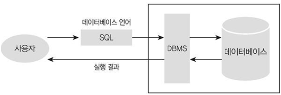

# 📚 <a style="color:#00adb5">DB ( DataBase )</a>


## <a style="color:#00adb5">Subquery</a>
- 서브 쿼리 ( subquery) 란 <a style="color:red"><strong>다른 쿼리 내부에 포함 되어 있는 SELECT 문을 의미</strong></a>한다.
- 여러 번의 select 문을 실행하여 얻을 수 있는 결과를 하나의 쿼리로 결과를 얻을 수 있다.
- 서브 쿼리를 포함하고 있는 쿼리를 외부 쿼리 ( outer query ) 또는 메인 쿼리라고 부르며, 서브 쿼리는 내부 쿼리 ( inner query )라고도 부른다.
- <a style="color:red"><strong>메인쿼리보다 먼저 실행</strong></a>된다.
- 서브 쿼리는 <a style="color:red"><strong>비교 연산자의 오른쪽에 기술해야하고 반드시 괄호 ( () )로 감싸져 있어야만 한다.</strong></a>
- <a style="color:red"><strong>SELECT, FROM, WHERE, HAVING, ORDER BY, INSERT 문의 VALUES, UPDATE문의 SET</strong></a> 에 사용할 수 있다.
- 서브 쿼리는 <a style="color:red"><strong>단일 행('=, >, <, >=, <=') 또는 다중 행('IN, ANY, ALL') 비교 연산자와 같이 사용</strong></a>된다. 

```sql
사번이 100인 사원의 부서이름은?

-> join 사용

select department_name
from employees e inner join departments d
on e.department_id = d.department_id
where e.employee_id = 100;


-> subquery 사용

select department_name
from departments
where department_id = ( select department_id
                        from employees
                        where employee_id = 100);
```

### <a style="color:#00adb5">Nested Subquery</a>
- subquery가 <a style="color:red"><strong>where 절에서 사용된 것</strong></a>이 Nested Subquery라 한다.

#### <a style="color:#00adb5">Nested Subquery</a> - 단일 행
- subquery의 <a style="color:red"><strong>결과가 단일 행을 리턴</strong></a>한다.
- 단일 행 비교 연산자로는 '=, >, <, >=, <=' 이 있다.

```sql
-> 'adam'과 같은 부서에 근무하는 사원의 사번, 이름, 부서번호

select employee_id, first_name, department_id
from employees
where department_id = ( 
                        select department_id
                        from employees
                        where first_name='adam'
);
```

#### <a style="color:#00adb5">Nested Subquery</a> - 다중 행
- subquery의 <a style="color:red"><strong>결과가 다중 행을 리턴</strong></a>한다.
- 다중 행 비교 연산자로는 'IN, ANY, ALL' 이 있다.

```sql
-> IN
-> 근무 도시가 'seattle' 인 사원의 사번, 이름

select employee_id, first_name
from employees
where department_id in (
                        select department_id
                        from department 
                        where location_id = (
                                             select location_id
                                             from locations
                                             where city = 'seattle'
                                            
                        )
);


-> ANY ( 적어도 하나만 만족하면 true )
-> 모든 사원 중 적어도 ( 최소 급여자 보다 ) 30번 부서에서 근무하는 사원의 급여보다 많이 받는 사원의 사번,이름,급여,부서번호

select employee_id, first_name, salary, department_id
from employees
where salary > any (
                    select salary
                    from employees
                    where department_id = 30
);


-> ALL ( 모두 만족하면 true )
-> 30번 부서에서 근무하는 모든 ( 최대 급여자 보다 ) 사원들 보다 급여를 많이 받는 사원의 사번, 이름, 급여, 부서번호

select employee_id, first_name, salary, department_id
from employees
where salary > all (
                    select salary
                    from employees
                    where department_id = 30
);
```


#### <a style="color:#00adb5">Nested Subquery</a>- 다중 열
- subquery의 <a style="color:red"><strong>결과가 다중 열을 리턴</strong></a>한다.

```sql
-> 커미션을 받는 사원 중 매니저 사번이 148인 사원의 급여와 부서번호가 일치하는 사원의 사번, 이름

select employee_id, first_name
from employees
where (salary, depmartment_id) in ( 
                                    select salary, department_id
                                    from employees
                                    where commission_pct is not null
                                    and manager_id = 148
);
```


### <a style="color:#00adb5">Inline View Subquery</a>
- subquery가 <a style="color:red"><strong>from 절에서 사용된 것</strong></a>이 Inline View Subquery라 한다.
- subquery가 from 절에 사용되면 <a style="color:red"><strong>View 처럼 결과가 동적으로 생성된 테이블로 사용 가능</strong></a>하다.
- 임시적인 뷰이기 때문에 DB에 저장되지는 않는다.
- 동적으로 생성된 테이블이기 때문에 column을 자유롭게 참조할 수 있다.

```sql
-> 모든 사원의 평균 급여보다 적게 받는 사원들과 같은 부서에서 근무하는 사원의 사번, 이름, 급여, 부서번호

select employee_id, first_name, salary, department_id
from (
        select distinct department_id
        from employees
        where salary < (select avg(salary) from employees)
) d join employees e
on d.department_id = e.department_id;


-> limit 활용 ( MYSQL의 장점 )
-> 모든 사원의 사번 , 이름, 급여 출력 
-> 사원 정보를 급여순으로 정렬
-> 한 페이지당 5명이 출력되고 
-> 현재페이지가 3페이지라고 가정해라 ( 11등 ~ 15등 출력 )

select employee_id, first_name, salary
from employees
order by salary desc limit 10, 5;
```


### <a style="color:#00adb5">Scalar Subquery</a>
- subquery가 <a style="color:red"><strong>select 절에서 사용된 것</strong></a>이 Scalar Subquery라 한다.
- 한 개의 행만 반환한다.

```sql
-> 60번 부서에 근무하는 사원의 사번, 이름, 급여, 부서번호, 60번부서의 평균 급여

select employee_id, first_name, salary, departname_id,
     (select avg(salary) from employees where department_id = 60) as avg60
from employees
where department_id = 60;
```


## <a style="color:#00adb5">Subquery</a> 활용

### <a style="color:#00adb5">CREATE</a>

```sql
-> employees table 을 emp_copy라는 이름을 복사

create table emp_copy
select *
from employees;

-> 50번 부서의 사번, 이름, 급여, 부서번호만 emp50이라는 테이블 생성

create table emp50
select employee_id, first_name, salary, department_id
from employees
where department_id=50;
```

### <a style="color:#00adb5">INSERT</a>

```sql
-> employees table 에서 부서번호가 80인 사원의 모든 정보를 emp_blank에 insert

insert into emp_blank
select *
from employees
where department_id = 80;
```

### <a style="color:#00adb5">UPDATE</a>

```sql
-> employees table 의 모든 사원의 평균 급여보다 적게 받는 emp50 table의 사원의 급여를 500 인상

update emp50
set sal = sal + 500
where sal < (select avg(salary) from employees);
```

### <a style="color:#00adb5">DELETE</a>

```sql
-> employees table 의 모든 사원의 평균 급여보다 적게 받는 emp50 table의 사원은 퇴사

delete from emp50
where sal < (select avg(salary) from employees);
```


## <a style="color:#00adb5">DATABASE</a> Subquery 마무리
DB의 꽃인 Subquery를 배워보았다.<br>
확실히 Join과 Subquery를 배우니 접근할 수 있는 데이터들이 훨씬 많이 늘어났다.<br>
물론 복잡하게 구하면 어렵지만 어느정도 구조는 다 이해한 것 같다.<br>
Subquery도 똑같이 국어 ! 를 잘해야한다.. ㅋㅋ 테이블의 구조도 잘 알아야하고..<br>
그래야 쿼리문을 잘 짤수 있을 것 같다.<br>
많이 사용하는 만큼 잘 알아둬야한다 !!