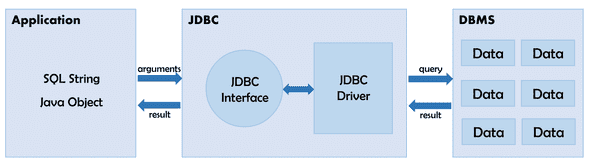
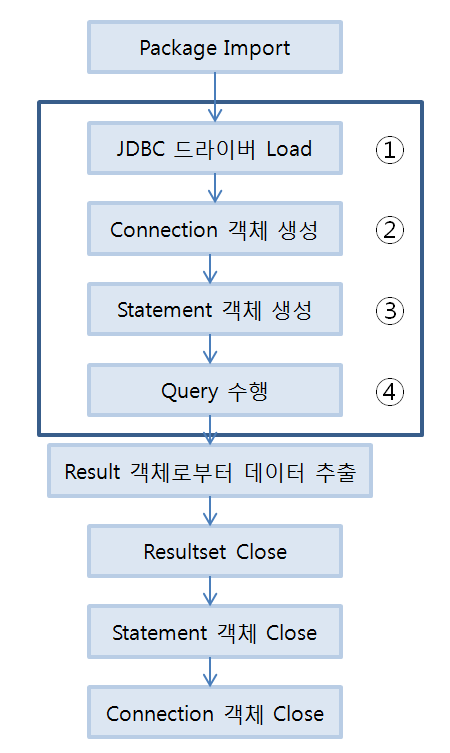

# 📚 <a style="color:#00adb5">DB ( DataBase )</a>

<center>

</center>
<br>

# 📚 <a style="color:#00adb5">JDBC</a>

## <a style="color:#00adb5">JDBC</a> 란 무엇인가?
<center>

</center>
<br>
JDBC - <a style="color:red"><strong>Java Database Connectivity</strong></a><br>
<a style="color:red"><strong>자바 프로그램이 데이터베이스와 연결되어 데이터를 주고 받을 수 있게 해주는 프로그래밍 인터페이스</strong></a>이다.<br>
응용프로그램과 DBMS간의 통신을 중간에서 번역해주는 역할을 한다.

## <a style="color:#00adb5">DATABASE JDBC</a> java.sql.Package
- java.sql.Driver<br>
DB와 연결하는 Driver class를 만들 때 반드시 implements 해야하는 interface로 <a style="color:red"><strong>JDBC 드라이버의 중심</strong></a>이 되는 Interface이다.

- java.sql.Connection<br>
특정 데이터베이스와 <a style="color:red"><strong>연결정보</strong></a>를 가지는 Interface이다.<br>
DriverManager로부터 Connection 객체를 가져온다.

- java.sql.Statement<br>
<a style="color:red"><strong>SQL query 문을 DB에 전송하는 방법을 정의</strong></a>한 Interface이다.<br>
Connection을 통해 가져온다.

- java.sql.ResultSet<br>
<a style="color:red"><strong>SELECT 문의 실행 결과를 조회할 수 있는 방법을 정의</strong></a>한 INTERFACE이다.

- java.sql.PreparedStatement<br>
Statement의 하위 INTERFACE이다.<br>
<a style="color:red"><strong>SQL문을 미리 컴파일</strong></a>하여 실행 속도를 높인다.

- java.sql.CallableStatement<br>
PreparedStatement의 하위 INTERFACE이다.<br>
<a style="color:red"><strong>DBMS의 Stored procedure을 호출</strong></a>한다.

## <a style="color:#00adb5">DATABASE JDBC</a> 개발단계
<center>

</center>

① **JDBC Driver Loading**

```java
Class.forName("com.mysql.cj.jdbc.Driver"); 
```

- 데이터베이스 벤더에 맞는 드라이버를 호출한다. ( MYSQL에서 제공하는 Driver 클래스 )
- 데이터베이스와의 연결을 위해 드라이버를 로딩한다.

② **Connection**

```java
String jdbcURL = "jdbc:mysql://127.0.0.1:3306/database?serverTimezone=UTC&useUniCode=yes&characterEncoding=UTF-8";
                                              ________ -> database 스키마명
String jdbcid= "root";
String jdbcpw= "1234";

Connection conn = null;
conn = DriverManager.getConnection(jdbcURL, jdbcid, jdbcpw);
```

- DB와 연결을 위해 커넥션 정보 ( url, user, password )가 필요하다.
- DriverManager.getConnection(jdbcURL, jdbcid, jdbcpw) 수행 결과로 Connection 객체를 반환해서 쿼리를 날리는 statement를 작성할 수 있다.

- <a style="color:red"><strong>SELECT 쿼리는 createStatement(), INSERT 쿼리는 prepareStatement()를 호출</strong></a>한다.

③ Statement/**PreparedStatement**

```java
PreparedStatement stmt = null;
stmt = conn.prepareStatement();
```

- SQL 구문을 정의하고 변경 될 값은 치환문자를 이용해 쿼리 전송 전에 값을 setting 한다.

④ **executeUpdate()** or **executeQuery()**

```java
-> INSERT
String sql = "insert into product (product_id, product_name, product_price, product_desc, register_date) values (?, ?, ?, ?, now())"

Result rst = null;
rst = stmt.executeUpdate(sql);

-> SELECT
String sql = "select * from product"

Result rst = null;
rst = stmt.executeQuery(sql);

```

- **executeUpdate()**는 <a style="color:red"><strong>INSERT, DELETE, UPDATE</strong></a>의 경우에 사용한다. 반환값의 타입은 <a style="color:red"><strong>int</strong></a>이다.<br>
테이블의 내용을 변경하는 문장에 사용
- **executeQuery()**는 <a style="color:red"><strong>SELECT</strong></a>의 경우에 사용한다. 반환값의 타입은 <a style="color:red"><strong>ResultSet</strong></a>이다.<br>
테이블 형태의 결과를 반환할 때 사용

⑤ **ResultSet ( SELECT의 경우 )**

```java
while(rst.next()) {
				System.out.print(rst.getInt("idx") + " ");      // col 이름이 int형 idx
				System.out.print(rst.getString(2) + " ");       // 2번째 col
				System.out.println(rst.getString("pname"));     // col 이름이 String형 pname
			}
```

- 데이터베이스 조회 결과집합에 대한 표준이다.
- next() 를 통해 DB의 table 안의 row 한 줄을 불러온다. ResultSet 인터페이스에는 질의 결과의 현재 행(row)을 가리키는 커서라는 개념이 있다.
- <a style="color:red"><strong>getString(), getInt()를 통해 컬럼 이름을 문자열로 직접 쓰거나 또는 컬럼번호를 이용해서 한 행의 특정 Column을 가져 올 수 있다.</strong></a>

⑥ **close ( Connection, Statement, ResultSet )**

```java
close ( conn, stmt, rst );
```

- <a style="color:red"><strong>Connection, Statement, ResultSet에 대해 close 를 해준다</strong></a>( 꼭 close 해줘야 한다, 따로 클래스를 만들어 close 하는 과정을 저장해둔다. )

## <a style="color:#00adb5">DATABASE JDBC</a> 마무리
JDBC에 대해 알아보았다.<br>
빨리 JAVA와 DB를 연결하는 것을 해보고 싶었는데 해보니까 신기하다 ㅎㅎ<br>
비록 이 방법이 mybatis를 사용하면 더 간단하게 이뤄지는 것 이지만 JDBC의 구조를 파악하기 위해서는 꼭 필요한 과정이라고 생각한다.<br>
가져와서 연결하고 실행하고 종료하는 것까지.<br>
데이터를 조회하는 select 와 데이터를 출력하거나 변경하는 insert, update 등등 두 부분의 방법이 약간씩 쓰는 메서드도 다르고 set, get도 상황에 맞게 잘 써야한다.<br>
JAVA와 연결할 때 부터 이제 DB가 본격적으로 시작하는 것이니까 잘 알 필요가 있다 !!


<br><br><br><br>
👏 참조<br>
<a href="https://shs2810.tistory.com/18" target=_blank>https://shs2810.tistory.com/18</a><br>
<a href="https://devlog-wjdrbs96.tistory.com/139" target=_blank>https://devlog-wjdrbs96.tistory.com/139</a><br>
