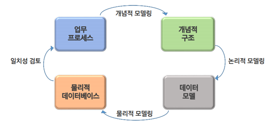
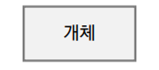
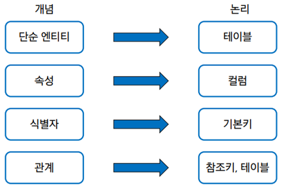

# 📚 <a style="color:#00adb5">DB ( DataBase )</a>

 

# 📚 <a style="color:#00adb5">DATABASE Modelling</a>

## <a style="color:#00adb5">DATABASE Modelling ( 데이터베이스 모델링 ) </a> 이란 무엇인가?

데이터베이스 모델링은 <a style="color:red"><strong>정보화 시스템을 구축하기 위해 어떤 데이터가 존재 하는지 또는 업무에 필요한 정보는 무엇인지 분석하는 방법</strong></a>이다. 
관계형 데이터베이스는 <a style="color:red"><strong>표의 개념 ( 행 Row, 열 Column )</strong></a>을 사용해서 데이터를 구성하는 방법을 사용한다. 

## <a style="color:#00adb5">개념적 데이터베이스 모델링</a>

<a style="color:red"><strong>업무분석 단계에서 얻어진 내용을 토대로 우선 Entity를 추출하고 속성(Attribute)을 구성하여 Entity간의 관계를 정의해서 ER-Diagram을 정의하는 단계</strong></a> 
Entity Relationship (E-R) Diagram 기호에는 세가지가 있다 - 개체, 속성, 관계

### <a style="color:#00adb5">개체 ( Entity )</a>

- <a style="color:red"><strong>사용자와 관계가 있는 주요 객체로써 업무 수행을 위해 데이터로 관리되어져야 하는 사람, 사물 등을 개체</strong></a>라고 한다. 
ex) 학생, 직원 ..
- Entity 찾는 법
    - 영속적으로 존재하는 것
    - 새로 식별이 가능한 데이터 요소를 가짐
    - <a style="color:red"><strong>Entity는 반드시 attribute를 가져야 함</strong></a>
    - 명사적 표현

### <a style="color:#00adb5">속성 ( Attribute )</a>

- <a style="color:red"><strong>저장할 필요가 있는 실체에 관한 정보</strong></a>
- 개체의 성질, 분류, 수량, 상태, 특성 등을 나타내는 세부사항
- 개체에 포함되는 속성의 숫자는 10개 내외로 하는 것이 바람직함
- 최종 DB 모델링 단계를 통해 테이블의 컬럼으로 활용 
ex) 학생 : 학번, 이름, 주민번호, 전화번호, 주소
- 속성의 유형
    - 기초 속성 
    원래 갖고 있는 속성으로 현업에서 기본적으로 사용되는 속성
    
    - 추출 속성 
    기초 속성으로부터 계산(가공)에 의해 얻어질 수 있는 속성

    - 설계 속성 
    실제로 존재하지 않으나 시스템의 효율성을 도모하기 위해 설계자가 임의로 부여하는 속성

- <a style="color:red"><strong>식별자</strong></a> 
한 개체 내에서 인스턴스를 유일하게 구분할 수 있는 단일 속성 또는 속성 그룹
    - 후보키 ( Candidate Key ) 
    개체내에서 각각의 인스턴스를 구분할 수 있는 속성으로 기본키가 될 수 있는 후보 속성
    - <a style="color:red"><strong>기본키 ( Primary Key )</strong></a> 
        - <a style="color:red"><strong>개체에서 각 인스턴스를 유일하게 식별하는데 가장 적합한 Key</strong></a>
        - 기본키 설정 시 고려할 사항으로 해당 실체를 대표할 수 있을 것, 업무적 활용도가 높을 것, 길이가 짧을 것 등이 있다.
        - ER-Diagram에서 밑줄로 표현된다.
    - 대체키 ( Alternate Key ) 
    후보키중에서 기본키로 선정되지 않은 속성
    - 복합키 ( Composite Key ) 
    하나의 속성으로 기본키가 될 수 없는 경우 둘 이상의 컬럼을 묶어서 식별자로 정의하는 경우
    - 대리키 ( Surrogate Key ) 
    식별자가 너무 길거나 여러 개의 속성으로 구성되어 있는 경우에 인위적으로 추가할 식별자

### <a style="color:#00adb5">관계 ( relationship )</a>

- <a style="color:red"><strong>두 Entity 간의 업무적인 연관성 또는 관련 사실</strong></a>
- relationship 분석
    - 각 Entity 간에 특정한 존재여부 결정
    - 현재의 관계 뿐만 아니라 장래에 사용될 경우도 고려
- 관계를 결정하는 순서
    - 관계가 있는 두 실체를 <a style="color:red"><strong>실선으로 연결하고 관계를 부여</strong></a>
    - <a style="color:red"><strong>관계차수</strong></a>를 표현
        - 차수성 : 한 실체의 하나의 인스턴스가 다른 실체의 몇 개의 인스턴스와 관련될 수 있는 가를 정의
            - 경우에 따라 발생 횟수 조사
            - 양쪽 방향 모두 조사
            - 1 : 1 ( 일 대 일) 
            두 실체의 레코드가 서로 하나씩 대응
            - 1 : N ( 일 대 다) 
            부모 실체의 하나의 레코드가 자식 실체의 여러 레코드에 대응
            - N : M ( 다 대 다) 
            양 쪽 실체 간에 여러 개의 레코드와 관계를 맺을 수 있는 경우
    - <a style="color:red"><strong>선택성</strong></a>을 표시
        - 선택적(optional)인지 반드시(mandatory)인지를 표시
        - 관계가 하나라도 만족되지 않으면 선택적으로 표시
        - 양쪽 방향 모두 조사

## <a style="color:#00adb5">논리적 데이터베이스 모델링</a>

개념적 데이터 베이스 모델링 단계에서 정의된 <a style="color:red"><strong>ER-Diagram을 Mapping Rule을 적용하여 관계형 데이터 베이스 이론에 입각한 스키마를 설계하는 단계와 이를 이용하여 필요하다면 정규화 하는 단계</strong></a>로 구성.
 
데이터 모델링 과정에서 가장 핵심이 되는 부분 
- <a style="color:red"><strong>기본키 ( Primary Key )</strong></a>
    - 후보키 중에서 선택한 주 키
    - NUll 값을 가질 수 없다. ( Not Null )
    - 동일한 값이 중복해서 저장될 수 없다. ( Unique )
- <a style="color:red"><strong>참조키, 이웃키 ( Foreign Key )</strong></a>
    - 관계를 맺는 두 엔티티에서 서로 참조하는 릴레이션의 attribute로 지정되는 키
- Mapping Rule 
    - 개념적 데이터베이스 모델링에서 도출된 개체 타입과 관계 타입의 테이블을 정의한다.

 
- <a style="color:red"><strong>정규화</strong></a>
    - Attribute간에 존재하는 함수적 종속성을 분석해서 관계형 스키마를 더 좋은 구조로 정제해 나가는 일련의 과정
    - 데이터의 중복을 제거하고 속성들을 본래의 제자리에 위치 시키는 것
    - 무결성을 유지할 수 있으며 DB 저장 용량 또한 줄일 수 있다.

제 1, 2, 3 정규화, BCNF 정규화에 대해 정리하려고 하였으나 블로그를 찾아보다 설명을 너무 깔끔하게 해놓은 블로그가 있어 링크 걸어둡니다. 참고하세용 
<a href="https://mangkyu.tistory.com/110?category=761304" target=_blank>https://mangkyu.tistory.com/110?category=761304</a>

## <a style="color:#00adb5">물리적 데이터베이스 모델링</a>
- 논리적 데이터베이스 모델링 단계에서 얻어진 <a style="color:red"><strong>데이터베이스 스키마를 좀더 효율적으로 구현하기 위한 작업</strong></a>
- DBMS 특성에 맞게 <a style="color:red"><strong>실제 데이터베이스내의 개체들을 정의하는 단계</strong></a> 
Column의 domain 설정 ( int, varchar ..)
- 데이터 사용량 분석과 업무 프로게스 분석을 통해서 보다 효율적인 데이터베이스가 될 수 있도록 효과적인 인덱스를 정의하고 상황에 따른 역정규화 작업을 수행한다. 
Index, Trigger, 역정규화
- <a style="color:red"><strong>역정규화 ( Denomalization )</strong></a>
    - 시스템 성능을 고려하여 기존 설계를 재구성하는 것
    - 정규화에 위배되는 행위
    - 테이블의 재구성
- 역정규화 방법
    - 데이터 중복 ( 컬럼 역정규화 )
        - 조인 프로세스가 많아 시스템의 성능저하를 가져오는 경우
        - 조인 프로세스를 줄이기 위해 해당 컬럼을 중복함으로써 성능을 향상시키기 위한 방법
    - 파생 컬럼의 생성
        - 기본적으로 테이블에 없는 컬럼을 숫자 연산이나 데이터 조작등을 통해 조회할 때 새로운 정보를 보여주는 경우
        - 판매테이블의 판매금액 컬럼이나 성적 테이블의 총점과 평균
    - 테이블 분리
        - 컬럼 기준으로 분리 ( 컬럼 수 )
        - 레코드 기준으로 분리 ( 레코드 양 )
    - 요약 테이블 생성 ( Summary Table )
        - 조회의 프로세스를 줄이기 위해 요약된 정보만을 저장하는 테이블을 만드는 것
    - 테이블 통합
        - 분리된 두 테이블이 시스템 성능에 영향을 끼칠 경우 고려

## <a style="color:#00adb5">DATABASE Modelling ( 데이터베이스 모델링 )</a> 마무리
데이터베이스 모델링에 대해 공부해 보았다. 
정처기 공부할 때 배웠던 내용들이 나와서 반가웠다 ㅎㅎ 정규화를 얼마나 빡세게 외웠는지.. 
필수 기출 문제라서 ㅎㅎ  
데이터베이스에서 중요한 개념이지만 교수님의 말씀에 따르면 DBA 데이터베이스 관리쪽으로 가지 않는다면 이 정도만 알고 있으면 된다고 하셨다 ㅎㅎ 가장 중요한 건 내가 원하는 데이터를 가져올 수 있냐 이기 떄문에 .. 
그래도 개념을 탄탄하게 해서 DB도 잘 다룰수 있도록 하겠다 !!

    
👏 참조 
<a href="https://mangkyu.tistory.com/110?category=761304" target=_blank>https://mangkyu.tistory.com/110?category=761304</a> 