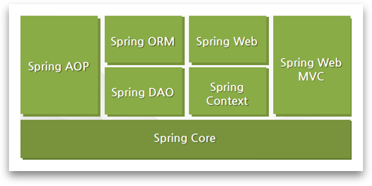

# 📚 <a style="color:#00adb5">SPRING</a>

 

# 📚 <a style="color:#00adb5">SPRING</a>

## <a style="color:#00adb5">SPRING</a> 의 탄생배경
SPRING을 알아 보기 전에 SPRING의 탄생 배경 먼저 살펴 보자. 그럼 SPRING의 사용에 관한 이해가 더 잘 될 것이다. 
기존에는 EJB ( Enterprise JavaBean ) 를 사용해서 애플리케이션을 작성하였다. 여기서 web에서도 나왔었던 JavaBean은 자바 객체를 재사용하도록 즉, 컴포넌트화시킬 수 있는 코딩 방침을 정의한 것이다. 
EJB는 <a style="color:red"><strong>비즈니스 객체들을 관리하는 컨테이너를 만들어서 필요할 때마다 컨테이너로부터 객체를 받는 식으로 관리하자</strong></a> 라는 취지로 탄생했는데,
그러나 EJB 는 현실에서 반영하기에는 과정이 너무 거창하고 복잡한 스펙틀 가지고 있어 개발의 효율이 떨어졌다. ( EJB 서버도 필수적이였다. )  

이 때 Rod Johnson 이 EJB를 사용하지 않고 엔터프라이즈 어플리케이션을 개발하는 방법을 소개했다. 이것이 스프링의 모태이다. 
<a style="color:red"><strong>특정 클래스를 상속하거나 인터페이스를 구현하지 않는 평범한 자바 클래스 ( POJO , 느슨한 JavaBean , Spring Bean )를 이용하여 단순하지만 EJB에서 제공하는 고급 기술을 제공</strong></a>하는 Spring을 창시하였다. 
 
<a style="color:red"><strong>POJO + 경량 프레임워크</strong></a> 
- POJO ( Plain Old Java Object )
    - <a style="color:red"><strong>특정 프레임 워크나 기술에 의존적이지 않은 자바 객체</strong></a> 
    - 특정 기술에 종속적이지 않기 때문에 생산성, 이식성 향상
    - Plain :  component interface를 상속받지 않는 특징 ( 특정 framework에 종속 x )
    - Old : EJB 이전의 Java Class 를 의미
- 경량 프레임 워크
    - EJB 가 제공하는 서비스를 지원해 줄 수 있는 프레임 워크 등장
    - Hibernate, JDO, iBatis(MyBatis), Spring
- POJO + 경량 프레임 워크
    - EJB 서버 같은 거창한 컨테이너가 필요 없다.
    - 오픈소스 프레임 워크라 사용이 무료
    - 각종 기업용 어플리케이션 개발에 필요한 상당히 많은 라이브러리 지원
    - 스프링 프레임워크는 모든 플랫폼에서 사용이 가능하다.
    - 스프링은 웹 분야 뿐만이 아니라 어플리케이션 등 모든 분야에 적용이 가능한 다양한 라이브러리를 가지고 있다.

## <a style="color:#00adb5">SPRING</a> 이란 무엇인가

### <a style="color:#00adb5">SPRING FRAMEWORK</a>

<a style="color:red"><strong>Spring Framework</strong></a> 
엔터프라이즈 급 애플리케이션을 만들기 위한 모든 기능을 종합적으로 제공하는 경량화 된 솔루션이다.  
JEE가 제공하는 다수의 기능을 지원하고 있기 때문에, JEE를 대체하는 Framework로 자리잡고 있다. 
Spring Framework는 JEE가 제공하는 다양한 기능 뿐만 아니라 DI, AOP와 같은 기능도 제공을 한다.  
Spring Framework는 <a style="color:red"><strong>자바로 Enterprise Application ( 기업의 업무를 처리해주는 system )을 만들 때 포괄적으로 사용하는 Programming 및 Configuration Model을 제공해주는 Framework로 Application 수준의 인프라 구조를 제공</strong></a>한다. 
즉 <strong>개발자가 복잡하고 실수하기 쉬운 low level 에 신경 쓰지 않고 Business Logic 개발에 전념할 수 있도록 해준다.</strong> 

### <a style="color:#00adb5">SPRING FRAMEWORK</a>의 구조

 
<a style="color:red"><strong>Spring 삼각형</strong></a> 
Enterprise Application 개발 시 복잡함을 해결하는 Spring의 핵심이다. 
 
- <a style="color:red"><strong>POJO ( Plain Old Java Object )</strong></a>
    - 특정 환경이나 기술에 종속적이지 않은 객체지향 원리에 충실한 자바객체
    - 테스트하기 용이하며, 객체지향 설계를 자유롭게 적용할 수 있다.
    - 생산성과 이식성이 좋다.
    - <a style="color:red"><strong>getter / setter 를 가진 단순한 자바 오브젝트</strong></a>

- <a style="color:red"><strong>PSA ( Portable Service Abstraction )</strong></a>
    - <a style="color:red"><strong>환경과 세부기술의 변경과 관계없이 일관된 방식으로 기술에 접근할 수 있게 해주는 설계 원칙, 서비스 추상화</strong></a>
    - 트랜잭션 추상화, OXM 추상화, 데이터 엑세스의 Exception 변환 기능 등 기술적인 복잡함은 추상화를 통해 Low Level의 기술 구현 부분과 기술을 사용하는 인터페이스로 분리
    - 예를 들면 DB에 관계없이 동일하게 적용 할 수 있는 트랜잭션 처리방식

- <a style="color:red"><strong>IoC ( Inversion of Control ) / DI ( Dependency Injection )</strong></a>
    - IoC는 인스턴스 ( 객체 )의 생성부터 소멸까지 <a style="color:red"><strong>객체 생명주기 관리를 개발자가 하는 것이 아니라 컨테이너가 대신 해주는 것</strong></a>
    - 제어권이 개발자가 아닌 IoC에게 있다.
    - DI 는 유연하게 확장 가능한 객체를 만들어 두고 <a style="color:red"><strong>객체 간의 의존관계는 외부에서 다이나믹하게 설정</strong></a> ( 의존관계가 내부가 아닌 외부에서 정의 )
    - 필요한 부분을 넣었다 뺐다 하면서 적절한 상황에 필요한 기능을 해낼 수 있다.

- <a style="color:red"><strong>AOP ( Aspect Oriented Programming )</strong></a>
    - 관심사의 분리를 통해서 소프트웨어의 모듈성을 향상
    - 공통 모듈을 여러 코드에 쉽게 적용가능
    - <a style="color:red"><strong>여러 객체에 공통으로 적용할 수 있는 기능을 구분함으로써 재사용성을 높여주는 프로그래밍 기법</strong></a>
    - 예를 들면 exception이 발생하면 어디로 가라 ( try-catch 필요 x )

### <a style="color:#00adb5">SPRING FRAMEWORK</a> 주요 모듈
✍ 모듈이란 한 시스템의 여러 개의 기능적 구성요소들이다. 
Spring 의 레고블럭을 생각해라. 
<a style="color:red"><strong>필수적으로 Spring core 깔고 위에 원하는 것을 깐다.</strong></a> 

 

1. Spring Core
    - Spring Framework의 핵심 기능을 제공( 컨테이너 역할 )
    - Core 컨테이너의 주요 컴포넌트는 Bean Factory 이다.
2. Spring Context
    - Spring을 컨테이너로 만든 것이 Spring core의 BeanFactory 라면 Spring을 Framework로 만든 것은 Context module 이다.
    - 국제화된 메세지, Application 생명 주기 이벤트 , 유효성 검증을 지원함으로써 BeanFactory의 개념을 확장한다.
3. Spring AOP
    - 설정 관리 기능을 통해 AOP 기능을 Spring Framework와 직접 통합 시킨다.
4. Spring DAO
    - Spring JDBC DAO 추상 레이어는 다른 DB 벤터들의 예외 핸들링과 오류 메세지를 관리하는 중요한 예외계층을 제공한다.
5. Spring ORM
    - Spring Framework는 여러 ORM ( Object Relational Mapping ) Framework에 플러그인 되어, Object Relational 툴을 제공한다.
6. Spring Web
    - Web Context Module 은 Application Context module 상위에 구현되어 Web 기반 Application에 Context 를 제공한다.
7. Spring Web MVC
    - Spring Framework는 자체적으로 MVC 프레임 워크를 제공하고 있으며 스프링만 사용해도 MVC 기반의 웹 어플리케이션을 어렵지 않게 개발이 가능하다.