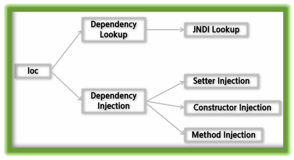
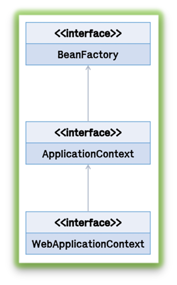

# 📚 <a style="color:#00adb5">SPRING</a>

<center>

</center>
<br>

# 📚 <a style="color:#00adb5">IoC & Container</a>

## <a style="color:#00adb5">IoC ( Inversion of Control )</a> 란

- <a style="color:red"><strong>메서드나 객체의 호출작업을 개발자가 결정하는 것이 아니라 외부에서 결정되는 것</strong></a>
- 객체의 의존성을 역전시켜 결합도를 줄이고 유연한 코드를 작성할 수 있게 하여 가독성 및 코드 중복, 유지 보수를 편하게 할 수 있게 한다.
- IoC / DI
- 객체지향 언어에서 Object 간의 연결 관계를 런타임에 결정
- <a style="color:red"><strong>객체 간의 관계가 느슨하게 연결됨 ( loose coupling )</strong></a> ( new 로 객체 선언은 강한 연결이다 )
- IoC의 구현 방법 중 하나가 DI ( Dependency Injection )
- 쉽게 말하면 기존에는 객체를 필요할 때 만들어서 사용했다면 IoC 는 무조건 미리 만들어 놓고 사용하는 것이다.

## <a style="color:#00adb5">IoC ( Inversion of Control )</a> 개념

- 객체 제어 방식
    - 기존 : 필요한 위치에서 개발자가 필요한 객체 생성 로직 구현
    - IoC : 객체 생성을 Container에게 위임하여 처리
- IoC 사용에 따른 장점
    - <a style="color:red"><strong>객체 간의 결합도를 떨어뜨릴 수 있음 ( loose coupling )</strong></a>
- 객체간 결합도가 높으면
    - 해당 클래스가 유지보수 될 때 그 클래스와 결합된 다른 클래스도 같이 유지보수 되어야할 가능성이 높음 ( 영향을 많이 준다. )
<br><br>
객체간 강한 결합은 클래스 호출 방식이다. 클래스내에 선언과 구현이 모두 되어 있기 때문에 다양한 형태로 변화가 불가능 하다.<br>
구현체 ( Member, Admin )를 클래스 ( Home )에서 직접 생성해서 사용한다. 그래서 구현체가 변경되거나 교체되면 클래스도 수정해야 할 가능성이 있다.

```java
public class HomeController{
    private MemberServiceImpl memberService = new MemberServiceImpl();
    private AdminServiceImpl adminservice = new AdminServiceImpl();

    ...
}
```

<a style="color:red"><strong>객체 간의 강한 결합을 다형성을 통해 결합도를 낮춘다.</strong></a><br>
<a style="color:red"><strong>인터페이스 호출 방식</strong></a>이며 구현 클래스 교체가 용이해 다양한 형태로 변화 가능하다.

```java

1.
public interface MemberService extends CommonService{
}

2. 
public interface AdminService extends CommonService{
}

public class HomeController{
    private CommonService memberService = new MemberServiceImpl();
    private CommonService adminservice = new AdminServiceImpl();
    // 모두 CommonService 타입으로 이용 가능
    ...
}
```

<a style="color:red"><strong>객체 간의 강한 결합을 Factory를 통해 결합도를 낮춘다.</strong></a><br>
<a style="color:red"><strong>팩토리 호출 방식</strong></a>이며 팩토리가 구현 클래스를 생성하므로 클래슨느 팩토리를 호출한다. 클래스에 팩토리를 호출하는 소스가 들어가야 한다. 이것 자체가 팩토리에 의존함을 의미한다.

```java
// 각 서비스를 생성하여 반환해주는 factory
public class ServiceFactory{
    public static CommonService getMemberService(){
        return new MemberServiceImpl();
    }

    public static CommonService getAdminService(){
        return new AdminServiceImpl();
    }    
}

public class HomeController{
    private CommonService memberService = ServiceFactory.getMemberService();

    private CommonService adminservice = ServiceFactory.getAdminService();
    
    ...
}
```

<a style="color:red"><strong>객체 간의 강한 결합을 Assembler를 통해 결합도를 낮춘다.</strong></a><br>
<a style="color:red"><strong>IoC 호출 방식</strong></a>이며 팩토리 패턴의 장점을 더하여 어떠한 것 에도 의존하지 않는 형태가 되었다. 실행시점( RunTime )에 클래스 간의 관계가 형성 된다.<br>
applicationContext.xml에 bean을 활용하여 id, class 를 주고 그것을 가져와 사용한다.<br>
Service 구현체 객체의 생성 및 관리를 Spring Container ( 외부 조립기 역할 Assemblr )가 하는 것이다.


## <a style="color:#00adb5">IoC ( Inversion of Control )</a> 유형
<center>

</center>
<br>

- Dependency Lookup
    - 컨테이너가 lookup context를 통해서 필요한 Resource나 Object를 얻는 방식
    - JNDI 이외의 방법을 사용한다면 JNDI 관련 코드를 오브젝트 내에서 일일이 변경해 주어야 함.
    - Lookup 한 Object를 필요한 타입으로 Casting 해 주어야 함
    - Naming Exception을 처리하기 위한 로직이 필요하다.
    - 쉽게 말하면 우리가 다 해야한다.
- <a style="color:red"><strong>Dependency Injection</strong></a>
    - 스프링이 다른 프레임워크와 차별화되어 제공하는 의존관계 주입 
    - <a style="color:red"><strong>객체를 직접 생성하는 것이 아니라 외부에서 생성한 후 주입 시켜주는 방식</strong></a>
    - 결합도가 낮아지고 유연성이 높아진다.
    - Object에 lookup 코드를 사용하지 않고 컨테이너가 직접 의존 구조를 Object에 설정 할 수 있도록 지정해 주는 방식
    - 클래스 변수를 결정하는 방법들이 곧 DI를 구현하는 방법이다.
    - Object가 컨테이너의 존재 여부를 알 필요가 없음
    - Lookup 관련된 코드들이 Object 내에서 사라짐
    - Setter Injection 과 Constructor Inject
    - 쉽게 말하면 우리가 할 필요 없이 Container가 해준다.

- <a style="color:red"><strong>Dependency Injection</strong></a> 용어
    - <a style="color:red"><strong>빈 ( Bean )</strong></a>
        - <a style="color:red"><strong>스프링이 IoC 방식으로 관리하는 오브젝트</strong></a>
        - 스프링이 직접 그 생성과 제어를 담당하는 오브젝트만을 빈이라 한다.
    - <a style="color:red"><strong>빈 팩토리 ( BeanFactory )</strong></a>
        - 스프링이 IoC를 담당하는 핵심 컨테이너
        - <a style="color:red"><strong>Bean을 등록, 생성, 조회, 반환하는 기능을 담당</strong></a>
        - 일반적으로 BeanFactory를 바로 사용하지 않고 이를 확장한 ApplicationContext를 이용한다.
    - <a style="color:red"><strong>애플리케이션 컨텍스트 ( ApplicationContext )</strong></a>
        - <a style="color:red"><strong>BeanFactory를 확장한 IoC 컨테이너</strong></a>이다.
        - 기본적인 기능은 같다.
        - 각종 부가서비스를 추가로 제공한다.
        - BeanFactory 라고 부를 때는 주로 빈의 생성과 제어의 관점에서 이야기하는 것이고, 애플리케이션 컨텍스트라고 할 때는 스프링이 제공하는 애플리케이션 지원 기능을 모두 포함해서 이야기하는 것이다. ( 확장 )
    - <a style="color:red"><strong>설정정보/ 설정 메타정보 ( configuration metadata )</strong></a>
        - 스프링의 설정정보란 ApplicationContext 또는 BeanFactory 가 IoC를 적용하기 위해 사용하는 메타정보를 말한다. 구성정보 내지는 형상정보라는 의미이다.
        - 설정정보는 <a style="color:red"><strong>IoC 컨테이너에 의해 관리되는 Bean 객체를 생성하고 구성할 때</strong></a> 사용 된다.
    - <a style="color:red"><strong>스프링 프레임 워크</strong></a>
        - 스프링 프레임 워크는 <a style="color:red"><strong>IoC 컨테이너, ApplicationContext를 포함해서 스프링이 제공하는 모든 기능을 통틀어 말할 때</strong></a> 주로 사용


## <a style="color:#00adb5">Container</a> 란

- <a style="color:red"><strong>객체의 생성, 사용, 소멸에 해당하는 라이프사이클을 담당</strong></a>한다.
- 라이프사이클을 기본으로 애플리케이션 사용에 필요한 주요 기능 제공

## <a style="color:#00adb5">Container</a> 기능

- 라이프사이클 관리
- Dependency 객체 제공
- Thread 관리
- 기타 애플리케이션 실행에 필요한 환경

## <a style="color:#00adb5">Container</a> 필요성

- 비즈니스 로직 외에 부가적인 기능들에 대해서는 독립적으로 관리되도록 하기 위함
- 서비스 look up 이나 Configuration에 대한 일관성을 갖기 위함
- <a style="color:red"><strong>서비스 객체를 사용하기 위해 각각 Factory 또는 Singleton 패턴을 직접 구현하지 않아도 됨</strong></a>

## <a style="color:#00adb5">IoC Container</a> 
- 오브젝트의 색성과 관계설정, 사용, 제거 등의 작업을 애플리케이션 코드 대신 독립된 컨테이너가 담당
- 컨테이너가 코드 대신 오브젝트에 대한 제어권을 가지고 있어 IoC라 부른다.
- 이러한 이유로 스프링 컨테이너를 IoC 컨테이너라고 부르기도 함
- <a style="color:red"><strong>스프링에서 IoC를 담당하는 컨테이너는 BeanFactory, ApplicationContext가 있다.</strong></a>

## <a style="color:#00adb5">Spring DI Container</a> 
- Spring DI Container가 관리하는 객체를 Bean이라 하고, 이 빈들의 생명 주기를 관리하는 의미로 BeanFactory 라 한다.
- Bean Factory 에 여러 가지 컨테이너 기능을 추가하여 ApplicationContext 라 한다.

## <a style="color:#00adb5">Spring Container</a> 
<center>

</center>
<br>