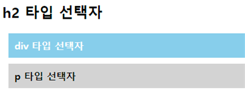
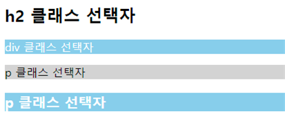
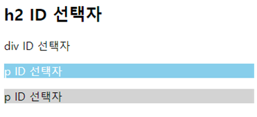
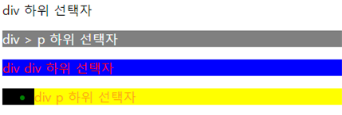
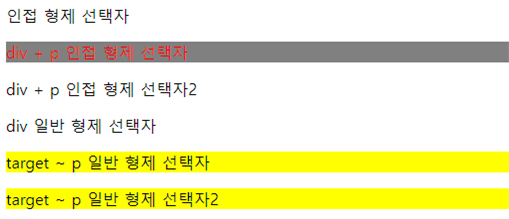

# 📚 <a style="color:#00adb5">CSS</a>

<center>

</center>
<br>

# 📚 <a style="color:#00adb5">Selector</a>

## <a style="color:#00adb5">CSS</a> 선택자 ( Selector )란 무엇인가 ?

선택자는 <a style="color:red"><strong>규칙이 적용되는 엘리먼트</strong></a>이다.<br>
HTML 문서에서 CSS 규칙 적용 타겟이 되는 다양한 종류의 CSS 선택자가 존재한다.<br>

- <a href="#general">일반 선택자</a>
  - 전체 선택자
  - 타입 선택자
  - 클래스 선택자
  - ID 선택자
- <a href="#mix">복합 선택자</a>
  - 자식 선택자
  - 하위 선택자
  - 인접 형제 선택자
  - 일반 형제 선택자
- <a href="#virtual">가상 클래스 선택자</a>
- <a href="#virtualEle">가상 엘리먼트 선택자</a>
- <a href="#property">속성 선택자</a>

### <a style="color:#00adb5" id="general">일반 선택자</a>

우선순위는 <a style="color:red">전체 선택자 < 타입 선택자 < 클래스 선택자 < ID 선택자</a> 이다.

#### <a style="color:#00adb5">전체 선택자 ( Universal Selector )</a>

사용법은 "\* {}" 이다.<br>
HTML 문서 내 모든 Element를 선택한다.

<hr>

```html
<head>
  <style type="text/css">
    * {
      background: skyblue;
      color: white;
      font-weight: bold;
    }
  </style>
</head>
<body>
  <h2>h2 전체 선택자</h2>
  <div>div 전체 선택자</div>
  <p>p 전체 선택자</p>
</body>
```

<hr>

<hr>

#### <a style="color:#00adb5">타입 선택자 ( Type Selector )</a>

사용법은 " elementName {} " 이다.<br>
태그명을 이용해서 스타일을 적용할 태그를 선택한다.<br>
1개 이상의 HTML 엘리먼트를 사용할 수 있다.<br>
여러 엘리먼트를 선택할 때는 컴마로(,) 구분한다.

<hr>

```html
<head>
  <style type="text/css">
    div,
    p {
      padding: 10px;
      margin: 10px;
      font-weight: bold;
    }

    div {
      background: skyblue;
      color: white;
    }

    p {
      background: lightgrey;
      color: black;
    }
  </style>
</head>
<body>
  <h2>h2 타입 선택자</h2>
  <div>div 타입 선택자</div>
  <p>p 타입 선택자</p>
</body>
```

<hr>

<hr>

#### <a style="color:#00adb5">클래스 선택자 ( Class Selector )</a>

사용법은 " .className {} " 이다.<br>
클래스 명은 공백 없이 대소문자 또는 (-), (\_) 로 시작한다.<br>
HTML 문서에서 동일한 클래스 명을 중복해서 사용 가능하다. ( 공통 속성 적용 가능 )<br>
class 속성 값에 하나 이상의 클래스를 적용 가능하다.

<hr>

```html
<head>
  <style type="text/css">
    .target1 {
      background: skyblue;
      color: white;
    }

    .target2 {
      background: lightgrey;
      color: black;
    }
    p.target1 {
      font-weight: bold;
      font-size: 20px;
    }
  </style>
</head>
<body>
  <h2>h2 클래스 선택자</h2>
  <div class="target1">div 클래스 선택자</div>
  <p class="target2">p 클래스 선택자</p>
  <p class="target1">p 클래스 선택자</p>
</body>
```

<hr>

<hr>

#### <a style="color:#00adb5">ID 선택자 ( ID Selector )</a>

사용법은 " #IDName {} " 이다.<br>
HTML 문서에서 동일한 ID를 중복 사용할 수 없다. ( class와 달리 ID는 유일해야 한다. )<br>
ID 속성 값엔 1개의 ID만 사용 가능<br>
<a style="color:red"><strong>일반 선택자 중에 가장 우선순위가 높다.</strong></a>

<hr>

```html
<head>
  <style type="text/css">
    #target1 {
      background: skyblue;
      color: white;
    }

    #target2 {
      background: lightgrey;
      color: black;
    }
  </style>
</head>
<body>
  <h2>h2 ID 선택자</h2>
  <div>div ID 선택자</div>
  <p id="target1">p ID 선택자</p>
  <p id="target2">p ID 선택자</p>
</body>
```

<hr>

<hr>

### <a style="color:#00adb5" id="mix">복합 선택자</a>

#### <a style="color:#00adb5">하위 선택자 ( Descendant Selector ) & 자식 선택자 ( Child Selector ) </a>

- 하위 선택자
  - 사용법은 " element element {} " 이다.<br>
  - 1단계 하위 요소 와 2단계 이상 하위 요소에 모두 적용한다.
- 자식 선택자
  - 사용법은 " element > element {} " 이다.<br>
  - 1단계 하위 요소에만 적용한다.

<hr>

```html
<head>
  <style type="text/css">
    div div {
      background-color: black;
      color: green;
    }
    div p {
      background-color: yellow;
      color: orange;
    }
    div > div {
      background-color: blue;
      color: red;
    }
    div > p {
      background-color: grey;
      color: white;
    }
  </style>
</head>
<body>
  <div>
    div 하위 선택자
    <p>div > p 하위 선택자</p>
    <div>
      div div 하위 선택자
      <span
        ><div>
          <ul>
            <li><p>div p 하위 선택자</p></li>
          </ul>
        </div></span
      >
    </div>
  </div>
</body>
```

<hr>

<hr>

#### <a style="color:#00adb5">인접 형제 선택자 ( Adjacent Sibling Selector ) & 일반 형제 선택자 ( General Sibling Selector )</a>

- 인접 형제 선택자
  - 사용법은 " element + element {} " 이다.<br>
  - 형제 관계인 엘리먼트가 여러개 존재할 때 첫번째 엘리먼트만 선택
- 일반 형제 선택자
  - 사용법은 " element ~ element {} " 이다.<br>
  - 형제 관계인 엘리먼트가 여러개 존재할 경우 모든 엘리먼트를 선택

<hr>

```html
<head>
  <style type="text/css">
    div + p {
      background-color: grey;
      color: red;
    }
    div.target ~ p {
      background-color: yellow;
      color: black;
    }
  </style>
</head>
<body>
  <div>인접 형제 선택자</div>
  <p>div + p 인접 형제 선택자</p>
  <p>div + p 인접 형제 선택자2</p>
  <div class="target">div 일반 형제 선택자</div>
  <p>target ~ p 일반 형제 선택자</p>
  <p>target ~ p 일반 형제 선택자2</p>
</body>
```

<hr>

<hr>

### <a style="color:#00adb5" id="virtual">가상 클래스 선택자 ( Pseudo-Classes Selector )</a>

사용법은 " 가상 클래스 {} " 이다.<br>
가상 클래스 선택자는 User Agent 가 제공하는 가상 클래스를 지정한다.<br>

| 선택자        | 의미                                    |
| ------------- | --------------------------------------- |
| :link         | 방문하지 않은 링크를 선택               |
| :visited      | 방문한 링크를 선택                      |
| :hover        | 지정된 요소에 마우스가 올라간 경우 선택 |
| :active       | 지정된 요소가 활성화 된 경우 선택       |
| :focus        | 지정된 요소가 포커스를 가질 경우 선택   |
| :first-child  | 지정된 요소 중 부모의 첫 번째 자식 선택 |
| :last-child   | 지정된 요소 중 부모의 마지막 자식 선택  |
| :nth-child(n) | 지정된 요소 중 n번째 자식 선택          |
| :enabled      | 지정된 요소 요소가 enabled인 경우 선택  |
| :disabled     | 지정된 요소 요소가 disabled인 경우 선택 |
| :checked      | 지정된 요소 요소가 checked인 경우 선택  |

### <a style="color:#00adb5" id="virtualEle">가상 엘리먼트 선택자 ( Psudeo-Element Selector ) </a>

사용법은 " ::가상 엘리먼트 {} " 이다. <br>
가상 엘리먼트 선택자는 보이지 않는 가상의 엘리먼트를 선택한다.<br>

| 선택자         | 의미                                             |
| -------------- | ------------------------------------------------ |
| ::after        | 지정된 요소 뒤에 content 추가                    |
| ::before       | 지정된 요소 앞에 content 추가                    |
| ::first-letter | 지정된 요소의 첫 번째 문자 선택                  |
| ::first-line   | 지정된 요소의 첫 번째 라인 선택                  |
| ::selection    | 사용자에 의해 선택된 요소의 위치 선택 ( 드래그 ) |

### <a style="color:#00adb5" id="property">속성 선택자</a>

특정한 속성을 가지거나 속성 값을 갖는 엘리먼트를 선택한다.<br>
속성 선택자를 사용하기 위해서는 HTML문서를 작성할 때에 name, title을 규칙적으로 정의해야한다.<br>
화면에 같은 분류의 많은 항목들을 일괄적으로 선택할 때 유용하다.<br>

| 선택자 | 의미                                          |
| ------ | --------------------------------------------- |
| [A]    | A 속성이 포함된 엘리먼트 선택                 |
| [A=V]  | A 속성 값이 V와 정확히 일치하는 엘리먼트 선택 |
| [A~=V] | A 속성 값이 V를 포함하는 엘리먼트 선택        |
| [A^=V] | A 속성 값이 V로 시작하는 엘리먼트 선택        |
| [A*=V] | A 속성 값이 V를 포함하는 엘리먼트 선택        |
| [A$=V] | A 속성 값이 V로 끝나는 엘리먼트 선택          |

## <a style="color:#00adb5">CSS</a> 규칙 적용 우선순위

- 같은 엘리먼트에 두 개이상의 CSS 규칙이 적용 된 경우 <a style="color:red">마지막 규칙, 구체적인 규칙, !important</a>가 우선 적용된다.<br>
- CSS 규칙들 중 하단에 작성한 규칙이 마지막 규칙이다.
- 속성 값 뒤에 !important를 작성하면 같은 엘리먼트에 대해 보다 우선적으로 스타일을 적용한다.

## <a style="color:#00adb5">CSS</a> 선택자 마무리

여러 종류의 선택자들을 알아보았다.<br>
앞으로 많이 쓰일 것들이라서 확실히 외우진 못했지만 어느정도 뭐가 있고 뭐가 언제 쓰이는지 파악했으니 나중에 사용할 때 다시 보면서 데이터를 쌓아가야겠다.<br>그리고 우선순위를 잘 파악해서 사용해야겠다 !
