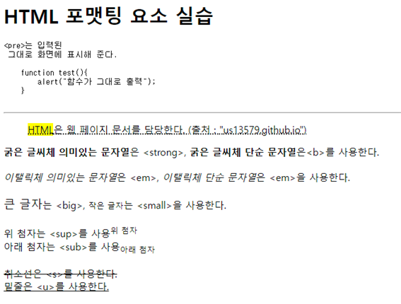

# 📚 <a style="color:#00adb5">HTML</a>

<center>

</center>
<br>

# 📚 <a style="color:#00adb5">포맷팅 요소</a>

## <a style="color:#00adb5">HTML 포맷팅 요소</a> 란 무엇인가?

포맷팅 요소에는 <a style="color:red"><strong>화면에는 동일하게 출력되지만 각 요소가 가진 의미가 다른 것이 있다.</strong></a><br>
예를 들면 b 와 strong tag 둘다 굵은 글씨로 표시하는 것인데 b 는 그냥 굵은 글씨라면 strong 은 특정 문자열을 강조하는 굵은 글씨이다.<br>
사용자가 보기에는 같지만 개발자가 볼 때에는 의미를 해석할 수 있다.<br>

| tag 명                      | 설명                                            |
| --------------------------- | ----------------------------------------------- |
| &lt;abbr&gt;                | 생략된 약어 표시, Title 속성을 함께 사용        |
| &lt;address&gt;             | 연락처 정보 표시                                |
| &lt;blockquote&gt;          | 긴 인용문구 표시, 좌우로 들여쓰기 됨            |
| &lt;q&gt;                   | 짧은 인용문구 표시, 좌우로 따옴표가 붙음        |
| &lt;cite&gt;                | 웹 문서나 포스트에서 참고 내용 표시             |
| &lt;pre&gt;                 | 공백, 줄바꿈 등 입력된 그대로 화면에 표시       |
| &lt;code&gt;                | 컴퓨터 인식을 위한 소스 코드                    |
| &lt;mark&gt;                | 특정 문자열을 강조, 화면에는 하이라이팅 됨      |
| &lt;hr&gt;                  | 구분선                                          |
| &lt;b&gt; , &lt;strong&gt;  | 굵은 글씨로 표시, 특정 문자열을 강조 ( strong ) |
| &lt;i&gt; , &lt;em&gt;      | 이탤릭(기울게) 표시, 특정 문자열을 강조 ( em )  |
| &lt;big&gt; , &lt;small&gt; | 큰 글자, 작은 글자로 표시                       |
| &lt;sup&gt; , &lt;sub&gt;   | 위 첨자, 아래 첨자로 표시                       |
| &lt;s&gt;, &lt;u&gt;        | 취소선, 밑줄                                    |

## 실습해보즈아

```html
<h1>HTML 포맷팅 요소 실습</h1>
<pre>
&lt;pre&gt;는 입력된
 그대로 화면에 표시해 준다.
<code>
    function test(){
        alert("함수가 그대로 출력");
    }
</code>
</pre>

<hr>

<blockquote>
   <abbr title = "HTML"> <mark>HTML</mark>은 웹 페이지 문서를 담당한다.
    (출처 : <q>us13579.github.io</q>)
</blockquote>
<strong>굵은 글씨체 의미있는 문자열</strong>은 &lt;strong&gt;,
<b>굵은 글씨체 단순 문자열</b>은&lt;b&gt;를 사용한다.<br><br>
<em>이탤릭체 의미있는 문자열</em>은 &lt;em&gt;,
<i>이탤릭체 단순 문자열</i>은 &lt;em&gt;을 사용한다.<br><br>
<big>큰 글자</big>는 &lt;big&gt;, <small>작은 글자</small>는 &lt;small&gt;을 사용한다.<br><br>
위 첨자는 &lt;sup&gt;를 사용<sup>위 첨자</sup><br>
아래 첨자는 &lt;sub&gt;를 사용<sub>아래 첨자</sub><br><br>
<s>취소선은 &lt;s&gt;를 사용한다.</s><br>
<u>밑줄은 &lt;u&gt;를 사용한다.</u><br>
```

<hr>


## <a style="color:#00adb5">HTML</a> 포멧팅 요소 마무리

HTML에서 사용하는 포멧팅 요소에 대해 알아보았다.<br>
그렇게 많은 종류는 아니라서 간단하게 알아볼 수 있었다.<br>
자주 쓰이는 것들은 암기하고 있으면 좋을 것 같다.<br>
내가 블로그를 작성하면서 자주 쓰는 것들이 있기 때문에 그런 것들이 많이 쓰이지 않을까 싶다.
