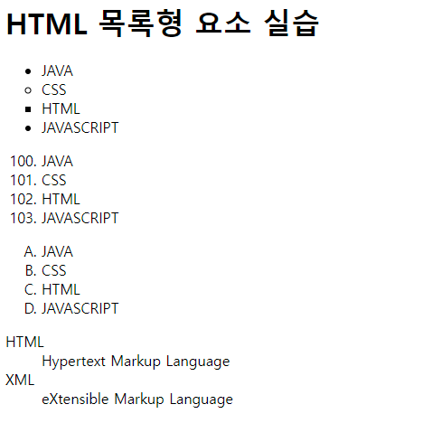

# 📚 <a style="color:#00adb5">HTML</a>

<center>

</center>
<br>

# 📚 <a style="color:#00adb5">목록형 요소</a>

## <a style="color:#00adb5">HTML 목록형 요소</a> 란 무엇인가?
- 목록 tag는 하나 이상의 하위 tag를 포함한다.
- 목록 tag는 각 항목을 들여쓰기로 표현한다.
- 번호 또는 심볼을 이용해서 목록을 표현한다.
<br>

| tag 명 | 설명 |
|--------|------|
| &lt;ul&gt; | 번호 없는 목록을 표시, 항목 앞에 심볼을 표시 |
| &lt;ol&gt; | 번호 있는 목록을 표시, 숫자, 알파벳, 로마숫자 등으로 표시 |
| &lt;li&gt; | 목록 항목, &lt;ul&gt; 나 &lt;ol&gt; 하위에서 사용 |
| &lt;dl&gt; | 용어 정의와 설명에 대한 내용을 목록화해서 표시 |
| &lt;dt&gt; | 용어 목록의 정의 부분을 나타냄 |
| &lt;dd&gt; | 용어 목록의 설명 부분을 나타냄 |

<br><br>
<big>&lt;ol&gt; 속성</big>

| 속성 | 속성값 | 설명 |
|--------|------|-----|
| type | 1| 숫자 ( 기본값 ) |
|  | a | 영문 소문자 |
|  | A | 영문 대문자 |
|  | i | 로마숫자 소문자 |
|  | l | 로마숫자 대문자 |
| start | 숫자 | 시작번호 |
| reversed | 숫자 | 역순으로 표시 |

<br>

## 실습해보즈아
```html
<h1>HTML 목록형 요소 실습</h1>

<!-- 번호 없는 목록 , 문양은 list-style-type을 통해 넣을 수 있다 -->

<ul>
    <li>JAVA</li>
    <li style="list-style-type: circle;">CSS</li>
    <li style="list-style-type: square;">HTML</li>
    <li style="list-style-type: disc;">JAVASCRIPT</li>
</ul>

<!-- 번호 있는 목록 , list-style-type을 통해 순서 관리 가능, start를 통해 시작 숫자 관리 가능 -->

<ol start="100">
    <li>JAVA</li>
    <li>CSS</li>
    <li>HTML</li>
    <li>JAVASCRIPT</li>
</ol>

<ol style="list-style-type: upper-alpha;">
    <li>JAVA</li>
    <li>CSS</li>
    <li>HTML</li>
    <li>JAVASCRIPT</li>
</ol>

<!-- dl, dt, dd -->

<dl>
    <dt>HTML</dt>
    <dd>Hypertext Markup Language</dd>
    
    <dt>XML</dt>
    <dd>eXtensible Markup Language</dd>
</dl>
```

<hr>



## <a style="color:#00adb5">HTML</a> 목록형 요소 마무리
HTML에서 사용하는 목록형 요소에 대해 알아보았다.<br>
교수님도 목록을 표시하는 것을 많이 사용한다고 하셔서 집중해서 공부 하였다.<br>
주로 번호가 없는 &lt;ul&gt;이 자주 쓰인다는데 사용법을 확실히 알고 가야겠다.<br>
실습을 몇 번 해봤는데 아주 많이 쓰인다. 잘 알도록 !!