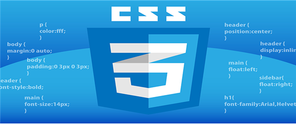

# 📚 <a style="color:#00adb5">CSS</a>

<center>

</center>
<br>

# 📚 <a style="color:#00adb5">Font & Text</a>

## <a style="color:#00adb5">CSS</a> Font
CSS Font 관련 속성은 text의 글꼴, 굵기, 크기, 스타일등을 지정한다.<br>

### <a style="color:#00adb5">font-family</a>
- <a style="color:red"><strong>글꼴 지정</strong></a>
- 사용법은 " E { font-family: 글꼴이름, 글꼴이름, ... }" 이다.
- generic font명을 뒤에 작성하는 것이 일반적이다.

```html
<style type="text/css">
#serif { font-family : serif; }
</style>
</head>
<body>
    <p id="serif"> 글자체가 serif이다. </p>
</body>
```

### <a style="color:#00adb5">font-size</a>
- <a style="color:red"><strong>글자 크기 지정</strong></a>
- 사용법 " E { font-size: 속성 값 } " 이다.
- 절대 사이즈 속성 값은 xx-small, x-small, small, medium, large, x-large, xx-large가 있다.
- 상대 사이즈 속성 값은 larger, smaller이 있다.
- 그 외 px, cm, % ( 부모 엘리먼트와의 비율 ) 단위도 사용 가능


```html
<style type="text/css">
#h1 { font-size : 150%; }
#h2 { font-size : 100%; }
#p { font-size : 10px; }
</style>
</head>
<body>
    <h1 id="h1"> h1 글자 사이즈 입니다. </h1>
    <h2 id="h2"> h2 글자 사이즈 입니다. </h2>
    <p id="p"> p 글자 사이즈 입니다. </p>
</body>
```


### <a style="color:#00adb5">font-style</a>
- <a style="color:red"><strong>글자 스타일 지정</strong></a>
- 사용법 " E { font-style: normal / italic / oblique } " 이다.
- 속성값은 normal, italic, oblique 가 있고 기본값은 normal이다.
- italic, oblique 둘다 기울임인데 italic은 디자이너에 의해 디자인된 특수한 글꼴이고 oblique는 일반 글자를 8~12eh 정도 기울여서 표시한 것이다.


```html
<style type="text/css">
#normal { font-style : normal; }
#italic { font-style : italic; }
#oblique { font-style : oblique; }
</style>
</head>
<body>
    <p id="normal"> normal 글자입니다. </p>
    <p id="italic"> italic 글자입니다. </p>
    <p id="oblique"> oblique 글자입니다. </p>
</body>
```


### <a style="color:#00adb5">font-variant</a>
- <a style="color:red"><strong>소문자를 작은 대문자로 변형</strong></a>
- 사용법 " E { font-variant: normal / small-caps }" 이다.
- 소문자를 작은 대문자로 변환, 초기값은 normal이며 한글은 변화가 없다.


```html
<style type="text/css">
#variant { font-variant : small-caps; }
</style>
</head>
<body>
    <p id="variant"> font-variant 적용.</p>
</body>
```


### <a style="color:#00adb5">font-weight</a>
- <a style="color:red"><strong>글자 굵기 지정</strong></a>
- 사용법 " E { font-weight: normal / bold / bolder / lighter }" 이다.
- 초기값은 normal이며, 100~900까지 숫자값으로 사용가능 ( normal : 400 , bold : 700 )


```html
<style type="text/css">
#weight1 { font-weight : bold; }
#weight2 { font-weight : 500; }
#weight3 { font-weight : lighter; }
</style>
</head>
<body>
    <p id="weight1"> font-weight bold.</p>
    <p id="weight2"> font-weight 500.</p>
    <p id="weight3"> font-weight lighter.</p>
</body>
```


### <a style="color:#00adb5">font</a>
- <a style="color:red"><strong>font에 관한 속성을 한번에 지정하는 단축형 속성이다.</strong></a>
- 속성 값은 style, variant, weight, size/line-height, family 순으로 작성한다.
- size와 family는 필수 값이며 생략 시 기본 값이 적용된다.
- 순서에 맞지 않게 되면 일부만 적용되거나 전체가 무시 될 수도 있다.

```html
<style type="text/css">
#target { font: italic small-caps bold 13px/1.7em Arial; }
</style>
</head>
<body>
    <p id="target"> full options이 적용된 문장입니다. </p>
</body>
```


## <a style="color:#00adb5">CSS</a> Text
CSS Text 관련 속성은 글자, 공간, 문단들이 보여지는 속성을 정의한다.

### <a style="color:#00adb5">text-align</a>
- <a style="color:red"><strong>text 정렬 방식 지정</strong></a>
- 사용법은 " E { text-align: left / right / center / justify } " 이다.
- justify는 각 라인의 너비가 모두 동일하도록 간격을 늘린다.

```html
<style type = "text/css">
    body { width : 300px; }
    div { text-align : center; }
    </style>
    </head>
    <body>
        <div>
            div부분의 텍스트를 모두 중앙 정렬 시킨다.
        </div>
    </body>
```

### <a style="color:#00adb5">text-decoration</a>
- <a style="color:red"><strong>text 장식 지정</strong></a>
- 사용법은 " E { text-decoration: none / underline / overline / line-through / blink } " 이다.
- underline은 밑줄을 생성 한다.
- overline은 text 위에 줄을 생성한다.
- line-through는 text 사이로 라인을 생성 한다.
- blink는 text가 깜빡이는 효과를 적용한다.

```html
<style type = "text/css">
    #none { text-decoration: none; }
    #underline { text-decoration : underline; }
    #underline { text-decoration : overline; }
    #line-through { text-decoration : line-through; }
    #blink { text-decoration : blink; }
    </style>
    </head>
    <body>
        <div id = "none"> none 속성이 적용된 문자열. </div>
        <div id = "underline"> underline 속성이 적용된 문자열. </div>
        <div id = "underline"> underline 속성이 적용된 문자열. </div>
        <div id = "line-through"> line-through 속성이 적용된 문자열. </div>
        <div id = "blink"> blink 속성이 적용된 문자열. </div>
    </body>
```

### <a style="color:#00adb5">text-indent</a>
- <a style="color:red"><strong>Text-block인 첫 라인의 들여쓰기 지정</strong></a>
- 사용법은 " E { text-indent: 절대 값(px, pt, em, em etc) / 배율 % } " 이다.
- 절대 값의 기본 값은 0 이다.
- 배율 값은 부모 엘리먼트 너비의 비율로 들여쓰기 한다.
- 속성 값에 음수를 허용한다. ( 음수 값 사용 시 왼쪽으로 들여쓰기 한다. )

```html
<style type = "text/css">
    p.positive { text-indent: 1cm; }
    p.negatvie { text-indent: -5px; }    
    </style>
    </head>
    <body>
        <p class="positive">
            들여쓰기가 적용된 내용입니다.
            text-indent 사용
            </p>
        <p class="negative">
            왼쪽 들여쓰기가 적용된 내용입니다.
            text-indent 사용
            </p>
    </body>
```

### <a style="color:#00adb5">text-transform</a>
- <a style="color:red"><strong>text 대문자화</strong></a>
- 사용법은 " E { text-transform: capitalize / uppercase / lowercase / none } " 이다.
- capitalize 는 첫 글자를 대문자로, uppercase 는 글자 전체를 대문자로, lowercase 는 글자 전체를 소문자로 바꿔준다.

```html
<style type = "text/css">
    .capitalize { text-transform: capitalize; }   
    .uppercase { text-transform: uppercase; }   
    .lowercase { text-transform: lowercase; }   
    </style>
    </head>
    <body>
        <p class= "capitalize">
            capitalize가 적용되었습니다.
            </p>
        <p class="uppercase">
            uppercase가 적용되었습니다.
            </p>
        <p class="lowercase">
            lowercase가 적용되었습니다.
            </p>
    </body>
```


### <a style="color:#00adb5">white-space</a>
- <a style="color:red"><strong>엘리먼트 안의 공백 지정</strong></a>
- 사용법은 " E { white-space: normal / pre / nowrap / pre-line / pre-wrap } " 이다.
- normal은 정해진 영역에 따라 줄이 바뀌며, 하나의 whitespace만 허용한다.
- pre는 &lt;pre&gt; 처럼 사용자가 입력한 모습 그대로 공백을 화면에 출력한다.
- nowrap은 하나의 whitespace만 허용하며 줄 바꿈 금지. ( &lt;br&gt; 만나기 전까지 같은 줄에 출력한다. )

```html
<style type = "text/css">
        .white1 { white-space: normal; }   
        .white2 { white-space: pre; }   
        .white3 { white-space: nowrap; }   
        </style>
        </head>
        <body>
            <!-- 마우스를 위에 올리면 white2 실행 
                 마우스를 누르면 white3 실행
                 다시 돌아오면 white1 실행 -->
            <p class= "white1"
            onmouseover ="this.className='white2'"
            onmousedown ="this.className='white3'"
            onmouseout ="this.className='white1'">
            basic : white1, mouseover : white2, mousedown : white3,
            mouseout : white1, white-space 속성 : normal, pre, nowrap, pre-line, pre-wrap
            </p>
        </body>
```


### <a style="color:#00adb5">letter-spacing</a>
- <a style="color:red"><strong>문자 간의 space 간격을 줄이거나 늘림</strong></a>
- 사용법은 " E { letter-spacing: normal / 길이 값 ( length )} " 이다.
- 간격을 늘릴 때는 양수, 줄일 때는 음수 사용

```html
<style type = "text/css">
        .letter { letter-spacing: 5px; }
        </style>
        </head>
        <body>
            <div class= "letter">글자간의 간격을 조절합니다. </div>
        </body>
```

### <a style="color:#00adb5">word-spacing</a>
- <a style="color:red"><strong>단어 간의 간격 지정</strong></a>
- 사용법은 " E { word-spacing : normal / 길이 값 ( length )} " 이다.

```html
<style type = "text/css">
        .word { word-spacing: -10px; }
        </style>
        </head>
        <body>
            <div class= "word">단어간의 간격을 조절합니다. </div>
        </body>
```

### <a style="color:#00adb5">line-height</a>
- <a style="color:red"><strong>줄(행) 간격 지정</strong></a>
- 사용법은 " E { line-height: 상대 값 / 절대 값 / 비율 } " 이다. 
- 비율 값을 사용하면 현재 글자 크기를 기본으로 50%, 200% 같은 비율로 행 간격을 설정한다.
- 절대 값을 사용하면 행 간격을 px, cm 등으로 직접 설정한다.
- 상대 값을 사용하면 현재 글자 크기에 상대 값을 곱한 수 만큼 행 간격을 설정할 수 있다.

```html
<style type = "text/css">
    p {line-height: normal; color: red; }
        .small { line-height: 0.7; color:orange; }
        .big { line-height: 4; color:yellow; }
        </style>
        </head>
        <body>
            <p> 기본 행 간격입니다.</p>
            <p class="small"  > small 행 간격입니다.</p>
            <p class="big"> big 행 간격입니다.</p>
        </body>
```


## <a style="color:#00adb5">CSS</a> Font & Text 마무리
CSS 에서 사용 되는 Font와 Text에 대해서 알아 보았다.<br>
많은 속성들이 있는데 어려운 것들은 없어서 이런게 있구나 하고 넘어갔다.<br>
그래도 정리를 한번 함으로써 나중에 사용할 때 좀 더 편할 것 같다는 생각이 들었다. 그리고 실습들을 해봄으로써 어떤 속성들인지 알게 된 것 같다.

