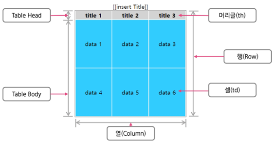
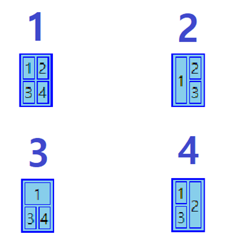
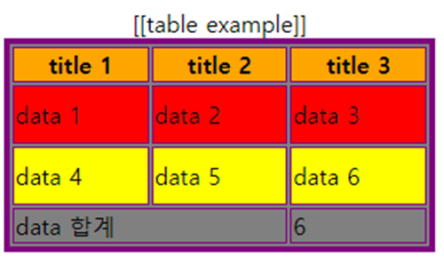

# 📚 <a style="color:#00adb5">HTML</a>

<center>

</center>
<br>

# 📚 <a style="color:#00adb5">Table</a>

## <a style="color:#00adb5">HTML Table 모델</a> 이란 무엇인가?

HTML Table 모델은 <a style="color:red"><strong>데이터를 행 ( Row ) 과 열 ( Column ) 의 셀에 표시한 것</strong></a><br>
&lt;thead&gt; &lt;tbody&gt; &lt;tfoot&gt; 요소들을 사용해 행들을 그룹화 한다.<br>
&lt;colgroup&gt; 과 &lt;col&gt; 요소는 열 그룹을 위한 추가적인 구조정보를 제공한다.<br>
table의 셀은 머리글 ( &lt;th&gt; ) 이나 데이터 ( &lt;td&gt; ) 를 가질 수 있다.

<p align="center"></p>

## <a style="color:#00adb5">HTML Table</a> 제목

<strong>&lt;caption&gt; 은 테이블의 제목을 정의하기 위해 사용</strong>되며 &lt;table&gt; 바로 뒤에 사용된다.<br>
&lt;caption&gt; 은 테이블당 하나만 사용한다.<br>
정렬방식은 CSS를 사용한다.

## <a style="color:#00adb5">HTML Table</a> 디자인

대표적인 테이블 디자인 속성들 입니다.<br>

- border<br>
  테두리 크기 설정

- bordercolor<br>
  테두리 색 설정

- width<br>
  테이블 가로 크기

- height<br>
  테이블 세로 크기

- align<br>
  테이블 정렬

- bgcolor<br>
  배경색 설정

## <a style="color:#00adb5">HTML Table</a> 행 ( Row ) 그룹 요소

테이블 행 그룹 요소는 테이블의 행들을 머리글, 바닥글, 하나 이상의 본체 항목으로 그룹핑 된 것이다.<br>
요소에는 <strong>머리글 ( &lt;thead&gt; ), 본체항목 ( &lt;tbody&gt; ), 바닥글 ( &lt;tfoot&gt; )</strong> 이 있다.<br>
각 행 그룹은 최소 하나 이상의 &lt;tr&gt; 을 가져야 한다.

## <a style="color:#00adb5">HTML Table</a> 열 ( Column ) 그룹 요소

테이블 열 그룹 요소는 테이블 내에서 구조적인 분리를 가능하게 한다.<br>
&lt;colgroup&gt; 요소는 명시적인 열 그룹을 만들며, &lt;col&gt; 요소는 열을 묶어 그룹핑 한다.<br>
&lt;colgroup&gt; 요소의 <strong>span 속성은 열 그룹에서 열 개수</strong>를 정의한다.<br>
&lt;col&gt; 요소의 <strong>span 속성은 &lt;col&gt; 에 의해 묶어진 열의 개수</strong>를 말한다.

## <a style="color:#00adb5">HTML Table</a> 테두리 ( border )

cellspacing은 테이블의 셀과 셀 사이 공간을 의미한다.<br>
cellpadding은 셀 외곽와 셀 컨텐츠 사이를 의미한다.<br>
CSS를 사용해서 설정한다.

<p align="center"></p>

## <a style="color:#00adb5">HTML Table</a> 셀 병합

HTML table 에는 두 가지의 셀 병합 속성이 있다.

- colspan<br>
  두 개 이상의 열을 하나로 합치기 위해 사용
- rowspan<br>
  두 개 이상의 행을 하나로 합치기 위해 사용
  <br>

<p align="center"></p>

```html
// 1
<table bordercolor="blue" bgcolor="skyblue" border="2">
  <tr>
    <td>1</td>
    <td>2</td>
  </tr>
  <tr>
    <td>3</td>
    <td>4</td>
  </tr>
</table>
<br /><br />

// 2
<table bordercolor="blue" bgcolor="skyblue" border="2">
  <tr>
    <td rowspan="2">1</td>
    <td>2</td>
  </tr>
  <tr>
    <td>3</td>
  </tr>
</table>
<br /><br />

// 3
<table bordercolor="blue" bgcolor="skyblue" border="2">
  <tr>
    <td align="center" colspan="2">1</td>
  </tr>
  <tr>
    <td>3</td>
    <td>4</td>
  </tr>
</table>
<br /><br />

// 4
<table bordercolor="blue" bgcolor="skyblue" border="2">
  <tr>
    <td>1</td>
    <td rowspan="2">2</td>
  </tr>
  <tr>
    <td>3</td>
  </tr>
</table>
```

## <a style="color:#00adb5">HTML Table</a> 실습해보즈아

<p align="center"></p>

```html
<!-- 테이블 디자인 ( 현재는 CSS 사용 )-->
<table bgcolor="grey" border="4" bordercolor="purple" width="300" height="150">
  <!-- 제목 -->
  <caption>
    [[table example]]
  </caption>

  <!-- 머리글 -->
  <thead>
    <tr bgcolor="orange">
      <th>title 1</th>
      <th>title 2</th>
      <th>title 3</th>
    </tr>
  </thead>

  <!-- 본체항목 -->
  <tbody>
    <tr bgcolor="red">
      <td>data 1</td>
      <td>data 2</td>
      <td>data 3</td>
    </tr>
    <tr bgcolor="yellow">
      <td>data 4</td>
      <td>data 5</td>
      <td>data 6</td>
    </tr>
  </tbody>

  <!-- 바닥글 -->
  <tfoot>
    <tr>
      <td colspan="2">data 합계</td>
      <td>6</td>
    </tr>
  </tfoot>
</table>
```

## <a style="color:#00adb5">HTML</a> Table 마무리

HTML에서 사용되는 테이블의 속성들에 대해 알아보았다.<br>
보통 웹에 표들이 많이 나오기 때문에 잘 알고 있어야 할 것 같다.<br>
크게 어려운 것은 없었지만 셀 병합이나 구조를 잘 파악해야한다.<br>
그리고 테이블을 설계할 때 바로 하는 것보다 구조를 짜서 계획을 세운 뒤 하는 것이 훨씬 효율적이라고 생각한다.
