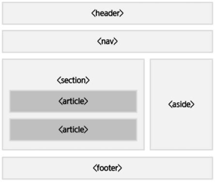

# 📚 <a style="color:#00adb5">HTML</a>

 

# 📚 <a style="color:#00adb5">Semantic</a>

## <a style="color:#00adb5">HTML Semantic</a> 이란?

- Semantic 이란 '의미론적인', '의미가 통하는' 이다.
- 기계가 쉽게 해석하고 분석 할 수 있도록 만들어진 태그.
- HTML4까지는 &lt;div&gt; 와 id 속성을 이용하여 화면을 구성하였는데 구조를 이해하는데 한계를 느껴 HTML5 부터 semantic tag를 이용한다.
- 사이트의 제목과 로고, 검색 창등이 있는 <a style="color:red"><strong>헤더 ( header ) </strong></a> , 여러 내용이 있는 <a style="color:red"><strong>본문 ( contents : section + articles ) </strong></a>, 본문 외 내용을 나타내는 <a style="color:red"><strong>사이드 바 ( sidebar ) </strong></a>, 저작권 정보와 제작자 정보를 표시하는 <a style="color:red"><strong>푸터 ( footer ) </strong></a> 로 이루어져 있다.
- semantic tag란 <a style="color:red"><strong>브라우저, 검색엔진, 개발자 모두에게 콘텐츠의 의미를 명확히 설명하는 역할</strong></a>을 한다.
- semantic web이란 웹에 존재하는 수많은 웹페이지들에 메타데이터를 부여하여, 기존에 잡다한 데이터 집합이였던 웹페이지를 <a style="color:red"><strong>'의미' 와 '관련성'</strong></a>을 가지는 거대한 데이터베이스로 구축하고자 하는 발상이다.
- 예를 들면, &lt;h2&gt; 와 &lt;font size="6"&gt; 은 출력되는 화면은 같지만 &lt;h2&gt;는 header 중 가장 상위 레벨이라는 의미를 내포하고 있어 개발자가 의도한 요소의 의미가 명확히 드러난다. 이것이 코드의 가독성을 높이고 유지보수를 쉽게 한다.

## <a style="color:#00adb5">Semantic</a>

HTML 요소는 non-semantic 요소와 semantic 요소로 구분된다.

- non-semantic 요소는 div, span 등이 있으며 이들 태그는 <strong>content에 대하여 어떤 설명도 하지 않는다.</strong>
- semantic 요소는 form, table, img 등이 있으며 이들 태그는 <strong>content의 의미를 명확히 설명한다.</strong>

| tag     | 설명                             |
| ------- | -------------------------------- |
| header  | 헤더 ( 머리말 ) 지정             |
| nav     | 문서 간의 네비게이션 지정        |
| aside   | 본문 이외의 내용 표시            |
| section | 본문의 여러 내용(article)을 포함 |
| article | 본문의 주 내용이 포함            |
| footer  | 제작정보와 저작권 표시 등 포함   |

### <a style="color:#00adb5">Semantic</a> 구조

## <a style="color:#00adb5">header</a> - 머리말

<a style="color:red"><strong>주로 &lt;form&gt; 를 사용하여 검색 창에 넣거나 &lt;nav&gt; 를 사용하여 사이트의 메뉴를 삽입.</strong></a> 
본문에 사용하여 해당 부분의 머리말로도 사용한다.

## <a style="color:#00adb5">nav</a> - 문서를 연결하는 navigation link

<a style="color:red"><strong>동일 사이트 내의 문서나 다른 사이트의 문서로 연결하는 링크 모음.</strong></a> 
&lt;nav&gt; 는 단독으로 사용되거나 , &lt;header&gt;, &lt;footer&gt;, &lt;aside&gt; 내에서 사용한다.

## <a style="color:#00adb5">section</a> - 주제별 콘텐츠 영역 표시

&lt;section&gt; 은 문맥 흐름 중에서 <a style="color:red"><strong>contents를 주제별로 묶을 때 사용한다.</strong></a> 
&lt;section&gt;안에 여러개의 &lt;article&gt;을 넣어 contents의 내용을 표현한다.

## <a style="color:#00adb5">aside</a> - 본문 이외의 내용 표시

일반적으로 사이트의 왼쪽이나 오른쪽 또는 하단에 위치한다. 
<a style="color:red"><strong>본문 내용 외에 주변에 표시되는 기타내용을 표현한다. ( 광고, 링크모음 .. )</strong></a>

## <a style="color:#00adb5">footer</a> - 제작 정보와 저작권 정보등 표시

<a style="color:red"><strong>일반적으로 사이트의 하단부에 표현한다.</strong></a>

## <a style="color:#00adb5">HTML</a> Semantic 마무리

HTML5 부터 사용되는 Semantic에 대해 알아보았다. 
확실히 Semantic을 활용하면 일반 사용자들은 못 느끼겠지만 개발자로서는 가독성과 유지보수 방면에서 효율이 배로 올랐을 것 같다. 
한 눈에봐도 어디가 헤더고 어디가 내용이고 이런 것들을 알 수 있으니 좋은 것 같다. 
앞으로 웹을 구현할 때 Semantic web을 Semantic 요소들을 적절히 사용해서 구현하여야 겠다.
