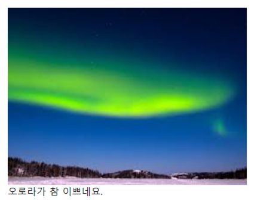

# <a style="color:#00adb5">HTML</a>
<b>웹 문서를 구성하는 3가지 요소</b>
<a style="color:red"><b>웹 페이지 문서 담당 ( 구 조 )</b></a><br>
<p align="center"></p>

## <a style="color:#00adb5">HTML Table</a> Img
HTML &lt;img&gt; 는 <strong>이미지를 삽입하기 위해 사용</strong>된다.
- <a style="color:red"><strong>src 속성</strong></a>은 이미지 경로를 지정하기 위해 사용 된다. ( 상대경로, URL 경로 다 가능 )
- height, width 속성은 이미지 사이즈를 지정하기 위해 사용 된다.
- alt 속성은 이미지를 표시할 수 없을 때 대체하는 텍스트를 지정합니다.
- &lt;figure&gt;은 설명 글을 붙입니다.
- 설명 글이 필요한 대상은 &lt;figure&gt; 로 묶고 설명 글은 &lt;figcaption&gt; 로 묶는다.
- 설명 글을 붙일 수 있는 대상은 이미지나 오디오, 비디오 같은 미디어파일이나 텍스트 단락이나 표에 붙일 수 있다.

```html
<figure>
    
        <figcaption>오로라가 참 이쁘네요.</figcaption>
</figure>
```

<p align="center"></p>

## <a style="color:#00adb5">HTML</a> Img 마무리
지금 블로그 쓰면서도 자주 이용하고 있는 이미지를 삽입하는 태그이다.<br>
어렵지 않고 많이 쓰다보니 벌써 외워졌을 정도다 ㅎㅎ<br>
그리고 정렬은 &lt;p&gt; 를 이용해서 해주면 된다.<br>
자주 사용되는 것이니 잘 알아둘 필요가 있다.