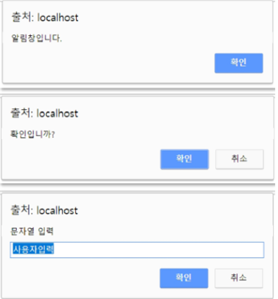
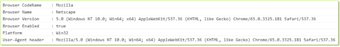

# <a style="color:#00adb5">JAVASCRIPT</a>
<b>웹 문서를 구성하는 3가지 요소</b>
<a style="color:red"><b>웹 페이지 이벤트 담당 ( 동 작 )</b></a><br>
<p align="center"></p>

## <a style="color:#00adb5">JAVASCRIPT Window 객체</a>란?
- Window 객체는 웹 브라우저에서 작동하는 JavaScript의 최상위 전역 객체이다.
- Window 객체에는 브라우저와 관련된 여러 객체와 속성, 함수가 있다.
- JS에서 기본적으로 제공하는 프로퍼티와 함수도 포함한다. ( Number 객체, setInterval() 함수 등 )
- BOM( Browser Object Model ) 으로 불리기도 한다.

## <a style="color:#00adb5">JAVASCRIPT Window 객체</a> 사용

### <a style="color:#00adb5">alert, confirm, prompt</a>
<a style="color:red"><strong>Window 객체의 함수를 호출하면 브라우저에서 제공하는 창을 open 해준다.</strong></a>
- alert()<br>
<strong>브라우저의 알림 창</strong>

- confirm()<br>
<strong>브라우저의 확인/취소 창 ( true 면 확인, false 면 취소 )</strong>

- prompt()<br>
<strong>브라우저의 입력 창 </strong>

```javascript

// alert()
    function openAlert(){
        alert("알림창입니다.");
    }

// confirm()
    function openConfirm(){
        if(confirm("확인입니까?")){
            console.log("확인 눌렀네요.");
        }
        else {
            console.log("취소 눌렀네요.");
        }
    }

// prompt()
    function openPrompt(){
        var txt = prompt("문자열 입력", "사용자입력" );
        console.log(txt);
    }
```

<p align="center"></p>

### <a style="color:#00adb5">navigator</a>
- navigator 객체는 <a style="color:red"><strong>브라우저의 정보가 내장된 객체</strong></a>이다.
- navigator의 정보로 서로 다른 브라우저를 구분할 수 있으며, 브라우저 별로 다르게 처리 가능하다.
- HTML5에서는 위치 정보를 알려주는 역할이 가능하다.

```javascript
console.log("Browser CodeName      :  " + navigator.appCodeName);
console.log("Browser Name          :  " + navigator.appName);
console.log("Browser Version       :  " + navigator.appVersion);
console.log("Browser Enabled       :  " + navigator.cookieEnabled);
console.log("Platform         :  " + navigator.platform);
console.log("User-Agent header     :  " + navigator.userAgent);
```

<p align="center"></p>


### <a style="color:#00adb5">location, history</a>
- location 객체를 이용하여 <a style="color:red"><strong>현재 페이지 주소 ( URL )와 관련된 정보들을 알 수 있다.</strong></a>
    - history.href<br>
    프로퍼티에 값을 할당하지 않으면 현재 URL을 조회하고 값을 할당하면 <strong>할당된 URL로 이동</strong>한다.
    - location.reload()<br>
    현재 페이지를 <strong>새로 고침</strong> ( 작업 후에 많이 사용한다. 변한 것을 반영 시키기 위해 )

- history 객체는 <a style="color:red"><strong>브라우저의 페이지 이력을 담는 객체</strong></a>이다.
    - history.back() / history.forward()<br>
    브라우저 <strong>뒤로가기, 앞으로 가기</strong> 버튼과 같은 동작


## <a style="color:#00adb5">JAVASCRIPT Window 객체</a> 새 창 열기

### <a style="color:#00adb5">새 창 열기</a>
- window 객체의 <strong>open() 함수를 이용하면 새 창을 열 수 있다.</strong>
- window.open('페이지 URL','창 이름', '특성', 히스토리 대체 여부 );
    - 창 이름 ( string ) : open 할 대상 ( _blank, _self 등 ) 지정 혹은 창의 이름
    - 특성 ( string ) : 새로 열릴 창의 너비, 높이 등의 특성 지정 ( width, height, top, left 등등 )
    - 히스토리 대체 여부 ( Boolean ) : 현재 페이지 히스토리에 덮어 쓸지 여부 ( true / false )

```javascript
// 버튼 창 열기
<button onclick="javascript:windowOpen();"> 버튼 창 열기 </button>

// 링크 창 열기
<a href="javascript:windowOpen();"> 링크 창 열기 </a>

// 함수로 창 열기
function windowOpen(){
    window.open("./TIL.html", "winname", "width=300, height=400");
}
```


### <a style="color:#00adb5">창 열고 닫기</a>
- 이벤트를 이용하여 특정 시점에 창을 열 수 있다.
    - 페이지 로딩 완료 후 새 창 열기, 클릭할 때 새 창 열기 등
- window 객체의 <strong>close() 함수로 현재 창을 닫을 수 있다.</strong>
- 특히 브라우저에 내장 된 창이 아닌 JavaScript로 자체 구현한 팝업에서 필요

```javascript
// 버튼으로 함수 이용해서 창 닫기
<button onclick="javascipt:windowClose();"> 함수 이용해서 닫기 </button>

// 메서드 이용해서 창 닫기
<a href="javascript:window.close();">메서드 이용해서 닫기 </a>

// 함수
function windowClose(){
    window.close();
}
```

### <a style="color:#00adb5">부모 창 컨트롤</a>
- <strong>window 객체의 opener 속성을 이용하면 부모 창 ( 새 창을 연 창 )을 컨트롤 가능</strong>
    - 부모 창에 값 전달
    - 부모 창을 새로 고침 하거나 페이지 이동
- opener 객체는 부모창의 window 객체


## <a style="color:#00adb5">JAVASCRIPT Window 객체</a> 함수
- alert()<br>
경고용 대화상자를 보여줌

- confirm()<br>
확인, 취소를 선택할 수 있는 대화상자를 보여줌

- prompt()<br>
입력창이 있는 대화 상자를 보여줌

- open()<br>
새로운 창을 오픈

- scroll()<br>
창을 스크롤 함

- find()<br>
창안에 지정된 문자열이 있는지 확인, 있으면 true 없으면 false

- stop()<br>
불러오기를 중지

- print()<br>
화면에 있는 내용을 프린터로 출력

- moveBy()<br>
창을 상대적 좌표로 이동. 수평방향과 수직방향의 이동량을 픽셀로 지정

- moveTo()<br>
창을 절대적 좌표로 이동. 창의 왼쪽 상단 모서리를 기준으로 픽셀을 지정

- resizeBy()<br>
창의 크기를 상대적인 좌표로 재설정

- resizeTo()<br>
창의 크기를 절대적인 좌표로 재설정

- scrollBy()<br>
창을 상대적인 좌표로 스크롤. 창의 표시영역의 수평방향과 수직방향에 대해 픽셀로 지정

- scrollTo()<br>
창을 절대적인 좌표를 스크롤 창의 왼쪽 상단 모서리를 기준으로 픽셀로 지정

- setTimeout()<br>
지정한 밀리초 시간이 흐른 후에 함수 호출

- clearTimeout()<br>
setTimeout 함수를 정지

- setInterval()<br>
지정한 밀리초 주기마다 함수를 반복적으로 호출

- clearInterval()<br>
setInterval 함수를 정지

- eval()<br>
문자열을 JavaScript 코드로 변환하여 실행


## <a style="color:#00adb5">JAVASCRIPT Window 객체</a> 마무리
JS window 객체에 대해 알아보았다. <br>
창을 열고 닫고, 컨트롤하고 다른 많은 함수들을 공부했는데 자주 쓰이는 것만 잘 외우면 될 것같다 !!<br>
alert(), confirm(), opener, open() 등이 될 것 같다..ㅎㅎ 뇌피셜 😅