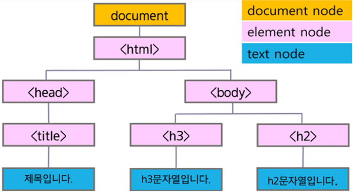
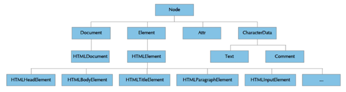

# 📚 <a style="color:#00adb5">JAVASCRIPT</a>
<b>웹 문서를 구성하는 3가지 요소</b>
<a style="color:red"><b>웹 페이지 이벤트 담당 ( 동 작 )</b></a><br>
<p align="center"></p>

## <a style="color:#00adb5">DOM</a> 이란?
- DOM ( Document Object Model ) 은 <a style="color:red"><strong>HTML과 XML 문서의 구조를 정의하는 API 제공</strong></a>한다.
- DOM은 문서 요소 집합을 트리 형태의 계층 구조로 HTML을 표현한다.
- HTML 계층 구조의 제일 위에는 document 노드가 있다.
- 그 아래로 HTML 태그나 요소들을 포함하는 노드와 문자열을 포함하는 노드가 있다.

```html
<!DOCTYPE html>
<html>
    <head>
        <title> 제목 입니다. </title>
    </head>
    <body>
        <h3>h3 문자열입니다.</h3>
        <h2>h2 문자열입니다.</h2>
    </body>
</html>
```

<p align="center"></p>


## <a style="color:#00adb5">DOM</a> 문서 계층 구조

- Document는 HTML또는 XML 문서를 표현한다.
- HTMLDocument는 HTML 문서와 요소만을 표현
- HTMLElement의 하위 타입은 HTML 단일 요소나 요소 집합의 속성에 해당하는 JavaScript 프로퍼티를 정의한다.
- Comment 노드는 HTML이나 XML의 주석을 표현한다.

<p align="center"></p>

## <a style="color:#00adb5">문서 객체 만들기</a> 

### <a style="color:#00adb5">문서 객체</a> 

- <strong>createElement(tagName)</strong><br>
element node를 생성한다.

- <strong>createTagNode(text)</strong><br>
text node를 생성한다.

- <strong>appendChild(node)</strong><br>
객체에 node를 child로 추가한다.

```javascript
// 윈도우 페이지가 열리면 함수 실행 한다는 의미이다.
    window.onload = function(){
        var title = document.createElement('h2');
        var msg = document.createTagNode('Hello !!');

//  text node를 element node에 추가한다.
        title.appendChild(msg);
//  title을 body에 추가한다.
        document.body.appendChild(title);
    }

    -> 이 결과는 body에 h2 속성의 "Hello !!"가 출력 된다.
```

### <a style="color:#00adb5">객체의 속성 설정</a> 

- <strong>setAttribute(name, value)</strong><br>
객체의 속성을 지정한다.

- <strong>getAttribute(name)</strong><br>
객체의 속성값을 가져온다.

```javascript
// 윈도우 페이지가 열리면 함수 실행 한다는 의미이다.
// 이 방법이 가장 간단한 방법이지만 웹 표준이나 웹 브라우저가 지원하는 태그의 속성만 가능하다 !!
    window.onload = function(){
        var profile = document.createElement('img');
        profile.src = 'profile.png';
        profile.width = 50;
        profile.height = 100;

        document.body.appendChild(profile);
    }

// 지원하지 않는 태그의 속성도 가능한 방법 !!
window.onload = function(){
        var profile = document.createElement('img');
        profile.setAttribute('src', 'profile.png' );
        profile.setAttribute('width', 50 );
        profile.setAttribute('height', 100 );

        profile.setAttribute('data-content', '내사진');

        document.body.appendChild(profile);
    }
```

### <a style="color:#00adb5">innerHTML & innerText</a> 

- <strong>innerHTML</strong><br>
문자열을 HTML 태그로 삽입한다.

- <strong>innerText</strong><br>
문자열을 text node로 삽입한다.

```javascript
window.onload = function(){
        var html = document.getElementById('divHtml');        
        var text = document.getElementById('divText');
        
        html.innerHTML = "<h2> Hello !! </h2>"
        text.innerText = "<h2> Hello !! </h2>"

        -> html은 html 양식대로 출력되지만 ( Hello !! )
        -> text는 그대로 출력 된다 ( <h2> Hello !! </h2>)
    }
```


## <a style="color:#00adb5">문서 객체 가져오기</a> 

### <a style="color:#00adb5">객체 가져오기</a> 

- getElementById(id)<br>
태그의 <strong>id</strong> 속성이 id 와 일치하는 element <a style="color:red">객체</a> 얻기

```html
<script type="text/javascript">
    window.onload = function(){
        var msg = document.getElementById('head');

        msg.innerHTML = 'hi !!!';
    };
    </script>
    </head>
    <body>
        <h2 id='head'>hello!!</h2>
    </body>

    -> hi !!! 가 출력된다.
```
<br>


- getElementsByClassName(classname)<br>
태그의 <strong>classname</strong> 속성이 classname 과 일치하는 element <a style="color:red">배열</a>  얻기

```html
<script type="text/javascript">
    window.onload = function(){
        var a = document.getElementsByClassName('class');

        a.style.backcolor = 'red';
    };
    </script>
    </head>
    <body>
        <h2 class='class'>hello!!</h2>
    </body>

    -> hello!! 가 배경이 빨간색으로 출력된다.
```
<br>

- getElementsByTagName(tagname)<br>
태그이름이 <strong>tagname</strong> 과 일치하는 element <a style="color:red">배열</a>  얻기

```html
<script type="text/javascript">
    window.onload = function(){
        var a = document.getElementsByTagName('h2');

        a.style.backcolor = 'red';
    };
    </script>
    </head>
    <body>
        <h2>hello!!</h2>
    </body>

    -> hello!! 가 배경이 빨간색으로 출력된다.
```
<br>


- getElementsByName(name)<br>
태그의 <strong>name</strong> 속성이 name 과 일치하는 element <a style="color:red">배열</a>  얻기

- querySelector(selector)<br>
<strong>selector</strong>에 일치하는 첫번째 element <a style="color:red">객체</a> 얻기

```html
<script type="text/javascript">
    window.onload = function(){
        var msg = document.querySelector('#head');

        msg.innerHTML = 'hi !!!';
    };
    </script>
    </head>
    <body>
        <h2 id="head">hello!!</h2>
    </body>

    -> hi !!! 가 출력된다.
```
<br>

- querySelectorAll(selector)<br>
<strong>selector</strong>에 일치하는 모든 element <a style="color:red">배열</a> 얻기

```html
<script type="text/javascript">
    window.onload = function(){
        var a = document.querySelectorAll('.class');

        a.style.backcolor = 'red';
    };
    </script>
    </head>
    <body>
        <h2 class="class">hello 1</h2>
        <h2 class="class">hello 2</h2>
        <h2 class="class">hello 3</h2>
    </body>

    -> hello 1, hello 2, hello 3 이 배경이 빨간색으로 출력된다.
```
<br>

## <a style="color:#00adb5">문서 객체 제거하기</a> 

### <a style="color:#00adb5">객체 제거</a> 

- <strong>removeChild(childnode)</strong><br>
객체의 자식 노드를 제거한다.

```html
<head>
<script type = "text/javascript">
    window.onload = function(){
        var input4 = document.querySelector("#input4");

        document.body.removeChild(input4);
    };
    </script>
    </head>
    <body>
        <h2 id="input1">input1</h2>
        <h2 id="input2">input2</h2>
        <h2 id="input3">input3</h2>
        <h2 id="input4">input4</h2>
</body>

// input4 는 출력되지 않는다
```

## <a style="color:#00adb5">DOM</a> 마무리
JavaScript에서 중요한 부분인 DOM 에 대해서 공부를 하였다.<br>
HTML에서 작성한 코드를 동적으로 실행하려면 id나 class를 가져와서 DOM의 API를 이용해 실행해준다. <br>
그리고 객체를 가져올 때 getElement 와 querySelect 중 하나를 선택하는 것이 나은데 교수님은 querySelect를 추천해 주셨다 ㅎㅎ <br>
객체를 가져와서 동작을 시키거나 객체의 속성을 생성, 변경하거나 여러가지를 DOM을 통해 하니까 DOM API에 대해 잘 알아 두어야 할 것 같다 !!

