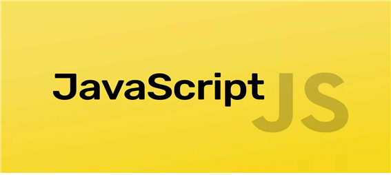

# 📚 <a style="color:#00adb5">JAVASCRIPT</a>

<center>

</center>
<br>

# 📚 <a style="color:#00adb5">Event</a>

## <a style="color:#00adb5">Event</a> 란?
- 웹 페이지에서 여러 종류의 상호작용이 있을 때 마다 이벤트가 발생한다.
- 사용자가 마우스를 클릭하거나 키보드를 누를 때 등등 발생하는 다양한 이벤트가 있다.
- <a style="color:red"><strong>JavaScript를 사용하여 DOM에서 발생하는 이벤트를 감지하여 이벤트에 대응하는 여러 작업을 수행한다.</strong></a> 
- 이벤트는 일반적으로 함수와 연결이 되고, 이 함수는 이벤트가 발생하기 전에는 실행되지 않다가 이벤트가 발생하면 실행한다.
- <a style="color:red"><strong>이벤트 핸들러 ( Handler ) 또는 이벤트 리스너 ( Listener )</strong></a> 라 하며 이 함수에 이벤트 발생 시 실행해야 하는 코드를 작성한다. 

## <a style="color:#00adb5">마우스</a> 이벤트
- 마우스 이벤트는 웹 어플리케이션에서 가장 많이 사용하는 이벤트 이다.
- <a style="color:red"><strong>마우스 이벤트 핸들러에 전달되는 이벤트 객체에는 마우스 위치와 버튼 상태 등의 정보를 담고 있다.</strong></a>

<br>

```html
<bojdy>
    <div onclick="javascript:open();"> 클릭 </div>
<script type="text/javascript">
    function open(){
        alert('안녕하세요');
    }
    </script>
    </body>

    -> 클릭을 누르면 '안녕하세요'라는 창이 뜬다.
```

- <strong>onclick</strong><br>
마우스로 Element를 클릭했을 때 발생한다.

- <strong>ondblclick</strong><br>
마우스로 Element를 더블 클릭했을 때 발생한다.

- <strong>onmouseup</strong><br>
마우스로 Element에서 마우스 버튼을 올렸을 때 발생한다.

- <strong>onmousedown</strong><br>
마우스로 Element에서 마우스 버튼을 눌렀을 때 발생한다.

- <strong>onmouseover</strong><br>
마우스를 움직여서 Element 밖에서 안으로 들어올 때 발생한다.

- <strong>onmouseout</strong><br>
마우스를 움직여서 Element 안에서 밖으로 나갈 때 발생한다.

- <strong>onmousemove</strong><br>
마우스를 움직일 때 발생한다.


## <a style="color:#00adb5">키보드</a> 이벤트
- <a style="color:red"><strong>키보드의 커서가 웹 브라우저에 나타나는 지점에서 키보드를 조작할 때 이벤트 발생한다.</strong></a>
- 키보드 조작은 운영체제에 영향을 받기 때문에 특정 키가 이벤트 핸들러에게 전달되지 않을 수 있다.
- 키보드 커서가 나타내는 요소가 없다면 document에서 이벤트가 발생한다.

- <strong>onkeypress</strong><br>
키보드가 눌려 졌을 때 발생한다. ( 아스키 코드 )

- <strong>onkeydown</strong><br>
키보드를 누르는 순간 발생한다. ( KeyCode )

- <strong>onkeyup</strong><br>
키보드의 누르고 있던 키를 뗄 때 발생한다.


## <a style="color:#00adb5">Frame ( UI ) </a> 이벤트
- <a style="color:red"><strong>Frame 관련 이벤트는 특정 DOM 문서에 관련된 이벤트가 아니라 Frame 자체에 대한 이벤트이다.</strong></a>
- load 이벤트가 가장 많이 사용 된다.
- Load는 문서 및 자원들이 모두 웹 브라우저에 탑재되면 이벤트를 수행한다.
- unload는 사용자가 브라우저를 떠날 때 이벤트가 발생하지만, 사용자가 브라우저를 떠나는 것을 막을 수 없다.

<br>

```javascript
window.onload = function(){
    로딩 되었을 때 실행할 것들을 작성 
}

```

- <strong>onload</strong><br>
document, image, frame 등이 모두 로딩 되었을 때 발생한다.

- <strong>onabort</strong><br>
이미지 등의 내용을 로딩하는 도중 취소 등으로 중단 되었을 때 발생한다.

- <strong>onerror</strong><br>
이미지 등의 내용을 로딩 중 오류가 발생 했을 때 발생한다.

- <strong>onresize</strong><br>
document, element의 크기가 변경 되었을 경우 발생한다.

- <strong>onscroll</strong><br>
document, element가 스크롤 되었을 때 발생한다.

- <strong>onselect</strong><br>
텍스트를 선택 했을 때 발생한다.


## <a style="color:#00adb5">폼 ( Form ) </a> 이벤트
- Form 관련 이벤트는 여러 웹 브라우저에서 가장 안정적으로 동작하는 이벤트이다.
- 자주 사용되는 이벤트로 form이 전송될 때에는 submit 이벤트가 발생한다.
- Form을 초기화 할때는 reset 이벤트가 발생한다.
- submit 과 reset 은 이벤트 핸들러에서 취소할 수 있다.

- <strong>onsubmit</strong><br>
form이 전송될 때 발생한다.

- <strong>onreset</strong><br>
입력 form이 reset될 떄 발생한다.

- <strong>oninput</strong><br>
input 또는 textarea의 값이 변경 되었을 때 발생한다.

- <strong>onchange</strong><br>
select box, checkbox, radio button의 상태가 변경 되었을 때 발생한다.

- <strong>onfocus(focusin)</strong><br>
input과 같은 요소에 입력 포커스가 들어 올 때 발생한다.

- <strong>onblur(focusout)</strong><br>
input과 같은 요소 등에서 입력 포커스가 다른 곳으로 이동할 때 발생한다.

- <strong>onselect</strong><br>
input, textarea에 입력 값 중 일부가 마우스 등으로 선택될 때 발생한다.


## <a style="color:#00adb5">이벤트 핸들러</a>
- 이벤트를 감지하고 대응하는 작업을 등록하는 방법은 여러가지가 있다.
- <a style="color:red"><strong>어떤 이벤트를 처리할 작업을 등록하는 것을 '이벤트 핸들러 ( 혹은 리스너 )를 등록한다' 라고 한다.</strong></a>


### <a style="color:#00adb5">인라인 이벤트 핸들러</a>
- <a style="color:red"><strong>HTML 요소의 내부에서 직접 이벤트 핸들러를 등록한다.</strong></a>
- 이 방법은 HTML 코드를 JS코드가 침범한다는 문제가 있다.
- 여러 개의 함수를 한 번에 호출가능
- 한동안 사용하지 않았다가<a style="color:red"><strong> 최근 관심 받고 있는 CBD( Component Based Development ) 방식의  Angular / React / Vue.js 와 같은 framework / library 에서는 인라인 방식으로 이벤트를 처리한다. ( CBD 에서는 html, css, js 를 view 의 구성 요소로만 생각하기 때문에 )</strong></a>

<br>

```html
<script type="text/javascript">
    var msg1 = function(){
        alert('HI');
    };
    var msg2 = function(){
        var msg = document.querySelector('#div1');
        msg.style.color='red';
    };
    </script>
    </head>
    <body>
        <div id = "div1" onclick="msg1(); msg2();">안녕하세요 ~ </div>
        </body>


    -> HI라는 창이 떴다가 '안녕하세요 ~' 라는 문자가 빨간색으로 출력된다. ( 두개의 함수 사용 가능 )
```


### <a style="color:#00adb5">이벤트 핸들러 프로퍼티 방식</a>
- JavaScript 에서 이벤트 핸들러를 등록하는 방법이 있다.
- JS에 등록함으로써 HTML 코드와 JS 코드를 분리할 수 있다. ( 인라인 이벤트 핸들러 방식의 문제를 해결 )
- <a style="color:red"><strong>이벤트 대상이 되는 특정 DOM을 선택하고 이벤트 핸들러를 등록한다.</strong></a>
- 이벤트 핸들러 프로퍼티에 하나의 이벤트 핸들러만을 바인딩 할 수 있다는 단점이 있다. ( 끝에 선언된 함수가 실행된다. )

<br>

```html
<body>
    <div id = "div1">클릭해보세요</div>

    <script type="text/javascript">
        document.querySelector('#div').onclick = function(){
            alert('안녕하세요');
        };

        </script>
        </body>

        -> div1 요소에 클릭 이벤트가 발생하면 '안녕하세요' 창을 띄운다
```

### <a style="color:#00adb5">addEventListener 메소드 방식</a>
- <a style="color:red"><strong>addEventListener ( 이벤트 이름, 이벤트 핸들러, 캡쳐링 여부 )</strong></a>
- 이벤트 이름은 on을 빼고 사용한다. 캡처링 여부는 잘 사용하지 않음
- 대상 DOM 요소에 이벤트를 바인딩하고 해당 이벤트가 발생했을 때 실행 될 콜백 함수 ( 이벤트 핸들러 )를 지정한다.
- 장점
    - 하나의 이벤트에 대해 하나 이상의 이벤트 핸들러를 추가할 수 있다.
    - 캡처링과 버블링을 지원한다.
    - HTML 요소 뿐만 아니라 모든 DOM에 대해 동작한다.

<br><br>
요소의 값 검사를 여러개 해야하는 경우 addEventListner 사용법 -> 이벤트 핸들러 내부에서 함수를 호출하는 방식

```html
<body>
    <label>아이디 <input type="text" /></label>
    <div class="message"></div>

    <script>
        const MIN_ID_LENGTH = 8;
        const input = document.querySelector('input[type="text"]');
        const msg = document.querySelector('.message');

        function checkVal(len){
            if(input.value.length < script len){
                msg.innerHTML = '값은' + len + '자 이상 입력해주세요';
            }else{
                msg.innerHTML = '';
            }
        }

        input.addEventListener('blur', function () {
            checkVal(MIN_ID_LENGTH);
        })
        </script>
        </body>

        -> 아이디를 입력하는 곳에서 8자 보다 적은 문자열로 입력하면 값은 8자 이상 입력해주세요 라고 출력된다.
```


## <a style="color:#00adb5">버블링과 캡쳐링</a>
- <a style="color:red"><strong>이벤트가 발생한 요소를 포함하는 부모 HTML로 부터 이벤트의 근원지인 자식요소까지 검사하는 것</strong></a>을 캡쳐링이라 한다.
    - 이벤트 캡쳐링에서 캡쳐 속성의 이벤트 핸들러가 등록되어 있으면 수행한다.

- <a style="color:red"><strong>이벤트 발생 요소 부터 요소를 포함하는 부모요소까지 올라가면서 이벤트를 검사하는 것</strong></a>을 이벤트 버블링이라 한다.
    - 이벤트 버블링에서 버블속성의 이벤트 핸들러가 등록되어 있으면 수행한다.


## <a style="color:#00adb5">Event</a> 마무리
JavaScript에서의 많은 Event에 대해 알아보았다.<br>
확실히 기능도 많고 이벤트의 수도 많은 것 같다. <br>
이것까지 공부하고 나니 확실히 웹의 기본인 로그인, 회원가입 같은 것들을 어떻게 구상해야 할지 감이 잡히는 것 같다.<br>
가장 많이 사용 되는 이벤트들은 확실히 알아둬서 나중에 구현할 때 많이 써먹어야 할 것 같다.<br>
그리고 이벤트 핸들러 같은 경우에도 3가지의 방법이 있는데 다 알고 있어야 좋을 것 같다.