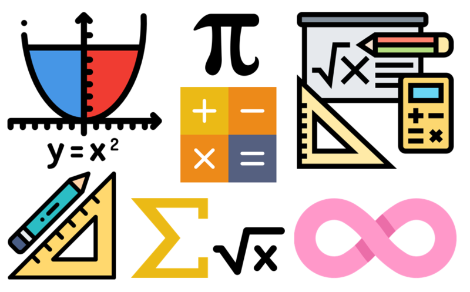
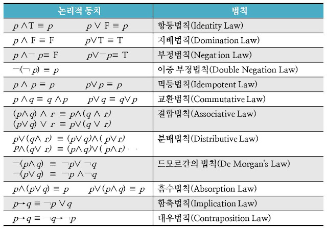

# 📚 <a style="color:#00adb5">이산 수학 ( Discrete Mathmatics )</a>

 

## <a style="color:#00adb5">이산 수학 개요</a>

- <big>이산 수학</big>

  - 참과 거짓으로 살펴보는 컴퓨터를 위한 수학
  - <a style="color:red"><strong>불연속적인 숫자를 다루는 수학</strong></a>
  - 컴퓨터 과학의 베이스 학문
  - 컴퓨팅 사고를 길러준다

## <a style="color:#00adb5">명제와 연산자</a>

### 명제

- <a style="color:red"><strong>참 or 거짓으로 진리를 정확하게 구분할 수 있는 문장</strong></a>
- 명제는 0 또한 1만 가지는 컴퓨터의 메모리처럼 항상 참과 거짓 둘 중 하나의 값만을 가진다.
- 여러가지 명제를 조합 가능

- 예시
  - 원빈은 잘생겼다 : X ( 명제 X )
  - 컴퓨터는 재미가 없다 : X ( 명제 X )
  - 숫자 11은 소수이다 : O ( 참 )
  - 모기는 동물이다 : O ( 참 )

### 연산자

- <a style="color:red"><strong>명제를 연산하기 위한 도구</strong></a>
- 6가지의 기본 연산자
  - <big>￢ : Not</big>
    - 거짓 : 참일땐 거짓, 거짓일땐 참
  - <big>∧ : And</big>
    - 논리곱 : 둘 다 참일 때 참
  - <big>∨ : Or</big>
    - 논리합 : 둘 중에 하나만 참이면 참
  - <big>⊕ : Exclusive or</big>
    - 배타적 논리합 : 한 개만 참일 때만 참
  - <big>→ : Implication</big>
    - 조건 명제 ( 함축 ) : p->q p일때 q이다. 조건과 결과를 나타낸다
    - T -> T : T
    - T -> F : F
    - F -> T : T
    - F -> F : T
  - <big>↔ : Biconditional</big>
    - 쌍방 조건 명제 : 서로 값이 일치할 때만 참

## <a style="color:#00adb5">역, 이, 대우</a>

- 진리표

  - 각 명제 사이의 관계식의 진릿값을 보여주는 표
  - 아무리 복잡한 합성 명제라도 진리표로 풀어낼 수 있다.

- 역, 이, 대우는 조건 명제에서 사용한다. ( p -> q )

### 역

- p와 q 위치를 바꾸는 것을 역이라 한다.
- q -> p

### 이

- 각각의 명제에 부정을 붙이는 것
- ￢ p -> ￢ q

### 대우

- <a style="color:red"><strong>증명하기 어려운 명제는 대우를 이용해 증명</strong></a>할 수 있다. ( 역, 이 , 대우를 사용하는 이유)
- 역과 이를 합친 것
- ￢ q -> ￢ p

## <a style="color:#00adb5">동치</a>

- <big>동치</big>

  - <a style="color:red"><strong>논리적으로 일치</strong></a>한다.
  - 동치는 같은 의미를 가진 더 쉬운 명제를 발견하는데 사용한다.
  - 여러 동치법칙이 있다.

- <big>동치 법칙</big>

  - 드모르간 법칙이 많이 사용된다.

  

  
  

   
