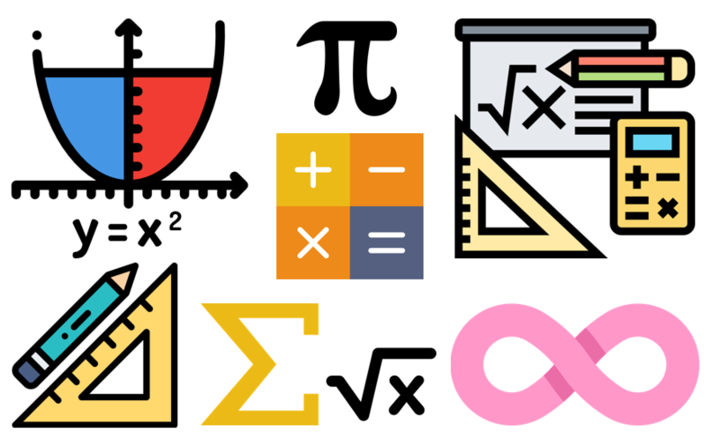

# 📚 <a style="color:#00adb5">이산 수학 ( Discrete Mathmatics )</a>

 

## <a style="color:#00adb5">명제</a>

- <a style="color:red"><strong>참 또는 거짓을 판명할 수 있는 선언적인 문장</strong></a>
- 사실 명제 : 관찰, 측정, 실험
- 논리 명제 : 수학, 형식
- 복합 명제 : 단순 명제의 조합
- 6가지의 기본 연산자

  - <big>￢ : Not</big>
    - 거짓 : 참일땐 거짓, 거짓일땐 참
  - <big>∧ : And</big>
    - 논리곱 : 둘 다 참일 때 참
  - <big>∨ : Or</big>
    - 논리합 : 둘 중에 하나만 참이면 참
  - <big>⊕ : Exclusive or</big>
    - 배타적 논리합 : 한 개만 참일 때만 참
  - <big>→ : Implication</big>
    - 조건 명제 ( 함축 ) : p->q p일때 q이다. 조건과 결과를 나타낸다
    - T -> T : T
    - T -> F : F
    - F -> T : T
    - F -> F : T
  - <big>↔ : Biconditional</big>
    - 쌍방 조건 명제 : 서로 값이 일치할 때만 참

 

- 주의할 점
  - 조건 명제에서 우리의 일상 언어 사용에서의 원인과 결과, 혹은 가정-결론의 논리로 해석하지 말고 조건 명제의 값을 정의하는 <a style="color:red"><strong>진리표에 의해서 결정되는 것</strong></a>임을 이해해야 한다.

 

- 진리표 ( truth table )
  - 진리표는 복합 명제의 값을 구하는데 유용한 방법이다.

 

- 두 명제의 동치 ( equivalence )
  - 두 명제의 <a style="color:red"><strong>값이 같으면(동치)</strong></a> 두 명제는 <a style="color:red"><strong>동일한 명제</strong></a>이다.

## <a style="color:#00adb5">명제의 표현</a>

- 명제는 <a style="color:red"><strong>주어</strong></a>와 <a style="color:red"><strong>술어</strong></a> ( 동사, 형용사 )로 구성되어 있다.

 

- <big>한정사 ( Quantifier )</big>
  - 명제 함수 p(x) 의 정의역은 한정사를 사용하여 표현할 수 있다.
  - 두가지 종류가 존재
    - all ( 전체 한정 ) : ∀ , 전체 함수
    - some ( 존재 한정 ) : ∃ , 어떤 함수

 

- 명제를 논리적 기호로 표현하기
- 장점
  - 의미가 명료해진다.
  - 진리값이 명백하게 표현된다.
- 문장의 논리적 표현
  - 수학이나 논리 프로그래밍, 인공 지능 등의 분야에서 굉장히 중요하다.
  - 동일 명제를 여러가지로 표현할 수 있다.
- 한정사를 이용한 명제의 부정
  - 모든 부정 , 부분 부정
- 중첩한정사
  - 필요한 경우에는 한 명제에서 두개 이상의 한정사를 사용할 수 있다.

## <a style="color:#00adb5">연역법과 귀납법</a>

- 추론
  - 이미 '참'으로 알고 있는 명제로부터 새로운 '참'인 명제를 찾아내려고 하는 과정
  - 전제 ( T ) -> 결론
  - 과연 전제들이 다 T이면 결론도 T인가 ?
  - 이 추론의 방법에는 2가지가 있다.
    - <a style="color:red"><strong>연역법</strong></a>
      - 형식 논리의 다음과 같은 명제의 틀에 기반을 두고 있다.
      - if P, then Q
      - P ( T ) -> Q ( T )
      - ex ) 모든 사람이 죽는다 / 소크라테스는 사람이다 -> 그러므로 소크라테스는 죽는다.
      - 전제가 T 이면 결론도 T 일수 밖에 없다.
      - 함정은 전제가 과연 True인가 !!
      - 수학의 이론은 연역법에 의해 만들어진 명제들로 이루어진다.
    - <a style="color:red"><strong>귀납법</strong></a>
      - 개별적인 사실을 말하는 명제들로부터 일반적인 결론을 도출하는 방법
      - X -> Y 를 증명할 때 , X1 -> Y and X2 -> Y and X3 -> Y ,, 을 만족해야한다.
      - 귀납법의 한계 : 집합의 모든 원소에 대해서 참인 것을 밝힐 수 없다. 그래서 확률적인 결론일 수 밖에 없다.
      - <a style="color:red"><strong>수학적 귀납법은 이러한 귀납법의 한계를 극복</strong></a>

## <a style="color:#00adb5">수학적 귀납법</a>

- 기존 귀납법의 한계를 극복
- <a style="color:red"><strong>집합의 모든 원소에 대해서 명제를 성립하는 것을 보여준다.</strong></a>
- 따라서 모든 경우에 명제가 성립하는 것을 증명한다.

- 구조
  1. n=1 일 때 True임을 보여라.
  2. n=k ( k>1 ) 일 때 True임을 보여라.
  3. n=k+1 일때 True임을 보여라.
     -> 모든 원소가 참임을 증명할 수 있다.

## <a style="color:#00adb5">부울 대수와 논리회로 설계</a>

- <a style="color:red"><strong>부울 대수 ( Boolean algebra )</strong></a>
  - 정의
    - 집합 S = { 0,1 } 에 대해 다음의 세가지 연산이 존재한다.
    - <big>보수 ( Complement )</big>
      - 0 -> 1, 1 -> 0
      - "`" 로 표시
    - <big>부울 합 ( boolean sum )</big>
      - "+" 로 표시
    - <big>부울 곱 ( boolean product )</big>
      - "·" 로 표시, 생략 가능 ( AND )
    - 연산 순서
      - 보수 >> 곱 >> 합
  - 부울 변수
    - 집합 S = { 0, 1 } 의 원소 값만을 갖는 변수
  - 부울 함수
    - 0 또는 1의 입력값들에 대하여 0 또는 1의 출력값을 갖는 함수
  - 부울 식
    - 부울 변수 하나 하나가 부울 식이 된다.
    - 보수, 합, 곱으로 구성된다.
    - <a style="color:red"><strong>부울 함수</strong></a>는 부울 변수와 부울 연산자로 구성된 <a style="color:red"><strong>부울 식</strong></a>으로 표현할 수 있다.
    - 항등
      - 모든 입력 값에 대해 함수의 값이 같다면 동등하다고 한다.

 

- <a style="color:red"><strong>부울 대수의 법칙</strong></a>

 

- <a style="color:red"><strong>쌍대성의 원리 ( duality principle )</strong></a>

  - 부울식으로 표현된 함수들 사이에 항등성이 유지되면, 이들의 쌍대도 항등성을 유지한다.
  - 합 <-> 곱 , 0 <-> 1
  - x+0=x <-> x·1=x 이 것 을 <a style="color:red"><strong>쌍 대</strong></a> 라 고 한 다.

 

- 최소항
  - 함수의 모든 변수에 대해 부울 곱을 취한 것
  - ex ) X1X2X3

 

- 최소항을 이용한 부울 식 ( 2가지 )

  - <a style="color:red"><strong>논리합 형식</strong></a> - 부울 함수의 최소항들의 부울합으로 나타내는 형식 - 부울 함수의 값이 1이 되는 변수값의 조합들에 대하여 최소항들을 구한다.
  

  
  

   

  - 카르노 맵
    - 부울 함수의 간단한 논리합 형식을 찾아내는 방법
    - 인접된 항의 공통된 인수를 가지고 더 간단히 나타낼 수 있다.
    - 변수가 2개 이면 2\*1
    - 변수가 3개 이면 4\*2
    - 변수가 4개 이면 4\*4
    - 표는 원통형으로 생각해야한다.

- <a style="color:red"><strong>논리회로 설계</strong></a>

- 게이트와 부울 연산
  - 전자 장치의 입력과 출력은 0 또는 1이기 때문에 전자 회로를 설계하는데 부울 대수를 사용할 수 있다.
  - 게이트 : 회로의 기본 요소
  - 게이트 : 부울 연산
  - 인버터 : 보수
  - OR 게이트 : 부울 합
  - AND 게이트 : 부울 곱
- 부울식은 논리 회로로 표현할 수 있다.

 

- 논리회로 설계
  - 문제 -> 입력과 출력 정의 부울 함수 -> 부울식 ( 논리식 ) -> 논리 회로
