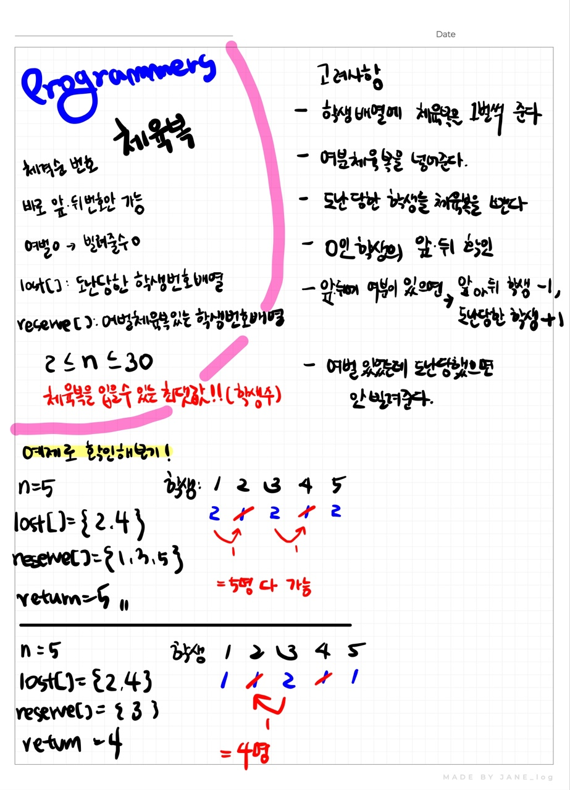

# 📁 <b><a style="color:#00adb5" href="https://programmers.co.kr/learn/courses/30/lessons/42862?language=java" target=_blank>[Lv1_42862] 체육복</a></b>

```java
class Solution {
    public int solution(int n, int[] lost, int[] reserve) {
        int answer = 0;
        
        // 학생 체육복 배열 ( 앞에, 뒤에 여유 한 명씩, 어차피 0 이라 상관 없음)
        int[] arr = new int[n+2];
        
        // 학생 체육복 입력 ( 먼저 다 1개씩 준다 )
        for(int i=1; i<=n; i++){
            arr[i]++;
        }
        
        // 여벌 체육복 입력
        for(int i=0; i<reserve.length; i++){
            arr[reserve[i]]++;
        }

         // 체육복 도난
        for(int i=0; i<lost.length; i++){
            arr[lost[i]]--;
        }
        
        // 체육복 빌릴수 있는지 체크
        for(int i=1; i<=n; i++){
            // 체육복이 없다면
            if(arr[i] == 0){
                // 앞에 체육복이 2개라면 하나 빌리기
                if(arr[i-1]==2){
                    arr[i-1]--;
                    arr[i]++;
                }
                // 뒤 확인 ( 앞에 빌릴게 없다면 )
                else if(arr[i+1]==2){
                    arr[i+1]--;
                    arr[i]++;            
                }
            }
        }
        
        // 0보다 크면 체육복이 있다는 의미
        // 출력
        for(int i=1; i<=n; i++){
            if(arr[i]>0) answer++;
        }
        
        return answer;
    }
}
```

## 🤔 <b><a style="color:#00adb5">나의 생각</a></b>
이 문제는 greedy 문제이다.<br>
기존에 주어진 배열을 가지고 비교해서 풀었는데 코드의 수를 좀 더 간단하게 하기 위한 key는 학생배열을 +2 해서 if문을 줄이는 것이다.<br>
난 앞뒤 확인을 좀 더 편하게 하기 위해 +2를 생각해냈다.

<br>
<center>
    
</center>
