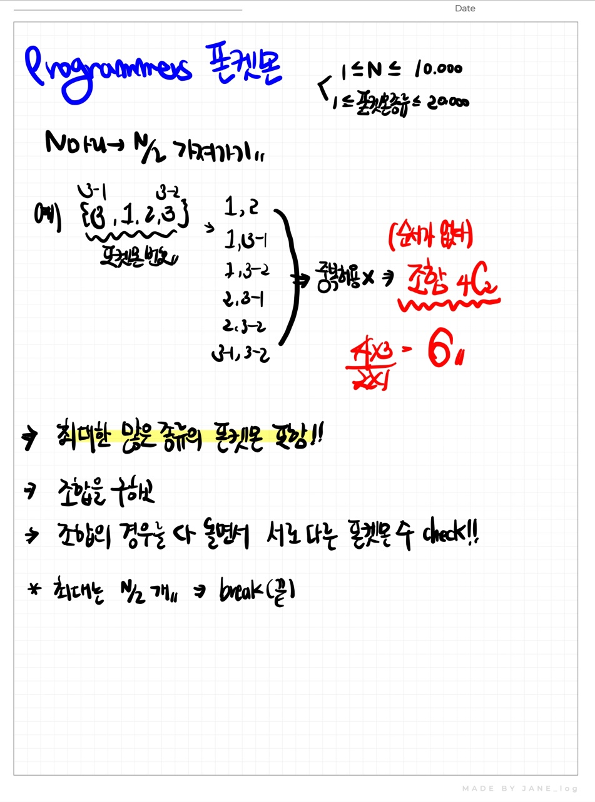

# 📁 <b><a style="color:#00adb5" href="https://programmers.co.kr/learn/courses/30/lessons/1845" target=_blank>[Lv1_1845] 폰켓몬</a></b>

```java
import java.util.*;

class Solution {
    public int solution(int[] nums) {
        int answer = 0;
        
        ArrayList<Integer> list = new ArrayList<Integer>();
        
        // arraylist 사용해서 만약 이미 폰켓몬 종류를 포함하고 있으면 통과 , 아니면 list에 입력
        for(int i=0; i<nums.length; i++){
            if(list.contains(nums[i])){
                continue;
            }else{
                list.add(nums[i]);
            }
        }
        
        // 만약 list 사이즈가 폰켓몬을 가질 수 있는 최대 사이즈 보다 크다면 폰켓몬을 가질 수 있는 최대 사이즈가 정답
        if(list.size()>(nums.length/2)){
            answer = nums.length/2;
        }
        // 아니면 list 크기가 정답
        else{
            answer = list.size();
        }

        return answer;
    }
}
```

## 🤔 <b><a style="color:#00adb5">나의 생각</a></b>
처음에.. 밑에 사진처럼 분석을 하고 문제를 풀었는데.. 역시 예상한대로 시간초과가 떴다..<br>
그래서 어떻게 하면 시간을 줄일까.. 하다가 가지치기도 해보고 생각을 해봤지만 도저히 떠오르지가 않아서 답을 봤는데.. 허 참 ㅋㅋㅋ<br>
이건 너무 과한생각이였다..<br>
왜 ArrayList를 생각하지 못했을까.. 사실 contains 생각을 하긴 했었는데 그것도 폰켓몬 수를 처리하기 위해서였다.<br>
사실 어떻게 보면 접근 방법이 틀렸던 건데.. 너무 조순부에 잡혀있었던게 아닌가 싶다.<br>
아쉬운 판단을 한 문제다.. ㅠ <br>
다음에 다시 풀어보도록 하자

<br>
<center>
    
</center>

