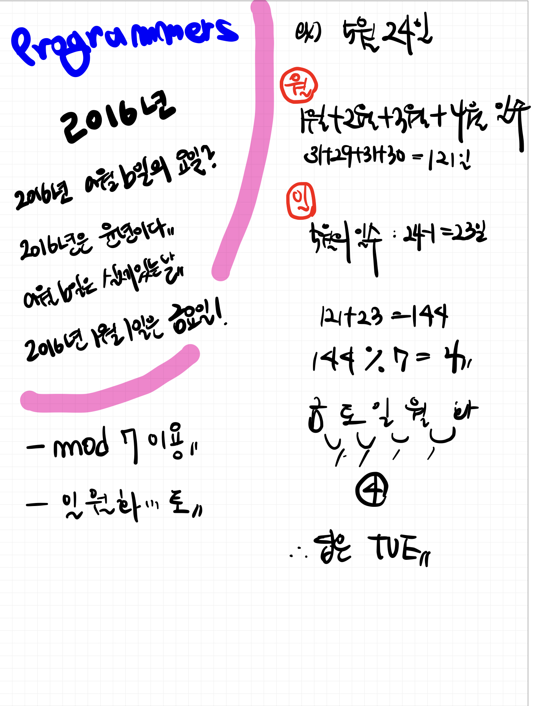

# 📁 <b><a style="color:#00adb5" href="https://programmers.co.kr/learn/courses/30/lessons/12901" target=_blank>[Lv1_12901] 2016년</a></b>

```java
class Solution {
    public String solution(int a, int b) {
        String answer = "";
        
        // 요일 수 저장
        int[] days = {31,29,31,30,31,30,31,31,30,31,30,31};
        // 요일 명 저장
        String[] day_array = {"FRI", "SAT", "SUN", "MON", "TUE", "WED", "THU"};
        
        // 월 차이
        int month = a - 1;
        
        // 일 차이
        int day = b - 1;
        
        // a월을 제외한 월의 일 수 더하기
        int sum = 0;
        
        for(int i=0; i<month; i++){
            sum += days[i];
        }
        
        // a월의 일 수 더하기
        sum += day;
        
        // 요일 명 구하기
        sum %= 7;
        
        answer = day_array[sum];

        return answer;
    }
}
```

## 🤔 <b><a style="color:#00adb5">나의 생각</a></b>
컴퓨팅 사고 공부하면서 날짜 구하는 것을 공부해서 쉽게 구했다.<br>
결국 key point는 mod를 사용하는 것이다.<br>
월의 일수와 요일의 이름을 배열에 저장하고 1월1일과 현재 월,일을 빼서 총 일수를 구한 뒤 mod 7 을 해준다.<br>
그 값을 통해 요일의 이름 배열에 접근해서 값을 구해낸다.<br>
라이브러리를 하나도 사용하지 않고도 간단히 풀린다.

<br>
<center>
    
</center>

