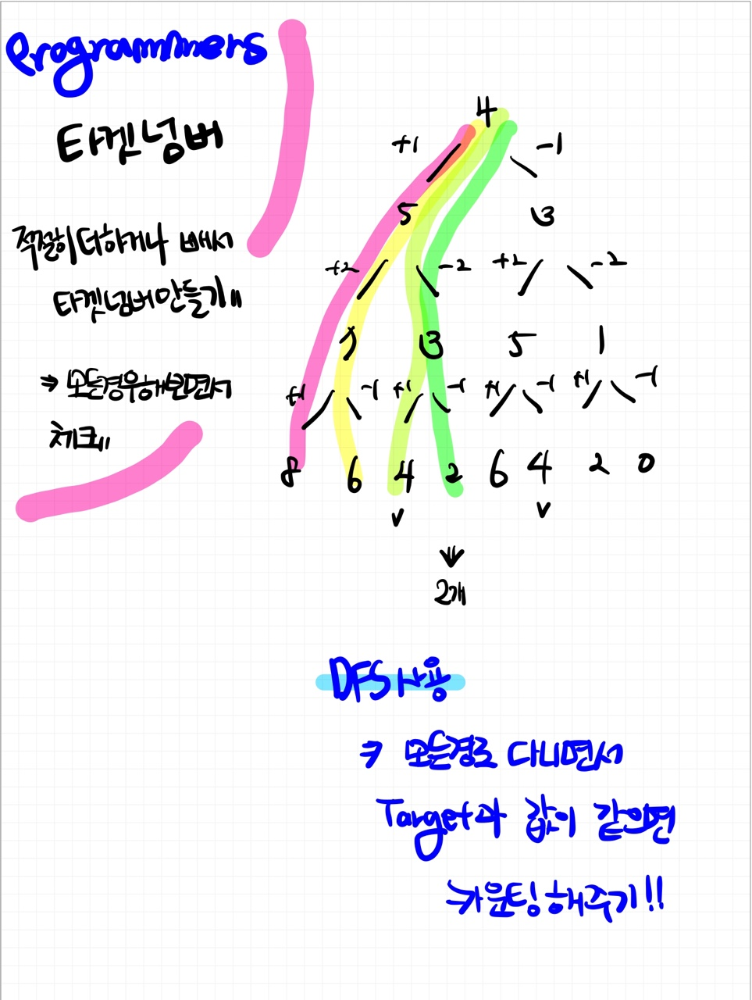

# 📁 <b><a style="color:#00adb5" href="https://programmers.co.kr/learn/courses/30/lessons/43165" target=_blank>[Lv2_12901] 타겟 넘버</a></b>

```java
class Solution {
    // 총 카운팅
    static int cnt = 0;
    public int solution(int[] numbers, int target) {
        int answer = 0;

        dfs(numbers, target, 0, 0);

        answer = cnt;

        return answer;
    }

    static void dfs(int[] numbers, int target, int res, int idx){
        // 기저조건 ( numbers 배열을 다 돈 경우 )
        if(idx == numbers.length){
            // 타겟 넘버이면 cnt++
            if(target == res){
                cnt++;
            }
            return;
        }

        // 덧셈 결과
        int add = res + numbers[idx];

        // 뺄셈 결과
        int sub =  res - numbers[idx];

        // 덧셈 dfs
        dfs(numbers, target, add, idx+1);

        // 뺄셈 dfs
        dfs(numbers, target, sub, idx+1);

    }
}
```

## 🤔 <b><a style="color:#00adb5">나의 생각</a></b>

처음에 접근을 .. 너무 어렵게 했다.. ㅋㅋㅋ<br>
결과론적인 얘기지만 간단했던 문제이다.<br>
처음에는 boolean 배열을 사용해서 백트래킹하고 난리를 했었는데 생각해보니 무조건 배열의 0번째 부터 출발하여 백트래킹이 딱히 필요가 없었다.<br>
밑에 그림처럼 굳이 가지치기 작업을 할 필요 없이 dfs로 끝까지 갔다가 target 값과 같은지 체크..<br>

<br>
<center>
    
</center>
