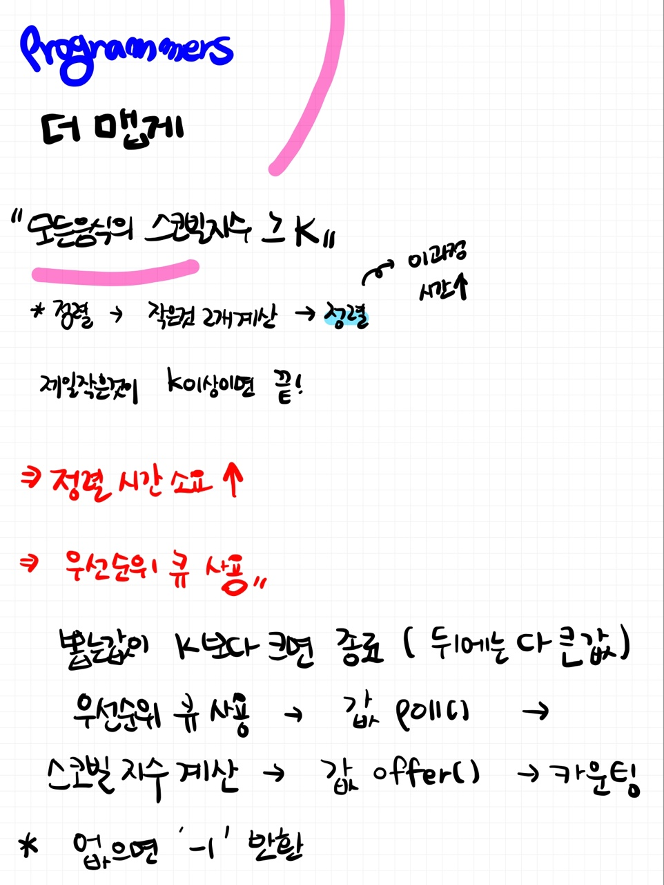

# 📁 <b><a style="color:#00adb5" href="https://programmers.co.kr/learn/courses/30/lessons/42626" target=_blank>[Lv2_42626] 더 맵게</a></b>

```java
import java.util.*;

class Solution {
    public int solution(int[] scoville, int K) {
        int answer = 0;
        int cnt = 0;

        PriorityQueue<Integer> heap = new PriorityQueue<Integer>();

        // 우선순위 큐에 값 입력
        for(int i=0; i<scoville.length; i++){
            heap.offer(scoville[i]);
        }

        // heap에서 뽑을 값이 K 보다 크면 종료
        while(heap.peek() <= K){
            if(heap.size()==1){
                return -1;
            }

            // 값 2개 뽑기
            int a = heap.poll();
            int b = heap.poll();

            // 스코빌 지수 계산
            int res = a + (b*2);

            // 스코빌 지수 입력
            heap.offer(res);

            // 카운팅
            answer++;
        }
        return answer;
    }
}
```

## 🤔 <b><a style="color:#00adb5">나의 생각</a></b>

처음에 우선순위 큐를 생각하지 못하고 그냥 ArrayList로 풀었는데 계속해서 답이 안나오는 것이 였다..<br>
그래서 프로그래머스 말고 IDE로 하다가 깨달았다.. remove를 해주면 바로 ArrayList 크기가 줄기 때문에 index를 잘 설정해줬어야 했는데 계속 한 칸 띄우고 설정을 해줘서 원하는 값이 안나왔다.<br>
그 이후에 문제는 풀었지만 효율성 부분에서 점수를 받지 못해서 좀 찾아보니 우선순위 큐를 사용하여 heap을 이용하면 효율성 부분에서도 점수를 받을 수 있는 것이였다.<br>
사실 우선순위 큐를 잘 이해하고 있지 못해서 문제를 잘 못푼 것 같다. 기회가 되면 정리를 해야겠다 !!

<br>
<center>
    
</center>
