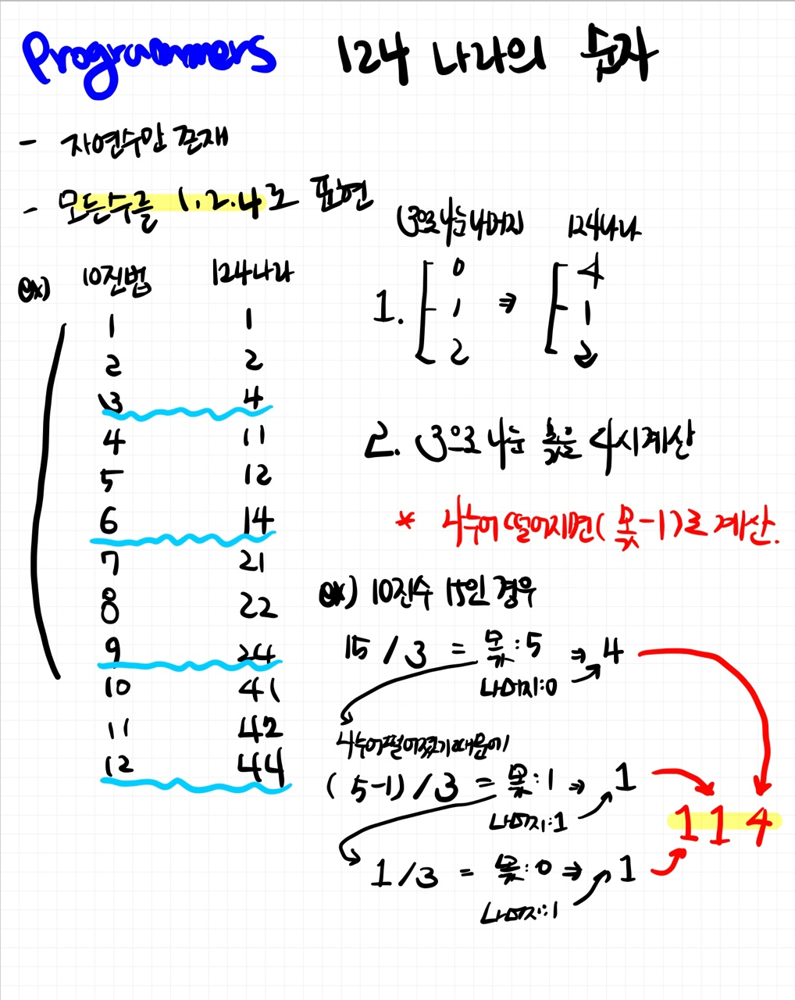

# 📁 <b><a style="color:#00adb5" href="https://programmers.co.kr/learn/courses/30/lessons/12899" target=_blank>[Lv2_12899] 124 나라의 숫자</a></b>

```java
class Solution {
    static StringBuilder sb = new StringBuilder();
    public String solution(int n) {
        String answer = "";

        while(n > 0){
            // 3으로 나눈 나머지
            int mod = (n % 3);

            // 나누어떨어지면 4
            if(mod == 0){
                sb.append(4);
            }
            // 나머지가 1이면 1
            else if(mod == 1){
                sb.append(1);
            }
            // 나머지가 2이면 2
            else{
                sb.append(2);
            }

            // 만약 나누어떨어지면 -1 해주기
            if(mod == 0){
                n -= 1;
            }

            n /= 3;

        }

        // 역순으로 돌려주기
        answer = sb.reverse().toString();

        return answer;
    }
}
```

## 🤔 <b><a style="color:#00adb5">나의 생각</a></b>

처음에 좀 해매다가 인터넷 도움을 받아 규칙을 발견하고 정리하고 구현해 보았다.<br>
while 문에 다 받고 나서 마지막에 for문을 통해 역순해주니 확실이 n이 5억개까지라 그런지 효율성에서 시간 초과가 났다.<br>
그래서 생각난 것이 StringBuilder 였는데 StringBuilder를 써주고 뒤에 reverse().toString()을 써주니 시간이 ... 진짜 깜짝 놀랄 정도로 감소되었다. <br>
거의다 0.05초안에 끝나고.. 그전에는 10초까지 걸렸었는데..<br>
참 시간복잡도의 중요성을 깨닫게 해주는 문제였다.

<br>
<center>
    
</center>
