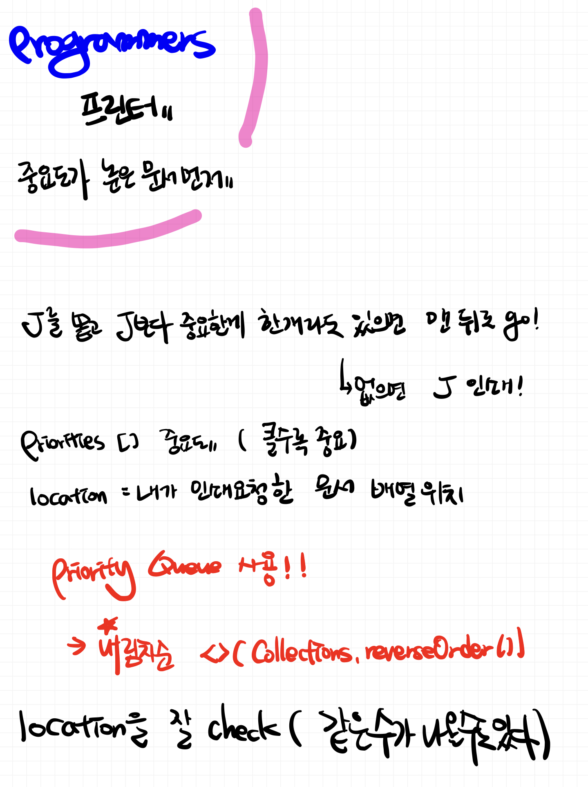

# 📁 <b><a style="color:#00adb5" href="https://programmers.co.kr/learn/courses/30/lessons/42587" target=_blank>[Lv2_42587] 프린터</a></b>

```java
import java.util.*;

class Solution {
    public int solution(int[] priorities, int location) {
        int answer = 0;

        // 우선순위 큐 선언 ( 내림차순 )
        PriorityQueue<Integer> pq = new PriorityQueue<>(Collections.reverseOrder());

        // 우선순위 큐에 배열값 넣기
        for(int i=0; i<priorities.length; i++){
            pq.add(priorities[i]);
        }

        while(!pq.isEmpty()){
            for(int i=0; i<priorities.length;i++){
                // 만약 베열 값이 내림차순 정렬해놓은 값과 같은 경우 ( 제일 처음은 가장 큰 경우 )
                if(priorities[i] == pq.peek()){
                    // 그 index가 location이랑 같을 경우
                    if(i == location){
                        answer++;
                        return answer;
                    }
                    // 크지만 원하는 값이 아니다 
                    pq.poll();
                    answer++;
                }
            }
        }

        return -1;

    }
}
```

## 🤔 <b><a style="color:#00adb5">나의 생각</a></b>

요즘 문제에 우선순위 큐가 많이 나오는 것 같다.
이 문제는 내림차순 정렬이라 `Collections.reverseOrder()` 을 사용하는 것이 키 포인트고 Queue의 성질을 이용하는 것이 포인트이다.
쉬운듯 쉽게 풀리지 않았따..ㅎ

<br>
<center>
    
</center>
