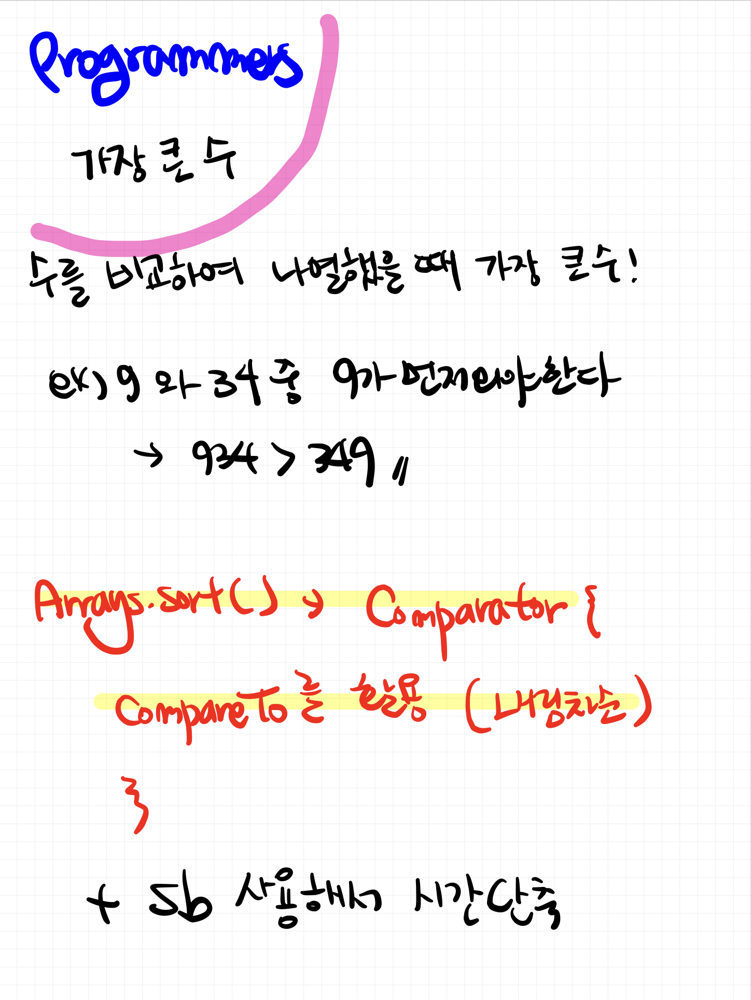

# 📁 <b><a style="color:#00adb5" href="https://programmers.co.kr/learn/courses/30/lessons/42746" target=_blank>[Lv2_42746] 가장 큰 수</a></b>

```java
import java.util.*;
class Solution {
    static StringBuilder sb = new StringBuilder();

    public String solution(int[] numbers) {
        String answer = "";

        String[] str = new String[numbers.length];

        // String 배열로 변환 ( Integer )
        for(int i=0; i<numbers.length; i++){
            str[i] = Integer.toString(numbers[i]);
        }


        // 내림차순 정렬 ( String 이라 더하는게 아니고 자리만 바꿔주는 것 앞,뒤 )
        Arrays.sort(str, new Comparator<String>(){

            @Override
            public int compare(String s1, String s2){
                return (s2+s1).compareTo(s1+s2);
            }
        });


        for(int i=0; i<str.length; i++){
            sb.append(str[i]);
        }

        // answer에 답 입력
        answer = sb.toString();

        // 만약 0이 다 입력되었을 경우 답은 0 이다
        if(answer.charAt(0) == '0') answer = "0";

        return answer;
    }
}
```

## 🤔 <b><a style="color:#00adb5">나의 생각</a></b>

이 문제는 한 방에 풀지 못했다..<br>
확실히 정렬에 comparator 이나 comparable에 약한 것 같다..<br>
그래도 구글선생님을 통해 답을 본 뒤 이해를 했다. <br>
숫자 배열을 문자 배열로 바꾼뒤 String 덧셈 연산을 통해 내림차순으로 정렬하고 ( 이것을 생각 못함 자꾸 어렵게 생각함 ) 순서대로 받아서 출력<br>
0 들만 들어오는 경우도 해결 !!

<br>
<center>
    
</center>
