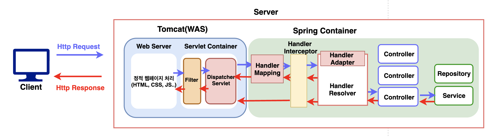
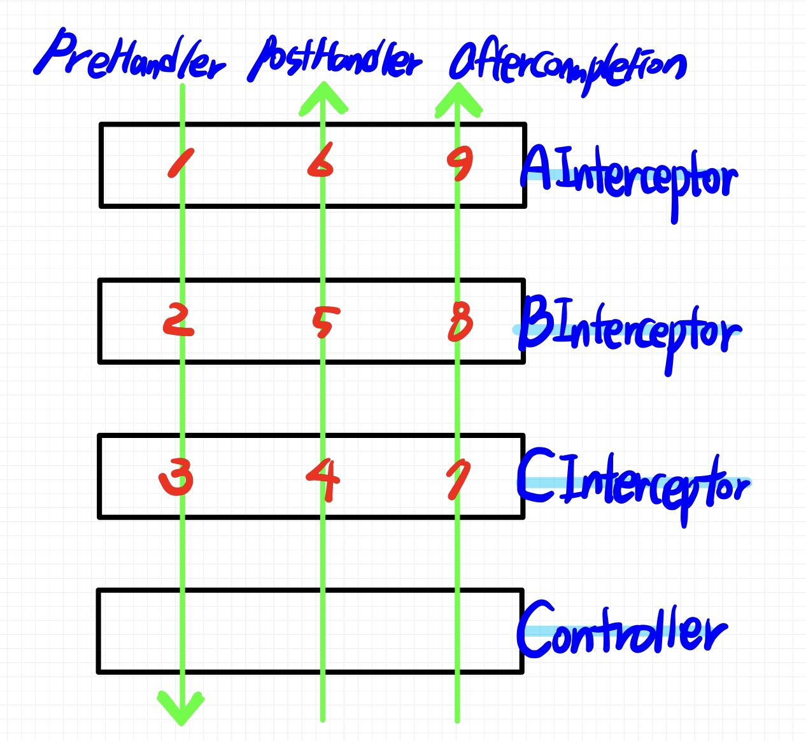

# 📚 <a style="color:#00adb5">SPRING</a>

<center>

</center>
<br>

# 📚 <a style="color:#00adb5">Interceptor</a>

## <a style="color:#00adb5">Interceptor</a> 란
Interceptor란 낚아채다라는 의미를 가지고 있다.<br>
<a style="color:red"><strong>Client에서 Server로 들어온 Request 객체를 Controller의 Handler로 도달하기 전에 가로채서 원하는 추가 작업이나 로직을 수행 한 후 Handler로 보낼 수 있도록 해주는 Module이다.</strong></a><br>
Controller가 요청을 처리하기 전/후에 처리한다.<br>

## <a style="color:#00adb5">Interceptor</a> 구현 수단
- <strong>HandlerInterceptor 인터페이스</strong><br>
인터페이스를 상속받아 메서드 사용
- <strong>HandlerInterceptorAdapter 추상 클래스 ( HandlerInterceptor Interface를 상속 받았다. )</strong><br>
추상 클래스를 오버라이딩 함으로써 자신만의 인터셉터 만들어 사용


## <a style="color:#00adb5">Interceptor</a> 설정
servlet-context.xml 에 설정을 한다.<br>

```xml
<interceptors>
		<interceptor>
        <!-- 적용 URL -->
			<mapping path="/*"/>
        <!-- Interceptor class 위치 -->
			<beans:bean class="com.test.sample.AInterceptor"/>
		</interceptor>
</interceptors>
```

<br>

여러개의 Interceptor 등록<br>

```xml
<interceptors>
		<interceptor>
			<mapping path="/*"/>
			<beans:bean class="com.test.sample.AInterceptor"/>
		</interceptor>
        <interceptor>
			<mapping path="/*"/>
			<beans:bean class="com.test.sample.BInterceptor"/>
		</interceptor>
</interceptors>
```


## <a style="color:#00adb5">Interceptor</a> 수행 과정
<center>

</center>
<br>
DispatcherServlet은 HandlerMapping에게 Client Request를 수행할 Handler를 찾도록 요청을 보낸다.<br><br>

이때 *HandlerExecutionChain ( 핸들러 실행 체인 )* 이 동작하는데, 이 것은 *하나 이상의 HandlerInterceptor* 를 거쳐 Controller가 실행되도록 구성되어 있다.<br>
HandlerInterceptor를 등록하지 않았을 때는 바로 Controller를 실행한다.<br><br>

HandlerInterceptor를 거쳐 Request에 대해 원하는 작업, 로직을 수행한 후 Controller로 Request 객체를 전달한다.<br>
주로 로킹, 모니터링 정보 수집, 접근 제어 처리 등의 실제 Bussiness Logic과는 분리되어 처리해야 하는 기능들을 넣고 싶을 때 유용하다.<br><br>

쉽게 말해, <a style="color:red"><strong>HandlerInterceptor의 역할은 HanldeMapping이 결정한 Handler를 HandlerAdapter 수행 전, 후 로 가로채어 추가적인 작업을 하는 것이다.</strong></a><br><br>

<a style="color:red"><strong>Interceptor 호출 순서</strong></a><br>

<strong>servlet-context.xml</strong>

```xml
<interceptors>
		<interceptor>
			<mapping path="/*"/>
			<beans:bean class="com.test.sample.AInterceptor"/>
		</interceptor>
		<interceptor>
			<mapping path="/*"/>
			<beans:bean class="com.test.sample.BInterceptor"/>
		</interceptor>
        <interceptor>
			<mapping path="/*"/>
			<beans:bean class="com.test.sample.CInterceptor"/>
		</interceptor>
	</interceptors>
```

<center>

</center>
<br>

1. AInterceptor.preHandle()
2. BInterceptor.preHandle()
3. CInterceptor.preHandle()
Controller
5. CInterceptor.postHandle()
6. BInterceptor.postHandle()
7. AInterceptor.postHandle()
8. CInterceptor.afterCompletion()
9. BInterceptor.afterCompletion()
10. AInterceptor.afterCompletion()


## <a style="color:#00adb5">Interceptor</a> 장점 ( 사용 이유 )
- 공통 코드 사용으로 코드 재사용성 증가
- 메모리 낭비, 서버 부하 감소
- 코드 누락에 대한 위험성 감소

## <a style="color:#00adb5">Interceptor</a> 제공 method
```java
import javax.servlet.http.HttpServletRequest;
import javax.servlet.http.HttpServletResponse;

import org.springframework.web.servlet.HandlerInterceptor;
import org.springframework.web.servlet.ModelAndView;

public class Interceptor implements HandlerInterceptor {

	@Override
	public boolean preHandle(HttpServletRequest request, HttpServletResponse response, Object handler)
			throws Exception {
		return true;
	}

	@Override
	public void postHandle(HttpServletRequest request, HttpServletResponse response, Object handler,
			ModelAndView modelAndView) throws Exception {
	}

	@Override
	public void afterCompletion(HttpServletRequest request, HttpServletResponse response, Object handler, Exception ex)
			throws Exception {
	}
}
```

- <strong>preHandle</strong><br>
지정된 컨트롤러의 동작 이전에 수행할 동작 ( 사전 제어 )<br>
false를 반환하면 request를 바로 종료

- <strong>postHandle</strong><br>
지정된 컨트롤러의 동작 이후에 처리할 동작 ( 사후 제어 )<br>
Controller 수행 후 호출

- <strong>afterCompletion</strong><br>
Dispatcher Servlet의 화면 처리가 완료된 이후 처리할 동작<br>
view를 통해 클라이언트에 응답을 전송한 뒤 실행<br>
예외가 발생하여도 실행


## <a style="color:#00adb5">Interceptor Session Check</a> 
preHandle()에 세션체크를 구현해 보았다.<br>
세션에 저장된 사용자 정보를 받아와서 사용자 정보가 존재하면 true, 존재하지 않으면 false를 해주고 root로 다시 보낸다.<br>
주로 사용자만이 사용할 수 있는 화면단에서 이용한다. 여기서는 기사를 적거나, 수정, 삭제하는 부분에 interceptor를 정의하겠다.<br>
<br>
<strong>servlet-context.xml</strong>

```xml
<beans: bean id="confirm" class="com.ssafy.interceptor.ConfirmInterceptor"/>

<interceptors>
    <interceptor>
        <mapping path="/article/write"/>
        <mapping path="/article/modify"/>
        <mapping path="/article/delete"/>
        <beans:ref bean="confirm"/>
    </interceptor>
</interceptors>
```

<br>
<strong>ConfirmInterceptor.java</strong>

```java
public class ConfirmInterceptor extends HanlderInterceptorAdaptor{

    @Override
    public boolean preHandle(HttpServletRequest request, HttpServletResponse response, Object handler) throws Exception{
        // 세션 받아오기
        HttpSession session = request.getSession();
        // 사용자 정보 저장
        MemberDto memberDto = (MemberDto) session.getAttribute("userinfo");
        // 사용자 정보가 없으면 root로 다시 보낸다
        if(memberDto == null){
            response.sendRedirect(request.getContextPath());
            return false;
        }
        return true;
    }
}
```